---
layout: default
title: Hybrid Integration
permalink: /hybrid-int
has_toc: false
has_children: false
nav_order: 70
---
{: .no_toc}
# Hybrid Integration 

---

#### Table of Contents

  1. [Context](#1-context)
  2. [Hybrid Integration Use Cases](#2-hybrid-integration-use-cases)
  3. [Key Drivers for Hybrid Integration](#3-key-drivers-for-hybrid-integration)
  4. [Agile Integration Architecture](#4-agile-integration-architecture)
  5. [Key Considerations for Hybrid Integration](#5-key-considerations-for-hybrid-integration)
  6. [Hybrid Integration Characteristics and Features](#6-hybrid-integration-characteristics-and-features)
  7. [IBM Approach for Hybrid Integration](#7-ibm-approach-for-hybrid-integration)
  8. [Digital Integration](#8-digital-integration)
  9. [Hybrid Integration and Application Development Scenarios](#9-hybrid-integration-and-application-development-scenarios)
  10. [Hybrid Integration Key Capabilities](#10-hybrid-integration-key-capabilities)
  11. [Business Case Development](#11-business-case-development)
  12. [Hybrid Integration Platform or Integration Capabilities by Vendors](#12-hybrid-integration-platform-or-integration-capabilities-by-vendors)
  13. [References](#13-references)

---

# 1. Context

Over the last two-three years, we’ve seen a tremendous **acceleration** in the pace that customers are establishing **digital transformation initiatives**. A primary focus of this digital transformation is to build new customer experiences through connected experiences across a network of applications that leverage data of all types.

However, **bringing together these processes and information sources** has become increasingly complicated. Consider that many organizations have aggressively **adopted SaaS** business applications which have spread their key data sources across a much broader landscape. Additionally, new data sources that are available from **external data providers** must be injected into business processes to create competitive differentiation.

Finally, **Infusing Artificial Intelligence** - which are being attached to many customer-facing applications - require a broad range of information. These processes and information sources need to be integrated by making them accessible via multitude of mechanisms for example APIs, Events, webhooks, etc.

Overall, business demand is changing driven by new technology and architectural trends, such as:
 - Cloud adoption
 - Microservice architecture adoption  
 - Digital transformations  
 - SaaS adoption  
 - New technology adoption (IOT, Blockchain)
 - Building intelligence for improved customer loyalty

These trends are leading to data sprawl / distributed across diverse location, platform, devices, applications.

| **Hybrid Integration Context** |
| :-: |
| 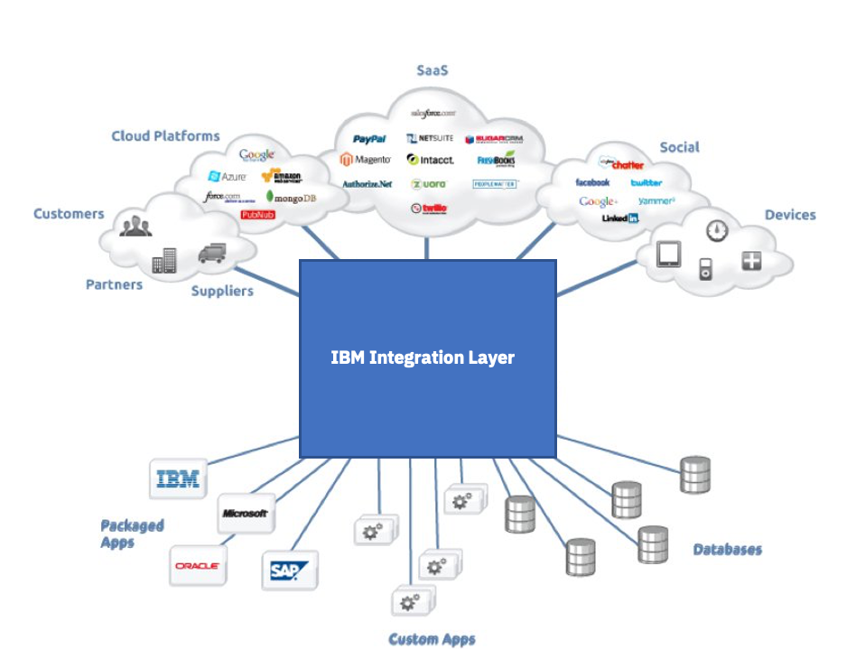 |

 

[Back to top](#top)

---

# 2. Hybrid Integration Use Cases 

Above demands and trends are leading to **new requirements/use cases** as below:

 - Customer is **migrating /modernizing their System of Records (SOR)/applications** to public cloud/private clouds that **requires integration between different applications/data sources** hosted on different cloud/s, on-premise, and private cloud, etc.
 - Applications are getting modernized using microservice / cloud native architecture, that requires **integration within cloud native applications or microservices** within application realm.
 - **Applications functions or data required to be exposed** for multi-channel experience layer or outside world using **REST APIs**.
 - To support **migrations requirements, need high volume and high- speed data transfer** between application /data source distributed across diverse locations.
 - While these trends are driving creation of new modern solutions, the businesses are not able to decommission the legacy system. Also, the existing business process are critically dependent on the legacy system and are now spanning across old and new. This requires **transient co-existence integration layer to connect modernized state and legacy state**.

 

[Back to top](#top)

---

# 3. Key Drivers for Hybrid Integration

##  Integration Journey: Point-to-Point, EAI, SOA, ESB & APIs / Microservices

Integration landscapes have evolved over the years. Point to Point (P2P) integrations, Enterprise Application Integration (EAI) middleware and Service Oriented Architecture (SOA) integrations were all part of this evolutionary journey. Enterprise Service Bus (ESB) Pattern were utilized to implement the Service Oriented Architecture (SOA). Many of the enterprises will have integrations realized by one or more of the above patterns in their landscape. Modern architectures like API / microservices and event-driven architectures are ideal for the hybrid cloud target. Enterprises are targeting to reach a higher level of maturity and realize an optimized integration landscape by adopting these newer architecture patterns as well as technology.

| **Integration Journey** |
| :-: |
| 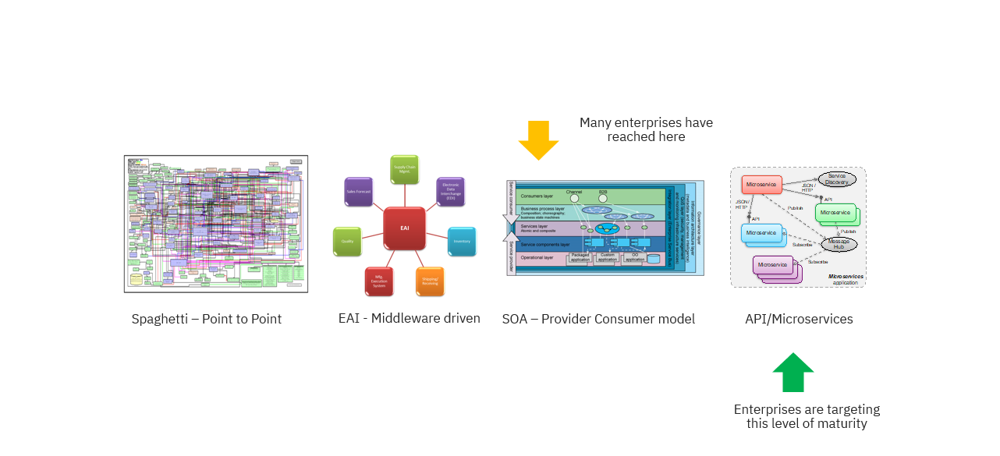 |

## More about SOA, ESB Pattern and Their Challenges

The core purpose of **SOA** was to **expose data and functions** buried in systems of record over well-formed, simple-to-use, **synchronous interfaces, such as web services**. Clearly, SOA was about more than just providing those services, and often involved some significant **re-engineering to align the back-end systems with the business needs**, but the end goal was a suite of well-defined common re-usable services collating disparate systems.

This synchronous exposure pattern via web services was what the Enterprise services bus (**ESB**) term was introduced for. It’s all in the name—a **centralized “bus”** that could provide **web “services”** across the “enterprise” and technology (the integration runtime) to provide **connectivity to the back-end systems**, coming from the preceding hub-and-spoke pattern.    

Please refer below the synchronous centralized / ESB exposure pattern depiction:

| **ESB Pattern** |
| :-: |
| 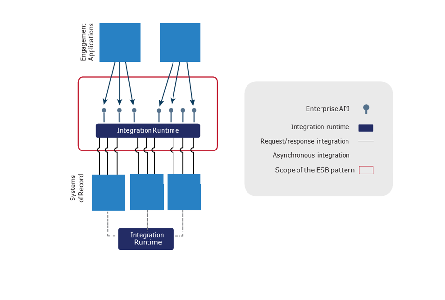 |

**Challenges with centralized ESB pattern**

 1. Deploying changes could potentially destabilize other unrelated interfaces running on the centralized ESB
 2. Servers containing many integrations had to be kept running and patched live wherever possible.
 3. Topologies for high availability and disaster recovery were complex and expensive.
 4. For stability, servers typically ran many versions behind the current release of software reducing productivity.
 5. The integration specialist teams often didn’t know much about the applications they were trying to integrate with.
 6. Pooling of specialist integration skilled people resulted in more waterfall style engagement with application teams.
 7. Service discovery was immature, so documentation became quickly outdated
 8. ESB patterns have had issues ensuring continued funding for cross-enterprise initiatives since those do not apply specifically within the context of a business initiative.

## SOA vs APIs / Microservice

Microservices mostly gets compared to SOA in architectural discussions, because they share many words in common. However, these terms apply to two very different scopes.

**Service-oriented architecture(SOA)** is an **enterprise-wide initiative** to create re-usable, synchronously available services and APIs, such that new applications can be created more quickly incorporating data from other systems.

**Microservices architecture**, on the other hand, is an option for how you might choose to write an **individual application** as smallest piece in the business/domain context that makes that application more agile, scalable, and resilient.

| **SOA** |
| :-: |
|  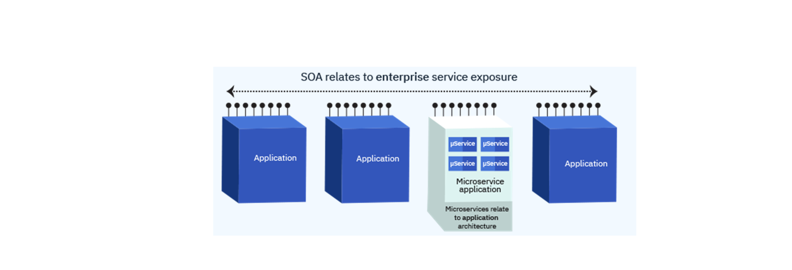 |

Some Microservice principals are different to SOA:

 - **Reuse is not the goal** - Re-use of common components is discouraged due to the dependencies it creates. Re-use by copy is preferred.
 - **Synchronous is bad**- Making synchronous calls such as API or web services creates real-time dependencies. Messaging/event is used wherever possible between microservices.
 - **Client-side load balancing**- Components are assumed to be volatile, so it is often the client’s responsibility to find and even load balance across instances.
 - **Data duplication is embraced** - Techniques such as event sourcing result in multiple independent “views” of the data, ensuring the microservices are truly decoupled.

## Adoption of IT by the Line of Business

For some years now, particularly accelerated by the **digital transformation revolution**, centralized IT has diverged into at least two different camps: often termed **enterprise IT** and **digital IT**.

**Enterprise IT** retains its vital role of **ensuring that business-critical systems** maintain their service levels and provide the type of data integrity and secure governance that are expected of core systems on which the business depends. However, this heavily regulated and controlled environment does not meet the needs of the **lines of business (LOBs)/digital teams** who must keep the public face of the enterprise fresh with **new propositions and innovations** in a rapidly changing market.

## Evolved Bi-modal IT Resulting from the New Trends and Initiatives

In a simplistic reference model for integration, such as the example shown in the following diagram, Enterprise / centralized IT team might perform most of the integration. The team essentially **bridges the bi-modal divide by empowering the digital teams**. It performs the deep integration that is needed to surface the systems of record as APIs and events on the central /internal API gateway.

| **Bi-modal IT** |
| :-: |
| 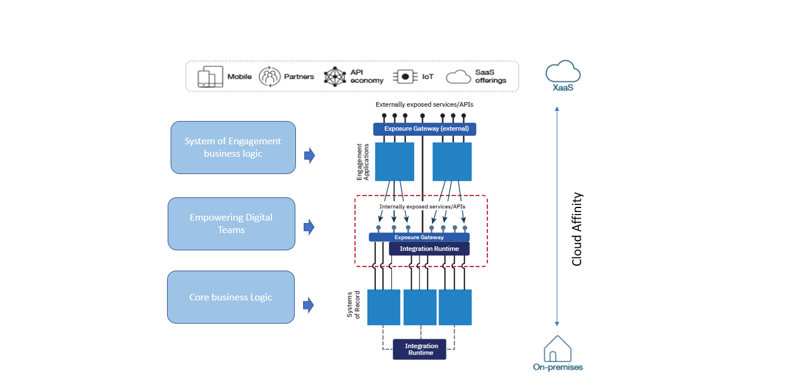 |

Another important but subtle aspect of the diagram is **cloud affinity**. This concept deliberately represents a continuum rather than a dividing line on the architecture. The components near the bottom of the diagram, such as **systems of record**, are more likely to be **on-premises**, but a **new system of record** might be deployed on a **cloud infrastructure, or even be SaaS**. Similarly, components near the top of the diagram are more likely to be cloud-based, but plenty of organizations still host their own systems of engagement applications. **The reality for any organization is a blend of on-premises and off-premises components, and any hybrid integration architecture must enable connectivity regardless.**

 

[Back to top](#top)

---

# 4. Agile Integration Architecture  

Integration is typically deployed in a very siloed and centralized fashion such as the ESB pattern. “Agile integration architecture” is an alternative approach to API/microservices architecture. **This helps to adopt the microservice/cloud native architecture to integration and brings all the benefits related to cloud like agility, scalability and resiliency to integration domain**. There are three primary aspect of it.  
**Fine-grained integration deployment** - Integration runtimes changed from heavy runtime to light weight to provide agility, scalability and resilience. Due to that,**ESB component has been broken down into smaller more manageable and dedicated pieces**.

**Decentralized integration ownership** - With Fine grained integration deployment as integration have broken up into smaller, lighter manageable pieces and ready for Cloud. Now **integrations can be distributed and deployed on decentralized locations**, then it needs **decentralized and distributed integration teams** instead of centralized teams to own and manage them.

**Cloud Native Integration Infrastructure** – This aspect concentrate, not just breaking up integrations into smaller containers but apply the Cloud native “**Cattle not Pets**” approach for our integrations. **Integration pets “The traditional approach”** are big bang servers as indispensable. Which is like centralized integration topologies solving enterprise application integration (EAI) and Service-oriented architecture (SOA) use cases. **Integration cattle, “An alternative lightweight approach”** this shift means breaking up the more centralized ESB runtime into multiple separate and highly decoupled run times. However, the change involves more than just breaking out the integrations into containers. **A cattle-based approach must exhibit many characteristics likes elastic scalability, disposability, agility, isolation, decomposition, etc.**

| **Agile Architecture** |
| :-: |
| 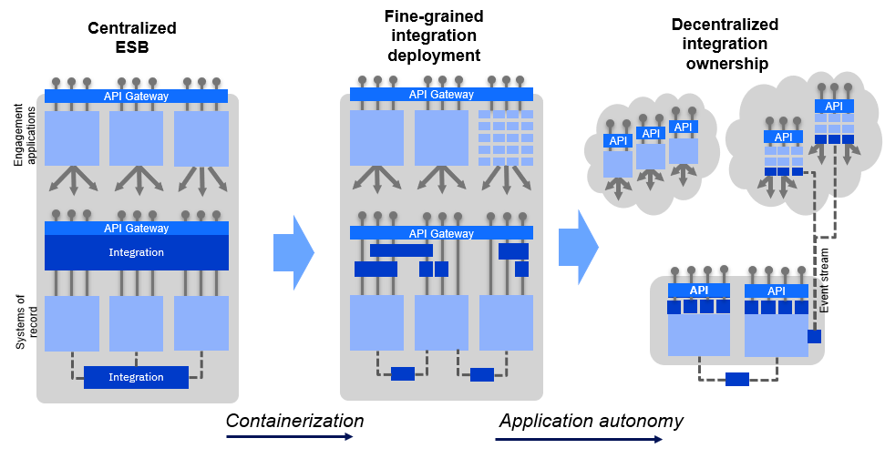 |

 

**Benefits and Resulting Changes with “Agile integration Architecture” Adoption**

“Agile Integration Architecture” adoption provide significant benefits to solve the Hybrid Integration problems additionally this architecture recommends following changes as well.

| **Agile Integration Architecture** |
| :-: |
| 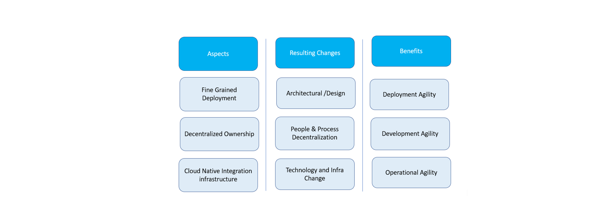 |

1.	**Architectural Change** – Instead of Centralized ESB Pattern to lightweight runtime using microservice architecture to provide deployment agility.
2.	**Technology Change**: Need of Container Platform to orchestrate containers and provide operational agility/excellence.
3.	**People/Process Change** – Due to decentralized integration deployment, need the distributed people and process to provide development agility. 

 

[Back to top](#top)

---

# 5. Key Considerations for Hybrid Integration 

While working in the multicloud and hybrid cloud integration, each cloud provider or non-cloud provider has similar challenges around how to surface or extract the data and  appetize and expose the data to other cloud or no cloud destination with the help of consistent integration solution.  

| Hybrid or Multicloud Challenges |
| :-: |
| 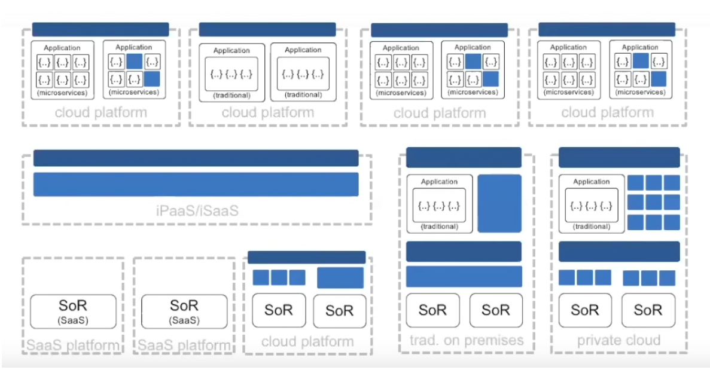 |

This aims to provide similar and consistent integration solution across Hybrid or Multicloud, provide better business collaboration and experience, and reducing cost for the customer.  

Please find below key considerations for Hybrid and Multicloud scenarios.

## Scope of Management  

This is one of major consideration which means "how much do you want to manage yourself (both in terms of apps and integration)”:
 1. Self Managed Pets (centralized/big bang) self managed deployment on on-premise
 2. Platform managed Cattles (lightweight) deployment on private cloud
 3. Fully managed PaaS / SaaS on private/public cloud. 

##  Network and Security (Identity and Access Control)

Each cloud provider / non-cloud provider has their own network and security solution. Considerations to deal such challenges as below:
 1. Choosing / bridging domains 
 2. Private, Partner, Public  
 3. Handling distributed IAM solution in hybrid / multicloud

## Data Sovereignty / Privacy  

Customer requirements around data sovereignty and privacy in hybrid / multicloud. Few considerations to deal such requirements as depicted below:
 1. Encryption
 2. Archiving /Deletion
 3. Legislative Information domains

 
## Ownership Boundaries

Basic considerations around application / solution boundaries.
 1. Application boundaries - How do applications sit within clouds and do they span clouds?
 2. Application between Clouds or within Clouds: if an application is partially migrated to cloud, how this is going to be managed? 
 3. Different boundaries at each level: between customer and vendor, then between groups within customer at each level
    - Infrastructure level 	
    - Platform level 	
    - Software level

## Portability 

This helps enable the hybrid and multicloud deployment. This is important consideration as depicted below:
 1. Cloud native principles
 2. Orchestrated containerization
 3. Image based deploy 
 4. Write once deploy to any cloud (cloud agnostic)
 5. Distributed deployment

 
## Asynchronous Transport Backbone  

This is going to important aspects to integrate hybrid / multicloud to address latency, performance and high throughput applications using asynchronous cloud messaging while synchronous connectivity and batch integration still valid in appropriate scenarios/use case. Few considerations for asynchronous messaging/transport.
 1. Messaging vs Events
 2. Event Replication
 3. When/Where to aggregate
 
## Latency

This is going to be one important consideration when application or data are located in different data centers/region on hybrid / multicloud, can bring latency in integration solution. This needs considerations as below:
 1. Data location
 2. Data replication close to consumer  
 3. Distance / Bandwidth
 4. Caching / Local data optimization 
 5. Reducing layering, but keeping isolation and abstraction 
   
 
## SaaS Integration  

With hybrid / multicloud adoption, customer are started moving from self managed enterprise solution to cloud managed SaaS solution, which required below considerations for integration solution:
 1. Cloud App Connectivity
 1. Business data aware Connectors
 1. Out of the Box Integration Patterns

## Monitoring and Operations  

With hybrid / multicloud adoption, customers' workload are distributed across cloud / non-cloud destinations, which required integrated monitoring and operation-based solution. Here are few considerations as below:
 1. Viewing and diagnosing across boundaries
 2. Collation and aggregation of logs across and end-to-end solution

## Migration and Modernization  

This aspects required to understand with respect to application refactoring/modernization to move on, and/or between clouds. Following considerations for integration solution associated with impacted applications:
 1. Co-location and isolations of integrations with its applications
 2. Lightweight integration services
 3. Lift and shift or refactor

## Decentralization

In distributed hybrid / multicloud environment, integration solution required to be distributed and decentralize to solve the below problems:
 1. Federated management of runtimes and gateways
 2. Simplifying cloud to ground hybrid solutions
 3. Solutions spanning multiple clouds

## Need of  Integration Platform as a Service (iPaaS)

Currently customers are using Enterprise Service Bus, enterprise messaging middleware, batch or ETL solutions to solve the enterprise wide integration problems. This is not going to solve integration problems in hybrid / multicloud environment. This arise the need of below considerations:
 1. Diverse integration capabilities 
 2. Cloud readiness integration platform
 3. Simplified self-provisioning of integration capabilities 
 4. Simplified governance of integration services 
 5. Low code and no code tooling for new line of business users 
 6. Cloud services applications development and execution 

 

[Back to top](#top)

---

# 6. Hybrid Integration Characteristics and Features

To solve the new/modern systems integrations problem with traditional systems integration problems, hybrid integration requires broad integration framework. It seamlessly bridges all owned environments, whether direct data sources, applications, or APIs, and can connect to them wherever they might be on-premises, IaaS, PaaS, or SaaS.  

| **Hybrid Integration Features** |
| :-: |
| 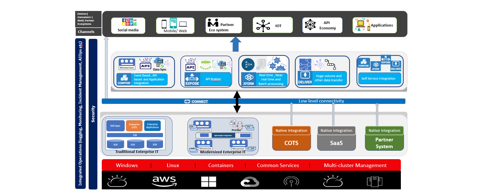 |

Hybrid integration must contain **broad connectivity capabilities** for modern cloud-based applications and to equally critical, but older systems of record (SOR). It must have tools to simplify and accelerate productivity, such as flexible and fast mapping and transformation. From a non-functional perspective, it must also provide **enterprise-grade and Internet-grade scalability, security, resilience and Integrated operations**. Here are Hybrid Integration characteristic and features as discussed below.

## Compose 

Compose features majorly focused to solve the **integration needs within digital applications or system of engagements**. Today Customer are planning to modernize their monolith applications using microservices architecture. While modernizing applications, Business functionality would require **composition of number of cloud-native/microservice applications**. This can be achieved using different patterns like **APIs based integration and Events-based integrations**.  There could few more use cases aligned to this characteristic like data synchronization from System of Records (SOR) to modernized applications and embracing data from external/SaaS Applications.

## Expose

Providing **customer-focused APIs exposure** to external innovators to rapidly create disruptive applications and open new business channels with **API Economy**.

## Connect   

This brings the capability to handle **low-level integration** with Enterprise /COTS applications and different data sources using provided connectors /adapters. This feature also support the connectivity using different protocols and open standards like REST APIs, SOAP WS, HTTP APIs, MQ. This feature can help to achieve complex integration requirements like data routing, data transformation, data sync, etc.

## Transform

As Line of business (LOB) and digital teams has evolved to deliver the engaging channel applications majorly due to digital transformation. Such team are known as shadow IT Line of business team (LOB) or Digital Teams, which does not have deep integration skills. This needs **Low code/no code tooling** to simplify and accelerate integration team’s productivity with **flexible and fast mapping and transformation** features.

## Deliver

Due to new trends, customer is adopting new architecture, new technology trends, cloud adoption, infusing artificial intelligence, involve in digital transformation for ex- providing responsive and customer centric digital channel applications for mobile, web etc. All these different trends, generating **very huge volume of data** like terabyte, petabyte which required to **transfer at very high speed**.

## Self Service Integration

This is generic features across all the above features to address the self-service demands for Line of Business (LOB) Team to **simplify and accelerate the productivity**.  

 

[Back to top](#top)

---

# 7. IBM Approach for Hybrid Integration

## Evolve to Agile Integration

Agile integration is an approach that breaks a centralized monolithic integration component, such as an Enterprise Service Bus (ESB), into smaller fine-grained independent components. Those smaller components can be dropped into the architecture seamlessly and removed or updated without disrupting other components. 

Agile integration is “a container-based, decentralized and microservices-aligned architecture for integration solutions.”

## Rethink Ownership

As the number of digital channels grows and the variety in their back-end service consumption increases, the ownership of the integration layer becomes less centralized and shifts to the application layer. 

| **Ownership** |
| :-: |
| 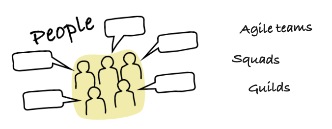 |

## Access Fine-grained Data via APIs

Tailor the data you expose to external third-party developers, to business partners, and to internal departments within your company. Developers can readily use standard APIs to build their own business objects. 

| **API** |
| :-: |
| 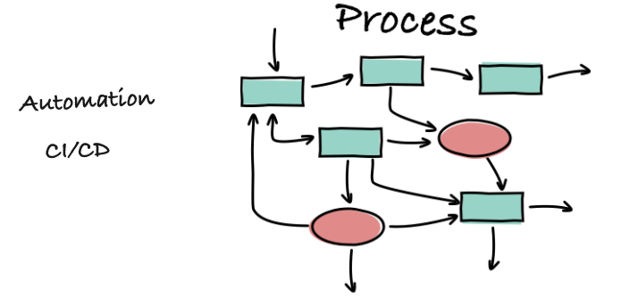 |

## Scale with Lightweight Integration Runtimes

With the advent of virtual machines, containers, and container orchestration, you can break the centralized ESB pattern into smaller, more easily managed independent pieces. 

| **Scale with Lightweight Integration Runtimes** |
| :-: |
| 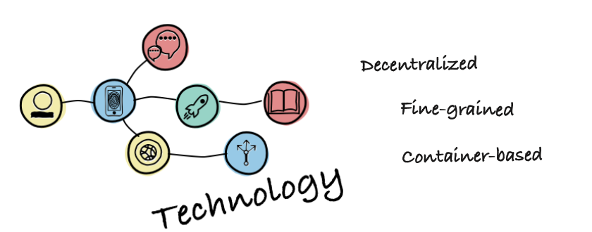 |

Agile integration is defined as “a container- based, decentralized and microservices- aligned architecture for integration solutions.”

## Assets

There are number of IBM assets to accelerate the Hybrid Integration engagements:

### IBM Reference Architecture for Hybrid Integration

IT environments are now fundamentally hybrid and multicloud in nature; and because of the growing need to connect heterogeneous endpoints in various locations, a hybrid multicloud integration platform is crucial.

Companies that adopt cloud applications view application integration as the critical component to harmonize business processes across their hybrid multicloud applications. 

Scenarios of hybrid cloud integration include these examples:
-   Viewing customer information between cloud-based Customer Relationship Management (CRM) systems and on-premises Enterprise Resource Planning (ERP) applications
-   Employee data integration between cloud-based human capital management systems and back-office applications
    
IBM's _Cloud application integration reference architecture_ shown below explores common patterns in enterprises that tackle issues that are related to a hybrid cloud environment:

| Cloud Application Integration Reference Architecture |
| :-: |
| 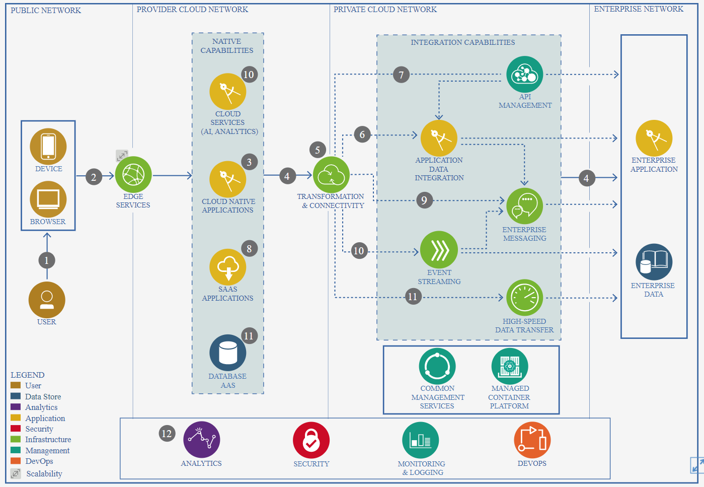 |

### IBM Garage Method for Hybrid Multicloud Integration Build 

IBM Garage Method for Cloud is a multi-step journey that delivers business value while driving towards standardization and simplification. 

| IBM Garage Method for Cloud |
| :-: | 
|  |

This brings the IBM way to address Hybrid Multicloud Integration journey. The method provides a streamlined approach to facilitate your hybrid / multicloud journey using predefined pathways and practices for Hybrid Cloud Integration.   
 
| IBM Garage Method for Cloud - Hybrid Integration |
| :-: | 
|  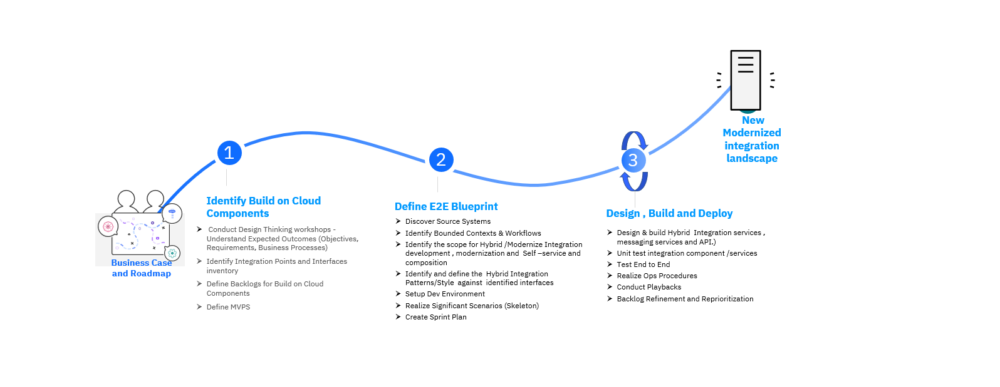 |

### IBM Hybrid Integration Platform

**What is a hybrid integration platform?**

[According to Ovum](https://www.ibm.com/account/reg/in-en/signup?formid=urx-39103){:target="_blank"}, a hybrid integration platform is “*a cohesive set of integration software (middleware) products enabling users to develop, secure and govern integration flows connecting diverse applications, systems, services and data stores, as well as enabling rapid API creation/composition and lifecycle management to meet the requirements of a range of hybrid integration use cases*.”

In other words, a hybrid integration platform should provide organizations with all of the tools they need to make it simpler and easier to integrate data and applications across any on-premises and multicloud environment. With data silos broken down, businesses have an incredible opportunity to turn their data into actionable insights, allowing them to make better decisions faster.   

Hybrid Integration Platform should also provide the below form factors:

 - **Increase efficiency**: The platform is low-code to employs to drive speed in integration development. In support of agile DevOps, the platform provides tools for test-driven development and automated continuous integration, continuous delivery (CICD) pipelines.
 
 - **Provide flexibility**: A distributed component-based architecture supports lightweight fine-grained integration services to enable microservices and on-demand runtime application-level composition and aggregation. You can build on open standards for quick innovation and assured compatibility across a diverse environment.
 
 - **Make the most of your investments**: It should provide support for integration in an architecture that is built on different cloud services from different cloud vendors and technologies and across many cloud deployment models, including public, private, and SaaS. It should also support for traditional integration styles and the ability to experiment with a containerized approach.

 

**What are the key capabilities to look for in a hybrid integration platform?**

Today’s integration teams need access to a mix of tools that allow them to balance traditional and modern integration styles. When evaluating hybrid integration platforms, here are the most important capabilities you should look to evaluate.

 1. **API lifecycle management.** APIs are among the most common styles of modern integration. Companies need to be able to create, secure, manage and share APIs across environments quickly and easily. 
 2. **Application and data integration.** Siloed data is one of the most critical problems organizations face when trying to digitally transform. The ability to copy and synchronize data across applications will help address a variety of issues, including data formats and standards.
 3. **Messaging and event-driven architecture.** Syncing and standardizing data is crucial, but if enterprises want to be able to build more engaging customer experiences or react to things in real-time, they need to have the ability to securely exchange that data across their ecosystem from any cloud-based to on-premise application. 
 4. **High-speed data transfer.** The sheer volume of data being exchanged in a modern environment can be staggering. In fact, by 2025, [IDC predicts](https://resources.moredirect.com/storage-optimization/idc-report-the-digitization-of-the-world-from-edge-to-core){:target="_blank"} worldwide data creation will reach 163 zettabytes per year. That’s ten times as much data as the world produced in 2017.

| Hybrid Integration Platform |
| :-: |
| 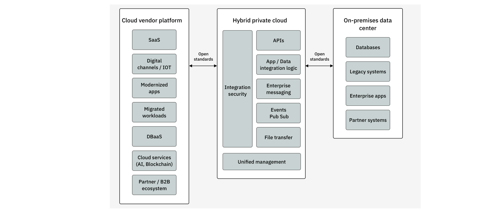 |
 
Until recently, hybrid integration platforms were mostly thought of as something that organizations needed to build by piecing together key capabilities from existing tools (like API management software, iPaaS and ESB solutions) from a variety of vendors into a cohesive system. This can be an expensive and cumbersome process. 

Instead, enterprises should consider complete solutions, like [IBM Cloud Pak for Integration](https://www.ibm.com/cloud/cloud-pak-for-integration){:target="_blank"}, which combine all of the capabilities required for both traditional and modern integration styles into a unified, containerized platform. Features like single sign-on, common logging, tracing, an asset repository and a unified dashboard help bring all of the capabilities together and make integration workflows more efficient.

 

[Back to top](#top)

---

# 8. Digital Integration

To help and accelerate the digital transformation journey using Hybrid Integration **Compose**,**Expose**  and **other features** as discussed in above sections, please refer to IBM POV for Digital Integration below.

Digital Integration is a transformation journey that requires business transformation, building new architectural layers, adopting new architectural patterns, modernizing & moving existing workloads, exposing existing processes/services as APIs: 
- Engage customers anytime anywhere
- Paradigm shift from business processes to customer journeys
- Offer a seamless customer experience beyond the original line of businesses
- Become agile to respond to market and regulatory changes
- Keeping innovation at the forefront - not just in business but also in technology (bringing new ideas to market rapidly)
- Extreme automation to reduce costs

Following image gives an overview of what it takes to become digital:

| **Digital Mandates** |
| :-: |
| 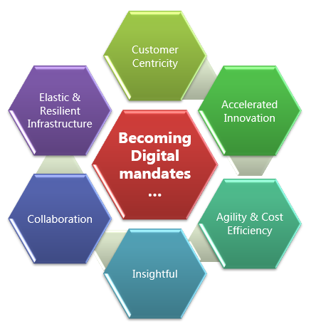 |

From an architecture & technology perspective this translates to:
- Building new architectural layers and patterns (Microservices, API, EDA, AI/insights)
- Modernization to remove impediments to rapid business transformation and innovation
- Adopting new technologies and development practices
- Reducing technical debt
- Exposing processes and data to partner and developer ecosystem to accelerate innovation (in a secure way ofcourse)
- Cloud migration/development
- Ensuring IT systems are resilient and available 
- Automation of software development processes

What it means is a holistic approach is required for Digital transformation. i.e.:
- Running siloed initiatives (e.g. enhancing systems of engagement, modernizing applications) is not enough
- Just developing systems of engagement will not realize the objectives of digital transformation
- There is a need for well-defined delivery practices, architecture and standards
- Services & API are the backbone of any digital strategy. 80% of the effort is in Integration to backend systems and Process Digitisation

**Key Questions to Ask** to better understand client's digital strategy and their progress before proposing changes or revamping their strategy:
- What is your modernization strategy?
- What is your cloud strategy?
- What is your API strategy?
- Are you modernizing your applications using Microservices architectural style?
- How are you handling co-existence?
- How are you doing DevOps?
- What are you doing in terms of business process transformation? How are you automating them?
- What is your integration strategy?

**Digital Integration Layer**

The core of any digital transformation program is the digital integration layer as depicted in the diagram below:

| **Digital Integration Layer** |
| :-: |
| 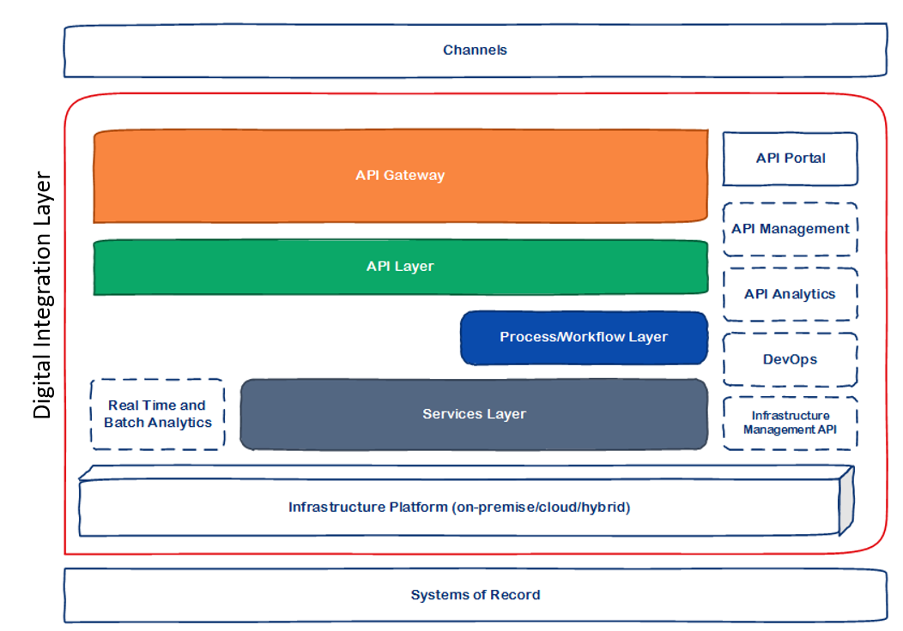 |

Following are the key capabilities that the digital integration layer should possess:

| **Digital Integration Layer Capabilities** |
| :-: |
| 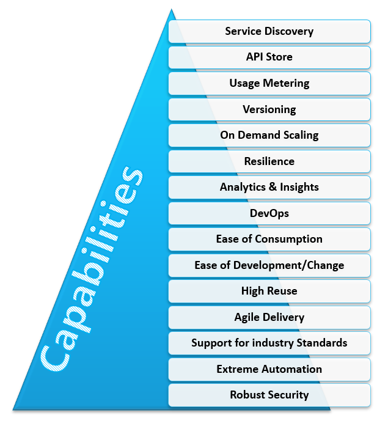

There are 4 main constituents of digital integration:

1. Business processes / Customer journeys
2. Microservices fabric
3. API 
4. Analytics (real-time and batch)

**Microservices Fabric**

Following is a conceptual view of the Microservices platform:

| **Microservices Platform - Conceptual View** |
| :-: |
| 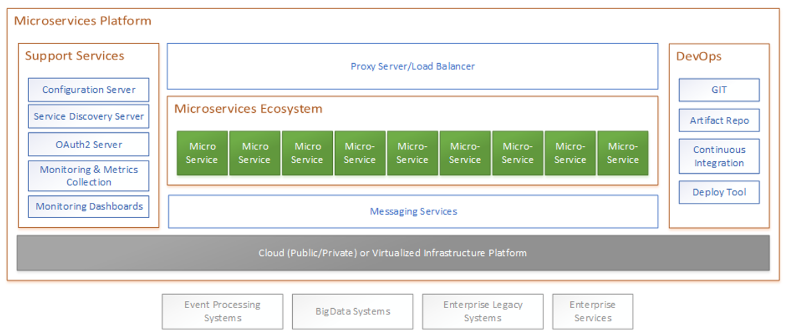 |

Microservices need to provide multiple ways of invocation. Primarily:
1. REST endpoints - these endpoints are then exposed as API endpoints on the API Gateway (or used to create APIs)
2. EDA or Stream data processing endpoints - microservices can be chained together to develop stream data processing logic

Following picture depicts a typical Microservice development blueprint with REST :

| **Microservices Development Blueprint** |
| :-: |
| 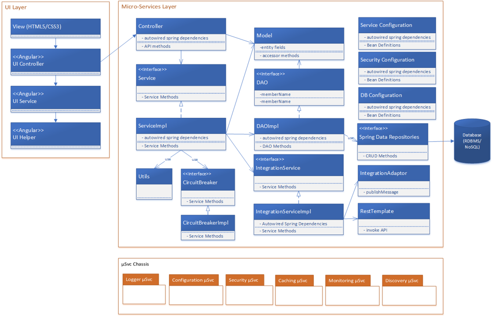 |

Following picture depicts a typical way in which microservices are chained together to build stream data processing logic

| **Streaming Data Processing** |
| :-: |
| 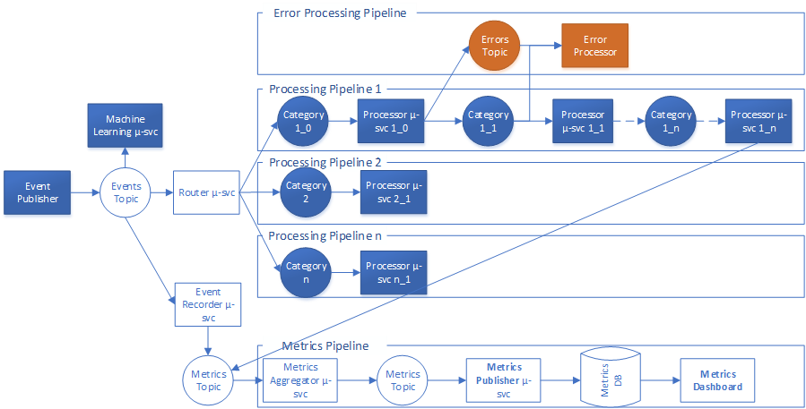 |
 

**DevOps**

Following picture depicts a typical CI/CD pipeline

| **DevOps - CI/CD** |
| :-: |
| 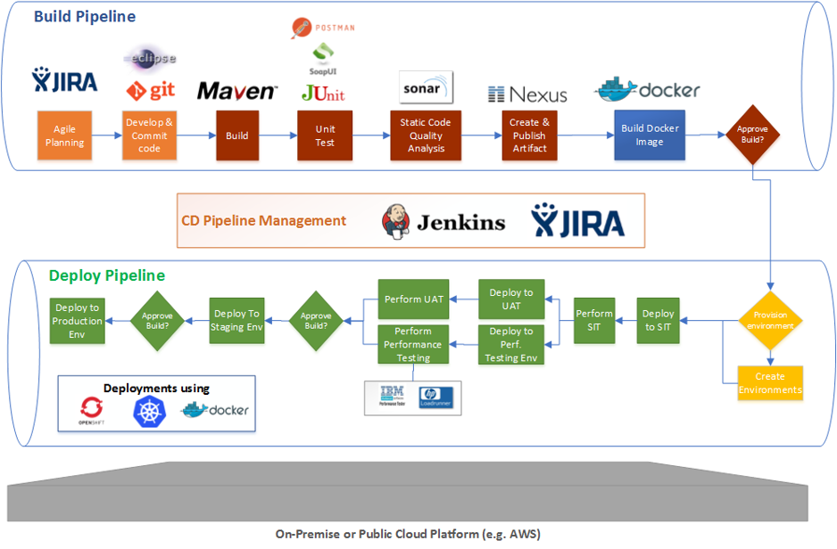 |

**References**

- [IBM Institute of Business Value white paper on Digital Transformation](https://www.ibm.com/downloads/cas/KWRV8QK6){:target="_blank"}
- [IBM's Smarter Business Microsite](https://www.ibm.com/in-en/smarter-business?p1=Search&p4=43700055523220409&p5=b&cm_mmc=Search_Google-_-1S_1S-_-AS_IN-_-ibm%20digital%20transformation_b&cm_mmca7=71700000068212243&cm_mmca8=kwd-296637289140&cm_mmca9=CjwKCAiAkan9BRAqEiwAP9X6Ub4zVyb4_WPv-DpOD2MUCHC4zbAuxZ-z4v3v0bWNmgUUqveMei0rzBoCYrsQAvD_BwE&cm_mmca10=446225946203&cm_mmca11=b&gclid=CjwKCAiAkan9BRAqEiwAP9X6Ub4zVyb4_WPv-DpOD2MUCHC4zbAuxZ-z4v3v0bWNmgUUqveMei0rzBoCYrsQAvD_BwE&gclsrc=aw.ds){:target="_blank"}

 

[Back to top](#top)

---

# 9. Hybrid Integration and Application Development Scenarios

Customer are going through the new application development and application modernization using containerized cloud native workloads due to new trends. While customer also have their legacy /traditional  systems with traditional integrations. There will be a coexistence, for certain amount of time, running modern system along with legacy system. Here are some scenarios for hybrid Integration opportunities (detailed scenarios and patterns are in the following sections).

| **No.** | **Client Scenarios** | **Integration Scenarios** | **Architectural Patterns** |
| :-: | ---------------------------------------------- | ------------------------------------------------------- | --------------------------------------------- |
| 1 | **Building new application on cloud** Customer is planning to develop a new application on cloud, integrating with channel applications. Customer is looking forward to solve the integration problems within the application boundary. | 1.[Exposing application/data using REST APIs](#integrations-with-external-applications-using-rest-apis).   2.[Cloud native application integration](#cloud-native-applications-and-integrations) | 1.[APIfication](#apification)   2.[Event Driven Integration](#event-driven-integration) |
| 2 |**Application modernization** Customer is ready to modernize their existing big application, so it started with portion of application to be refactor and ready to move on the cloud and remaining portion of application will be on premises. Customer is looking forward to solve the integration problems across hybrid cloud applications and within applications. |  1.[Co-existence integration](#integration-with-legacy-co-existence)  2.[Cloud native application integration](#cloud-native-applications-and-integrations)   3.[Exposing application/data using REST APIs](#integrations-with-external-applications-using-rest-apis).|   1.[Co-existence Integration](#co-existence-scenarios) |
| 3 | **SaaS Adoption** Customer is having System of Records (SOR) and Enterprise Applications in their landscape and adopting new SaaS based offering in their current Landscape. Customer needs to integrate their different applications and synchronize data between applications located on diverse platform. |  1.[Applications integration for cloud and ground connectivity](#hybrid--multicloud-integration). 2.[SaaS integrations](integration-with-saas) |  |
| 4 | **API Economy** Customer need to API enable Systems of Record / Core Systems and want to expose business functionalities as Public APIs for business partners. | 1.[Expose APIs for Consumers](#integrations-with-external-applications-using-rest-apis) | 1.[APIfication](#apification) |
| 5 | **Modernize Integration Landscape and ready for Cloud** Customer is using ESB Patterns and DataPower gateway in their current Integration Landscape and wants to be ready for cloud | 1.[Applications integration for cloud and ground connectivity](#hybrid--multicloud-integration)   2.[Expose APIs](#integrations-with-external-applications-using-rest-apis)   3.[Cloud native application integration](#cloud-native-applications-and-integrations). | 1.[APIfication](#apification)   2.[Event Driven Integration](#event-driven-integration) |
| 6 | **Upload and Ingest large Data Sets** Customer wants to migrate and upload volumes of data to cloud  **Replicate and Sync Data Sets** Customer wants to decrease RTO/RPO to ensure business Continuity and Prevent Data Loss. |  |  |

 

## Integration Scenarios

### Hybrid / Multicloud Integration

Application integrations are key to streamlining enterprises business processes and enabling data movement across systems. 

As part of digital transformation initiatives, enterprises are adopting cloud computing to take advantage of the optimization and flexibility the cloud platforms and providers bring to the table. Application workloads are moving to cloud platforms. This will often result in a hybrid cloud target state for enterprises. Public clouds (such as those from IBM, AWS, Azure or Google), SaaS solutions, private clouds, in-house container platforms and traditional data centers are all part of this mix. 

A hybrid cloud target introduces the following new integration patterns:

 1. Intra cloud - Integrations between applications in the same cloud platform.
 2. Inter cloud - Integration between applications deployed in different cloud platforms as well as applications in cloud and SaaS solutions.
 3. Cloud to on-premises - Integration between core Systems of Records (SOR) that are on-premise, and application deployed on a Cloud through integrations platforms like an Enterprise Service Bus (ESB).

We are majorly focused here for point-2 and point-3 in this scenario:

| Hybrid / Multicloud Integration |
| :-: |
| 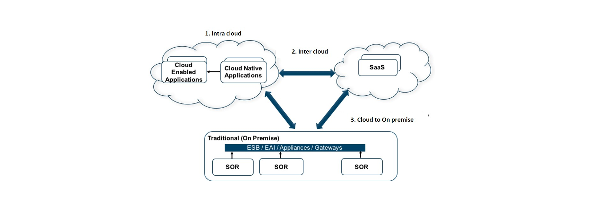 |

There are few considerations for Application integration distributed across various cloud providers or on-premise or on-private clouds:

 1. Enterprise Integration landscape has evolved from Point-to-point  to Enterprise Application integration(EAI)  middleware  to Service-oriented-Architecture(SOA). The Fact is major enterprise is using Enterprise service bus, enterprise Messaging queuing  or File based solution  for solving integration problems . Their integration Landscape should be ready to talk with Hybrid/Multi cloud platform, applications or data.
 2. Need a transformation of Integration landscape for cloud readiness and able to fulfill cloud related requirements agility, scalability and resiliency.
 3. Need cloud application connectors to enable connectivity with different SaaS applications . 
 4. Need the capability to connect between Cloud and On-premise/ground  applications . 
 5. Simplify exposing business functionalities/data using REST APIs. 
 6. Support all the integration patterns as APIs, Events and File based and support interaction/integrations with cloud messaging middleware and API Gateway solution. 
 7. Hybrid/Multi Cloud have their own security solution for authentication and authorization. How to integrate these security solutions for authentication and authorization? 
 8. Support distributed and decentralized integration solution to full fill Hybrid / Multicloud targets.

### Integrations with External Applications using REST APIs

An API (Application Programming Interface) is a software intermediary that allows two applications to talk each other. With the help of APIs, digital experience is growing very fast, such as booking a hotel room, booking rental car, downloading software, etc. 

REST APIs are the access standard for new application projects and enablement of digital business. As adoption and demand for REST APIs proliferated, there was a significant recognition across enterprises that REST APIs and API Management have a important role in integration. These business REST APIs also helps to create new revenue channels for businesses. 

| APIfication |
| :-: |
| 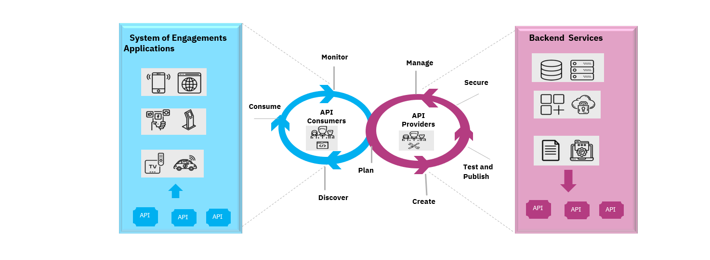 |

Please find below the following requirements for APIs based integrations:

 1. Need to provide the APIs documentation (details of the functionality offered by APIs)    
 2. Have a dependency on the performance and availability of the API  
 3. API Lifecycle management and version control  
 4. API Usage Controls (rate limiting / traffic controls) 
 5. Appropriate security controls (who can use what ?) & specialized security features for encryption/decryption, redaction, etc. 
 6. Easy discovery of APIs for consumers

 

**Business Benefits of an API Driven Strategy**
 - Reduced Costs and time to Market: One of the main benefits of an API-driven strategy is a reduction in development effort and faster time to market. Embracing and leveraging APIs helps businesses save money and resources and focus on other unique functionalities to deliver for applications/solution. 
 
 - Superior Digital Experience: APIs will be consumed to build solutions across any channel, this creates better and more engaging experiences for any audience, whether that be for customers, partners or your employees. APIs can help to enable the delivery of services such as personalization, data collection and integration. 
 
 - Enablement of New Technologies: Modern application architecture of cloud services, IoT devices and new technologies rely on APIs. According to an article by [Gartner](https://www.gartner.com/smarterwithgartner/the-road-to-the-api-economy/){:target="_blank"}, “APIs are now central to application architecture because they enable loosely coupled integration, as well as being the data conduits behind mobile apps and many IoT devices.” This also can empower internal innovation by providing the agility and flexibility needed to do so.

With integration modernization to cater the need of distributed API provider/backend on public / private or cloud providers, there has been shift from SOA exposure (single gateway) to distributed and decentralized API exposure.

| API Management |
| :-: |
| 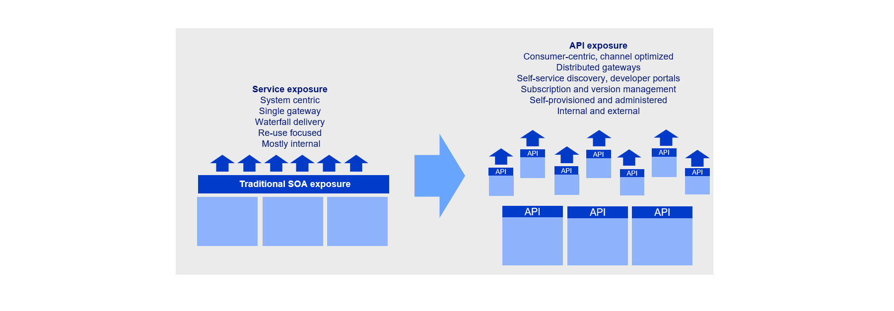

### Integration with SaaS

An organization's shift to public/private cloud is a significant and disruptive event that showcase, customers has started moving their workload from on-premise to cloud as System of Records (SOR) / Software as a Service (SaaS) / Modernized applications for optimization and flexibility.   

So, what is SaaS, and what good does it do?

It’s a method of software delivery where applications are hosted remotely by a vendor or service provider and are made available to customers over a network. Simply put, users rent the software instead of purchasing it. Most SaaS providers offer a usage-based subscription that can be purchased on a monthly or yearly basis, such as Salesforces (CRM ), SAP S/4 HANA, ServiceNow, Workday, etc .

As a cloud adoption use case, when there is a decision to decommission an older legacy application, replacing it major SaaS application, a ripple effect occurs impacting all applications that interacts with the legacy application.   

| Saas Integration |
| :-: |
| 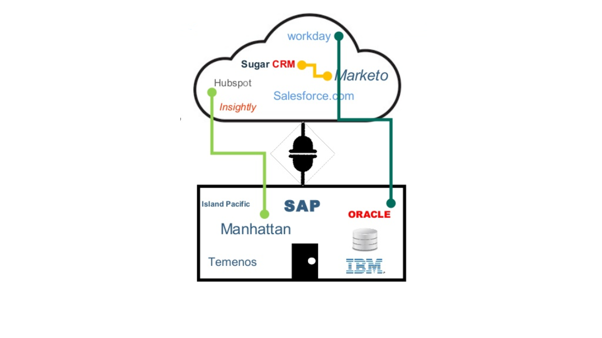 |

Please find below considerations for integration with SaaS applications:

 1. Integration Bus will not be sufficient or capable of mediating cloud originating integrations services request without use of gateway capability. 
 2. Integration architecture/solution need to be refactored or extended further .For example, web services interacting with legacy application earlier, may need to be extended to include the REST APIs to support the formats required by SaaS applications.
 3. Such integration solution might require SaaS application cloud connectors to support the different integration styles and business data formats.
 4. Such solution provide the low/no-code integration tooling for business/shadow integrator.
 5. Such Integration scenario need to address the on-premise and cloud based security (IAM) requirements.
 6. Such solution can address the data migrations between SaaS and on-premise applications.
 7. Using ETL or FTP to Synchronize application data is not secure enough between a datacenter and cloud application. Such requirements leads to cloud-optimized data integration software.
 8. For reliable integrations between Data center and SaaS application, arise the need of reliable messaging and improved error handling. 
 9. Shift from high speed LAN to fast broadband connectivity between on-premise and Cloud or multi-Cloud to provide low latency integrations.  

Enterprise need to add new integrations capabilities like Integration Platform as a Service (iPaaS) / Integration Software as a Service (iSaaS) to address cloud to ground application integration with the help of prebuilt SaaS connectors and highly performance data synchronization / replication capabilities as cloud ready application integration stack. 

### Integration with Legacy (Co-existence)

Organizations rely on core applications that maintain system-of-record (SOR) data on the legacy systems like mainframes and ERP systems. The transactional and batch applications running on these systems have organically evolved over time, reflecting the accumulated changes in a business and its requirements.   

Given the importance and history of these applications, apply a high degree of due diligence needs to be done for their modernization and evolution. Businesses are often risk-averse and avoid modifying their aging business-critical applications. So to mitigate these risks, business aligned modernization is done incrementally and iteratively. 

| Incremental Modernization |
| :-: |
| 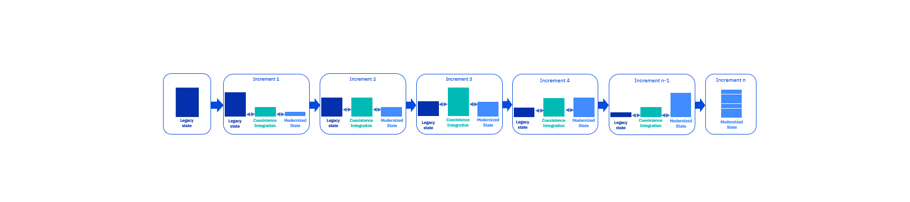

Coexistence is a by-product of incremental modernization to deliver modernized functionality into production in controlled risk adverse manner. This is a transient layer, which bridge legacy and modernized states and responsible for owning the complexities and gaps for smoothly conversating these two states.  

| Co-existence Integration |
| :-: |
| 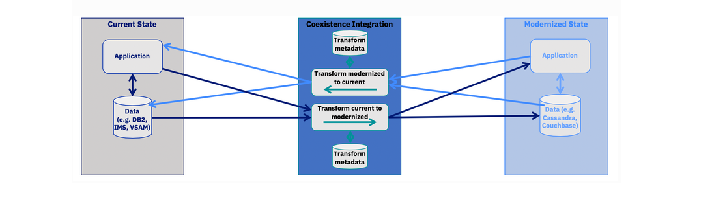

Please find below considerations for co-existence integration layer:

 - **Data**: As Data is fragmented and distributed across the legacy core and modernized core, there is high need of data consistency across these two components for example if there is any changes on modernized data, this needs to be replicated or synchronized or reconciled between two cores or vice versa.

 - **Data Mapping and Transformation**: As business functionalities started moving from legacy to modernized core, for conversation between legacy and modernized systems, coexistence integration services would need the data/interface mapping and transformation for moving data from one system to another as well as legacy system component changes can be minimized or avoided.
  
 - **End to End Transaction Management**: Business functionalities are distributed on legacy and modernized core. Co-existence layer needs to two cores to make the end to end transaction complete and successful. For example, transactions originated on modernized core needs to talk to legacy functions to get it completed or vice versa.
	 
 - **Non-Functional considerations**: Co-existence layer should address the non–functional aspects in alignment with modernized as well as legacy core. These non-functional aspects like performance, security, availability. For example:
	 - Data latency and performance while conversating legacy and modernize for various transactions
	 - Availability of this solution to avoid the impact on functional data flow between two systems

 - **End to End Security**: As Business functionalities started modernizing which evolves the need of end to end security aspects to be looked closely. For example:
	 - New integration touch points which required to be secured
	 - Consistent Identity provider solution across two cores 
	 - Varied Authentication and authorization solution across two states
	 - Data needs to be secured in flight or at rest 

 - **End to End Operation Management**: As end to end solution, spread across legacy and modernized cores, should provided end to end operational support through  integrated technical and business support solution with the help of co-existence layer. 

 - **Interception between current/legacy or modernized core**: In incremental modernization journey, business functionalities/sub-functionalities can be distributed and available on both legacy and modernized cores, incremental functionality switchover required, traffic/workload to be distributed between two system. 

 - **End to End Functional Flow Testing**: In progressive and iterative modernization journey, when incremental business functionalities are designed and modernized while other functionalities are already alive on the legacy. Functional flows or business processes are required to be end to end tested to ensure the expected outcomes in different modernization phases without any breakage. 
 
 - **Deployment Techniques**: Consider incremental modernization use cases deployment aspects, such as: 
	 - Does functionality switch of from legacy and switch on other side fully?
	 - Does functionality require to be incrementally available or specific workload routed on modernized state and keep incremented the load for same?

 - **Cost and budget**: As this is transient layer and will not be required once legacy core is fully transformed, so cost is one of major consideration while planning and design this layer in any modernization journey.

### Cloud Native Applications and Integrations

This scenario focus on new application architecture such as cloud-native / microservices that companies are using to modernize your applications to enable faster innovation and drive the digital transformation by composing business applications. Microservice applications are not built in isolations. They need access to data, and they need to be made available to other applications. 
   
Here are some use cases:  	 
 - Microservices needs to interact with other microservices  within the application
 - Process automation using microservice based applications/cloud native applications
 - Synchronizing System of  records (SORs) with modernized applications/data store

To enable innovation at this pace, business must be able to compose new applications / modernize applications using number of integration patterns as events / event-streams based interaction and APIs based interaction.  

| Business Composition |
| :-: |
| 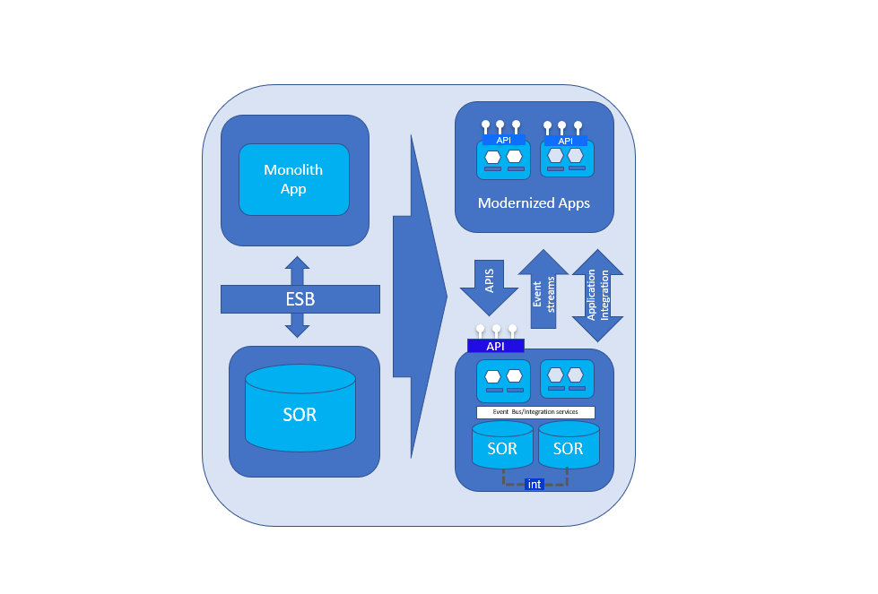  |

Key considerations/elements of cloud-native application integrations:
  
 - Modular components: Small, loosely coupled and minimal interdependencies. This enable greater agility and optimization of resources.
	   
 - Prefer stateless: Components can be re-created by starting a fresh copy of an image. This provides smooth scalability and reduces environment configuration divergence.
	 
 - Image based deployment: Lightweight file based packaging of all interdependencies into an immutable image. Enable simpler re-creation of environments. 
	
 - Lightweight runtimes: This runtime starts and stop in seconds or less, reacts instantly to workload demands.
	
 - API-led intra-app communication: APIs for communication among modular components of the application. This enables common routing and load balancing and use of polyglot of runtimes types.

 - Event driven architecture: Asynchronous patterns where runtime de-coupling and system reliability is required. This improves availability, reduces response time and helps to reduce latency issues. 
	 
 - Elastic and Cloud agnostic infrastructure: Self service, self-scaling and self healing infrastructure that runs all the workloads in the same way .

 - Continuous Integration and Continuous Delivery and Deployment(CI/CD): Automation of the building, testing and deployment of code to the different environments. 
		  
 - DevOps: Near merging of development and operations. Ensures route to live is short and feedback from production is correctly prioritized.
 
 - Agile methods: Short, business-led iterations from requirements to implementations. Keeps the direction of travel in line with business expectations. 

### Self-Service Integrations

Integration is no longer preserve of a central dedicated team of integration specialists. Different people in more diverse role are now involved in performing integration, and there is a significant shift towards the lines of business solving their own integration challenges.  

| User Community |
| :-: |
| 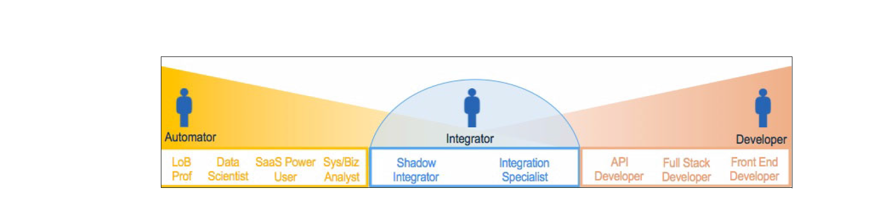 |

Self-service integration tools allow shadow or non-Integration specialist to connect apps and services in an intuitive and step-by-step experience without much experience and training. 

| Self-service Integration |
| :-: |
| 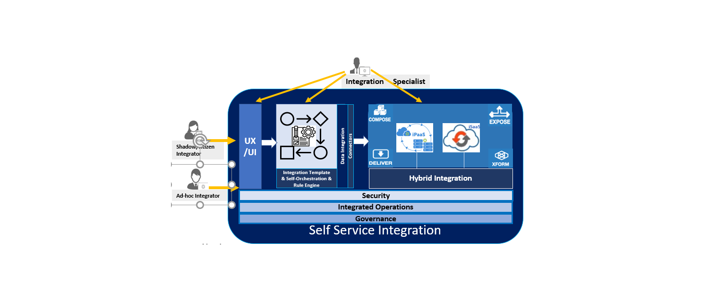

Please find below considerations for self-service integration:

 - There has to be low code / no-code based integration tooling available, which can be simply used to connect app and data without much experience and training.
 
 - Application Adapters/connectors should be able to connect with native Integration layer of new applications/SORs. The connectors should leverage one or more of the hybrid patterns (API, Event Driven) considering API Management tools & services, MQ, Event Stream based on candidate system/application.
   
 - Consider app/data Integration (protocol, data format, data mapping) & transformation to address polygot technologies and SORs.Ensure that data from new applications are supported by XForm (ETL/ELT process) adopted by the self-service integration platform.
 
 - The platform and its connectors should support protocols like JSON, RPC, HTTP, HTTPS, SOAP.
 
 - A lightweight data integration layer should be used to enable / enrich connectors for seamless integration with external systems and their diverse data types.
 
 - The major components of self service integration platform – UI, Connectors, workflow orchestration engine and data integration shall be built using Microservice pattern.
 
 - Use lightweight technologies like Springboot, Node.js, Angular. This will help with faster spin-up of containerized microservices built with docker optimization approach(fast build time, smaller image size, etc).
   
 - Ensure integrators are able to visualize a personalized dashboard of their individual integration journey.

 - The Deployment of platform components/features(e.g. Templates, Connectors, UI changes, workflows) should be GitOps enabled.
   
 - The platform should be able to scale dynamically based on number of integrators, no. of applications to be integrated and load volumetric. The containerization of platform components and following of 12 factor principle during design/build time is key  to scalable, resilient integration system.
 
 - The integration patterns must ensure that data in transit are encrypted and securely transferred.

 

## Architectural Patterns 

### APIfication

| APIfication |
| :-: |
| 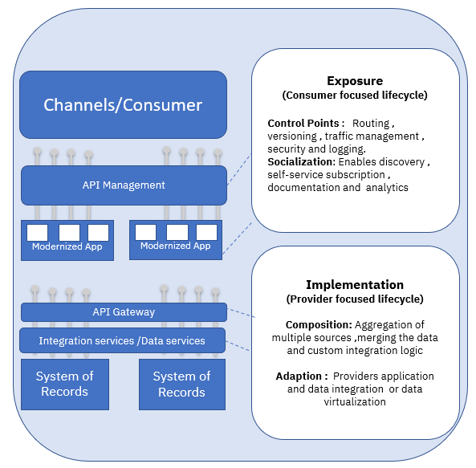 |

- APIfication offers functionality and data as a service for other systems to use. It opens up new ways composing and exposing existing functionality.
- An API hides the actual implementation and reveals only the simplified interactive model to the user.

- APIFication can be done in a _proactive_ or _reactive_ fashion:
	- **Proactive**: This includes defining the API interface first, based on forecasted need of the end consumer and then implementing it.
	- **Reactive**: This includes upfront implementation followed by a continuous definition of new interfaces on top of this implementation, based on the emerging needs of end consumer and then implementing it.

- **Benefits of APIFication**:
	-   **Cost reduction**: APIs promote and increase  service reuse. They provide a usage-based evolutionary development platform.
	-   **Increased agility**: APIs offer integration with any technology stack, so they enable greater productivity for developers.
	-   **Increase innovation**: By enabling others to build applications that integrate with their captive data and processes, companies see new applications that use their services in new contexts.

### Event Driven Integration

Event-driven architecture (EDA) is a common pattern that involves production, detection, consumption, and reaction to events.

| Event-Driven Architecture (EDA) Workflow |
| :-: |
| 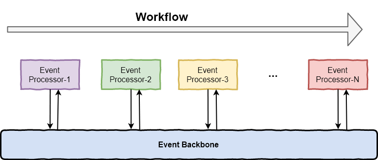 |

Event Driven integrations are *triggered by an event* in one system and trigger a predefined corresponding event in another. An event can be anything that happens in a particular system that you've integrated with, such as e.g. order creation in online shopping, lead creation in a CRM, a new registration received, etc.

Event driven integrations are suitable for *functional integration*. It is not a direct candidate option for syncing all data quickly and easily. 

Event driven integrations are suitable for simple point to point data transfer when certain events take place in a system and you want to trigger corresponding actions in the other system.

**Enabling Event Integration for Legacy Systems**

There are older systems which are not enabled to accept and act on events. You can choose to write **event adaptors**. These event adaptors intercept incoming events and pass them to the backend system in the native format. They then receive response from backend systems and put an optional outgoing event too.

| EDA Adaptor |
| :-: |
| 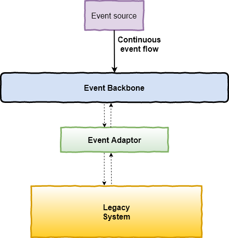 |

**Event Driven Data Synchronization**

Data Driven integrations have a different action that triggers synchronization. This action is a *change in the data* that you have in place in either system. This can be a *new record created* or a *change in an existing record* and more. 

| EDA Integration |
| :-: |
| 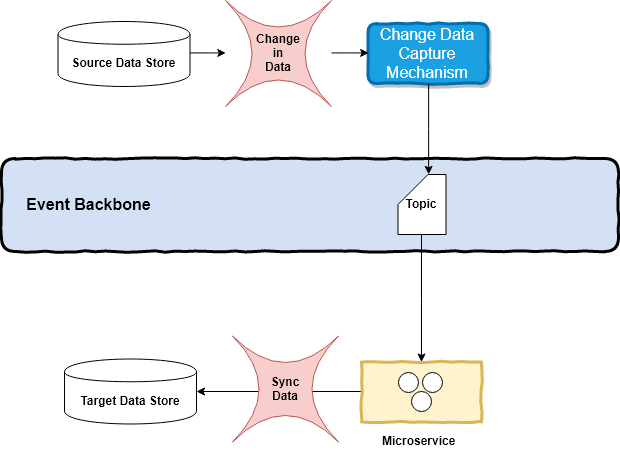 |

Any change in data will trigger a sync operation of the *delta in the data* to the other system(s). For example, a new entry in the order fulfillment system should trigger an update in the CRM system to reflect the customer’s order history.

Even driven data integration makes easy to achieve an enterprise-class type of integration with easy setup and maintenance.

One example of data synchronization is necessity to access data located in the on-premises data center from an application deployed in cloud. Data driven event based integration can come to rescue here. You can add a change data capture mechanism in front of the legacy datastore which can publish the change-sets of the data in order to synchronize your datastore in the cloud.

Data driven integrations are suitable for integrations with systems where you want to keep your data in sync regardless of the event that takes place.

### Co-existence Scenarios

Modernization of monolithic application to microservice based application needs monolithic & modern application to co-exist until the modernization is complete. To facilitate this co-existence, a co-existence integration layer needs to be built using various integration patterns across on-premise and cloud. 

Thus, the co-existence layer is a by-product of incremental modernization to deliver modernized functionality into production in controlled risk adverse manner.

Co-existence supports multiple patterns for the incremental modernization in both the scenarios listed below:

#### Scenario 1: Current state reads from and writes to modernized data

| Current state reads from and writes to modernized data |
| :-: |
| 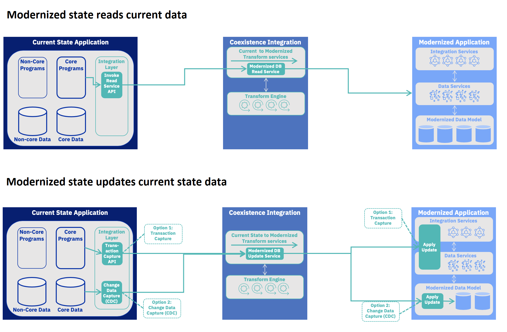 |

- Current state datasets are decommissioned; and the data is completely moved to the modernized state with its access is guarded by the domain/data services designed around that dataset. The current state reads and updates this data residing in the target state.
- This pattern can be used when modernized data to current state data transformation complexity is minimal and performance requirements are relaxed, thereby allowing real time transformation for reading & writing to modernized data from the current state.

- **Examples** : 
	- A status code, indicator, or flag value is needed on the current state that was transformed into a new value set when loaded to the modernized data model.
	- A complex batch job, in part or is not modernized along with a given modernization roll out, but a status code or aggregated value needs to be transformed and updated on the modernized database since the current state equivalent table was decommissioned.

#### Scenario 2: Modernized state reads and writes to current state data

| Modernized state reads and writes to current state data |
| :-: |
| 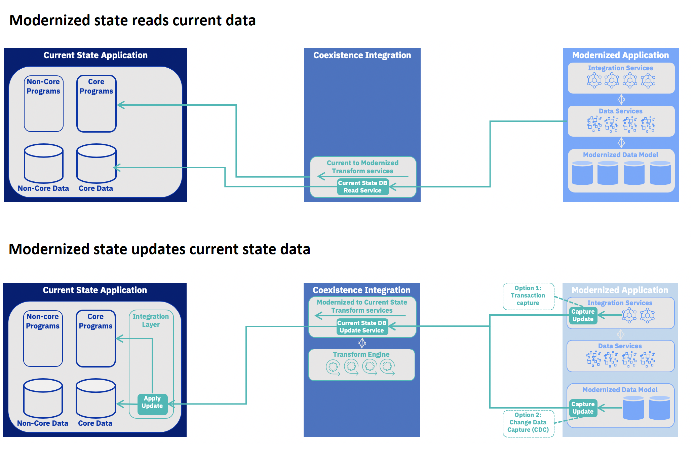 |

- Modernized data needs a subset of data from the current state (e.g. master data). A functionality is moved incrementally and the modernized data needs to update a subset of data from the current state.
- This pattern supports incremental modernization roll out where modernized data and current state data can be brought together in context within the modernized application.

- **Examples** : 
	- The modernized solution needs customer data reflected in the modernized user interface that has not yet been added to the modernized data model (e.g. customer name).
	- Critical business owned applications need replica of current state key data that cannot be changed in the timeframe planned for a given modernization roll out.

### Coexistence: Data Management Patterns

#### Change Data Capture

| Change Data Capture |
| :-: |
| 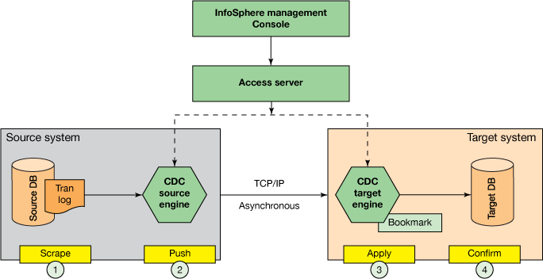 |

- CDC is an approach to data integration that is based on the identification, capture and delivery of the changes made to enterprise data sources. This pattern is used to replicate legacy application's state to modernized application(s).
- CDC can be used when changes to core programs at the source state are not feasible or yet to be planned.
- It is a set of software design patterns used to determine and track the data that has changed so that action can be taken using the changed data.
- CDC could be implemented in both unidirectional and bidirectional data synchronization.
- CDC occurs often in datawarehouse environments since capturing and preserving the state of data across time is one of the core functions of a data warehouse, but CDC can be utilized in any database or data repository system.
- CDC can deliver the change logs to target databases, message queues, or an extract, transform, load (ETL) solution.
- CDC is mostly supported by out-of-the-box technical components without any changes to core programs.

 

#### Transformation & Filtering Engine

| Filtering Engine |
| :-: |
| 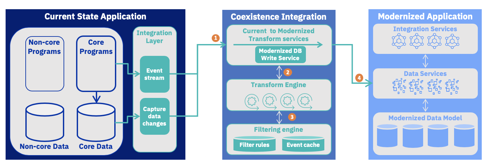 |

When an event driven integration approach is followed, there could be lot of unwanted events being raised. 

This pattern helps to reduce this noise and process only relevant events by applying transformation and filtering rules and caching processed events.
    
-   Filtering and transformation rules are used to:    
    -   Drop irrelevant events (i.e. CDC might send everything)
    -   Set event destination
-   Event cache is used to:    
    -   Filter out duplicate events
    -   Aggregate low-level events
-   Transformation engine is used to:
	- Apply event transformation logic   
	- Applying data transformation rules, splitting complex events and aggregating low level events
	- Defines destination for transformed events

 

#### Data Adapters

| Data Adapters |
| :-: |
| 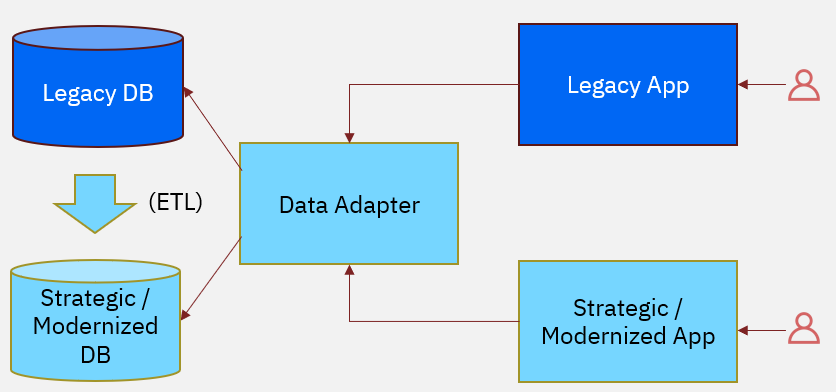 |

- Data Adapter Pattern is used in data consolidation scenarios to incrementally move the data traffic from legacy source / targets to strategic / modernized source / targets.
- This pattern provides flexibility to modernize both legacy data source and data target platforms independently and incrementally.
- Data Adapter is capable of consuming data from both legacy and modernized data sources, and is configurable to send all data to either legacy DB or strategic / modernized DB or both.
- During the coexistence state, the data adapter can be configured to send all data to both legacy and strategic / modernized databases.
- Upon successful data reconciliation, the Data Adapter can be configured to send data only to the modernized DB (target state), allowing the business to discontinue legacy databases and legacy application sources.

**Benefits**
- No changes to legacy and strategic / modernized data sources & targets.
- Data sources and data targets can be modernized independently and incrementally.
- Ability to reconcile data during coexistence elevates confidence with modernization.
- Ability to fallback to legacy systems, lowers business risk.

 

#### Data Virtualization

| Data Virtualization |
| :-: |
| 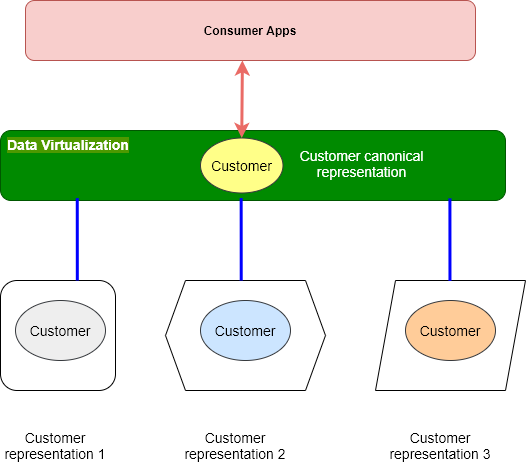 |

- One of the primary problems that clients face is how to provide a "unified view of data" across regions. 
- Most of the companies have grown as a result of acquisitions of regional companies that in many cases operate independently and maintain their local IT infrastructure. There are data model mismatches, different levels of granularity when representing the same entity, and different interfaces and protocols to access the same kind of information, making difficult to achieve a unified view of data.
- To solve these issues, _data virtualization_ provides an abstraction layer that keeps a unified and common representation of the business entities, in the form of a Canonical Business Model that can be consumed by all the enterprise applications regardless of the underlying data schemas in every location.
- It helps customers capture data from multiple data sources and allows them to be treated as a single source, delivering the right data in the required form and at the right time to any application and/or user, in real time.
- The benefits of data virtualization for companies include quickly combining different sources of data, improving productivity, accelerating time value, eliminating latency, maintaining data warehouse, and reducing the need for multiple copies of data as well as less hardware.

 

### Coexistence: Transaction Management Patterns

#### Saga

Saga is an architectural pattern that provides an elegant approach to implement a transaction that spans multiple services and is asynchronous and reactive in nature. Each service in a Saga performs its own local transaction and publishes an event. The successive services listen to that event and perform the next local transaction. If one transaction fails for some reason, the Saga also executes compensating transactions to undo the impact of the preceding transactions.

| Saga |
| :-: |
| 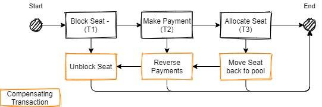 |

**Different ways to implement the Saga pattern**

There are two logical ways to implement the Saga pattern: choreography and orchestration.

**1. Choreography**

In the Saga choreography pattern, each individual microservice that is part of a process publishes an event that is picked up by the successive microservice. You must make decisions early in the microservice development lifecycle to understand if it will be part of a Saga pattern or not, since you must choose an appropriate framework that will help implement this pattern. To adopt a particular framework code, the microservice must be decorated with annotations, class initializations, or other configuration changes. In the Saga choreography pattern, the SEC (Saga Execution Coordinator) can be embedded within the microservice or in most of the scenarios is a standalone component.

**2. Orchestration**

As the name of the Saga orchestration pattern suggests, there is a single orchestrator component that is responsible for managing the overall process flow. If the process encounters an error while calling any individual microservice, then it is responsible for calling the compensating service too. The orchestrator helps model the Saga flow, but also relies on the underlying framework to call the services in a sequence and make compensating calls if any of the services fail.

For more in depth view on the saga pattern, please refer [here](https://developer.ibm.com/depmodels/microservices/articles/use-saga-to-solve-distributed-transaction-management-problems-in-a-microservices-architecture/){:target="_blank"}.

 

#### Try-Confirm-Cancel (TCC)

**What is TCC**

- TCC patterns helps in managing distributed transactions for Systems using REST APIs. 
- It helps implementing distributed atomic transactions across REST services that aligns well with HTTP and REST principles.
- It provides a reservation process across multiple, independent REST services where failures before completion are guaranteed to have no effect and the system returns to its earlier consistent state.

**Roles in TCC**

1. **TCC Participant services** are TCC-aware REST service providers.
1. **Coordinator service** is what we provide: a reusable service to manage the consistent confirmation (or cancellation) of a set of related participant service invocations (including recovery).
1. **Business process** manages business flow by making use of the TCC participants and coordinator service.

**TCC Stages**

- Every REST service that participates in a distributed transaction needs to be TCC aware and is called as a TCC participant
- A TCC coordinator that manages the TCC flow on behalf of the client process.
- Client process invokes services on the TCC participants and TCC coordinator.

| TCC |
| :-: |
| 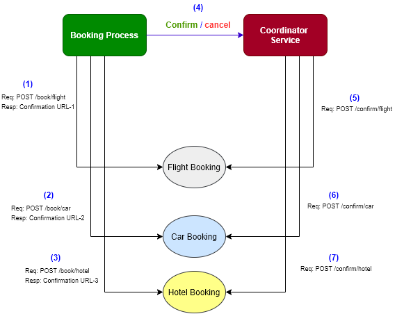 |

There are 2 stages in TCC:

1. **Try / Reserve**
	- The TCC coordinator makes an invocation via HTTP REST Call (mostly POST) on each TCC participant so that the participant can  _reserve_ a resource  on behalf of the client process. 
	- The reserved state is identified by a unique URI that can be used to confirm the reservation later and an optional expiration date/time after which the participant can autonomously cancel and move the resource back to the initial state.

2. **Confirm / Cancel** 
	- This state is reached when a reserved participant receives a confirmation message within the specified time frame.
    - If the business transaction fails, then the TCC coordinator makes an invocation via HTTP REST Call (mostly DELETE) on each participant so that the participant can  _unreserve_ the resource reserved in the previous stage.
    - If the business transaction succeeds, then the TCC coordinator makes an invocation via HTTP REST Call (mostly PUT) on each participant so that the participant can  _finalize the reservation_ on the resource reserved in the previous stage.

If there is any failures before stage #2, then everything will time out and cancel because of confirmations not being sent to TCC participants within stipulated time.

If there are failures during stage#2, then they are handled by the coordinator service, including recovery after crashes, network failures etc. This yields transactional guarantees for REST services.

 

### Coexistence: Request Management Patterns

 

#### Strangler Pattern

| Strangler Pattern |
| :-: |
| 

- While the modernization is in progress, there is a need to route the incoming requests to either current state or target state based on a pre-determined logic. Strangler pattern helps us do this. 

- Strangler component helps us to incrementally migrate a legacy system by gradually replacing specific pieces of functionality with new applications and services. As features from the legacy system are replaced, the new system eventually replaces all of the old system's features, strangling the old system and allowing you to decommission it.

- This strangler component could be a standalone component sitting outside the application or a wrapper of core programs sitting inside the current state.

- The strangler component captures requests initiated and does one of the following:
    - Streams them to the modernized side for synchronization purposes
    - Calls either current or modernized state applications
    - Calls both current and modernized state applications
    
- The strangler component could use a 'routing store' that keeps logic for request handling and it can be based on request type or/and specific field(s) values (i.e. account type or branch based).

 

[Back to top](#top)

---

# 10. Hybrid Integration Key Capabilities

Today’s integration teams need access to a mix of tools that allow them to balance traditional and modern integration styles. When evaluating hybrid integration platforms, here are the most important capabilities you should look to evaluate.

1.	**API lifecycle management** – This enables synchronous access to fine-grained services, such as create, retrieve, update, and delete operations to business objects across various backends. Thus, the composition of the integration logic on the consumer side.
2.	**Application and data integration** – This enable synchronous access to coarse-grained services such as transaction processing across various backends in accordance with enterprise compliance requirements. Thus, the governance of integration logic on the provider side.
3.	**Enterprise Messaging** - This enables asynchronous point-to-point access to services such as those that involve closed heritage systems or heterogeneous partner backends.
4.	**Event Pub/Sub**- This enables asynchronous many-to-many coordination of services across both cloud and on-premises components in an event-driven architecture context.
5.	**High-Volume and High-speed data transfer**. The sheer volume of data being exchanged in a modern environment can be staggering. In fact, by 2025, [IDC predicts](https://resources.moredirect.com/storage-optimization/idc-report-the-digitization-of-the-world-from-edge-to-core){:target="_blank"} worldwide data creation will reach 163 zettabytes per year. That’s ten times as much data as the world produced in 2017.

| **Hybrid Integration Platform** |
| :-: |
| 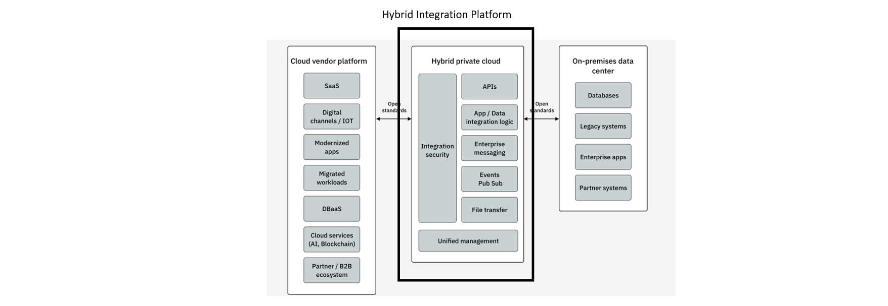 |

 

[Back to top](#top)

---

# 11. Business Case Development

As part of business case development for platform integration modernization initiatives it is extremely important to map business imperatives with IT tranformation initiatives to visualize the quantifiable value that it brings. A sample return on investment and business value metrics that IBM integration solution offers, which can well be tailored to a client's specific environment are shows below.

| **Sample ROI** |
| :-: |
| 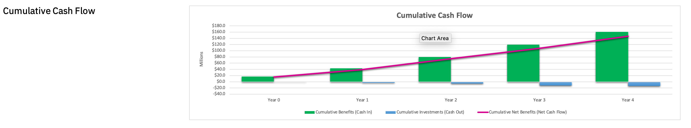 |
|    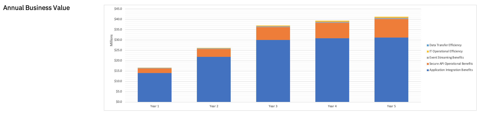 |

 

[Back to top](#top)

---

# 12. Hybrid Integration Platform or Integration Capabilities by Vendors

There are many vendors in the market, which provide the Hybrid Integration Platforms to solve the Hybrid Integration requirements as discussed above.

| Vendor | Product |
| - | - |
| IBM | - IBM Cloud Pak for Integration   - API Connect/DataPower   - App Connect   - IBM MQ   - Event Streams based on Apache Kafka   - IBM Aspera |
| Dell Bhomi| - Atmosphere Integration Platform as a Service, MDM and API Management |
| Salesforce/MuleSoft | - Mule Runtime Engine   - Anypoint Runtime Fabric   - DataWeave   - Anypoint MQ   - Anypoint Platform for B2B Integration |
| Tibco| - Tibco BusinessWorks   - Tibco BusinessWorks Container Edition   - Data virtualization   - Connectors   - Tibco Cloud Mashery   - Tibco Messaging   - Cloud Messaging   - Tibco BusinessEvents   - Streamworks   - TIBCO Apache Kafka Distribution   - TIBCO Application Integration B2B   - Tibco MFT|
| Informatica| - Informatica Intelligent Cloud Services   - Cloud application integration   - Informatica cloud data integration   - Master Data Management Cloud   - Integration at scale   - API Management   - Ingestion at scale   - Informatica Managed file transfer|
| Red Hat| - 3Scale API Management   - Fuse Application integration   - AMQ based on Apache Kafka |
| OpenSource | - Apache Camel   - Apache Kafka   - Kong API Gateway |

 

[Back to top](#top)

---

# 13. References

 1. [Fate of ESB](http://ibm.biz/FateOfTheESBPaper){:target="_blank"}
 2. [Microservice vs SOA](http://ibm.biz/MicroservicesVsSoa){:target="_blank"}
 3. [IBM Architecture for Hybrid Integration](https://cloudcontent.mybluemix.net/cloud/architecture/architectures/modern-integration){:target="_blank"}

