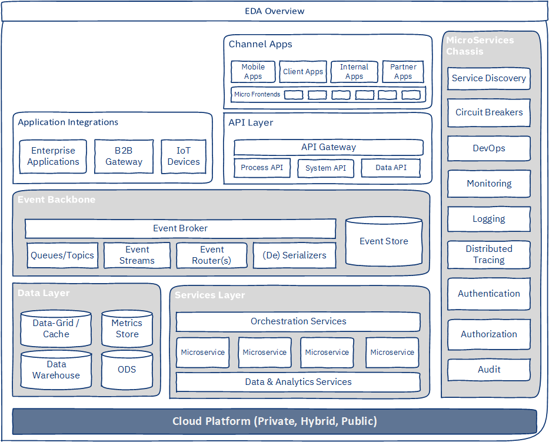
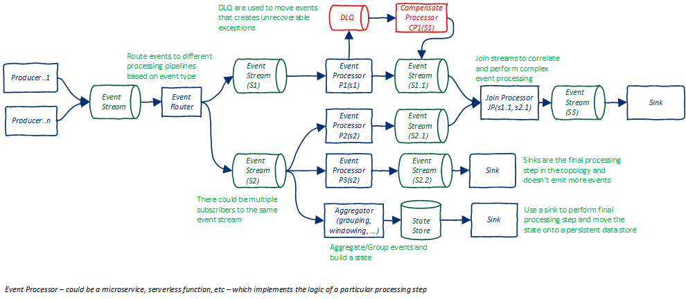
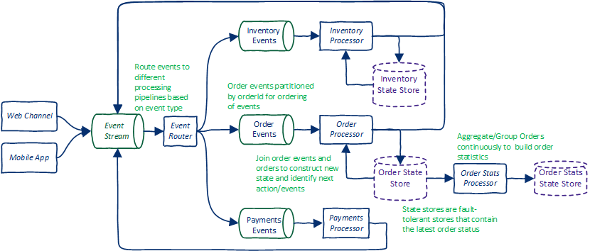

{: .no_toc}
# Architecture

---

#### Table of Contents

  1. [Event Driven Architecture](#1-event-driven-architecture)

---

# 1. Event Driven Architecture

## Introduction

Today’s IT systems are generating, collecting, and processing more data than ever before. And, they are dealing with highly complex processes (that are being automated) and integrations between systems and devices that cut across typical organizational boundaries. At the same time, IT systems are expected to be developed more quickly and cheaply, while also being highly available, scalable, and resilient.

To achieve these aims, developers are adopting architectural styles and programming paradigms, such as micoservices, event-driven architecture, DevOps, and more. New tools and frameworks are being built to help developers deliver on these expectations.

Developers are combining Event Driven Architecture (EDA) and Microservices architectural styles to build systems that are extremely scalable, available, fault tolerant, concurrent, and easy to develop and maintain. By combining these two architectural styles, developers can build distributed, highly scalable, available, fault-tolerant, and extensible systems. These systems can consume, process, aggregate, or correlate extremely large amounts of events or information in real-time. Developers can easily extend and enhance these systems by using industry-standard open-source frameworks and cloud platforms.

## EDA Overview

**Event Driven Architecture (EDA)** has existed for a long time. Cloud, microservices, and serverless programming paradigms and sophisticated development frameworks are increasing the applicability of EDA in solving mission critical business problems in real time. Technologies and Platforms, such as [Kafka](https://kafka.apache.org/){:target="_blank"}, [IBM Cloud Pak for Integration](https://developer.ibm.com/components/cloud-pak-for-integration/){:target="_blank"}, and [Lightbend](https://www.lightbend.com/), and development frameworks such as [Spring Cloud Stream](https://spring.io/projects/spring-cloud-stream){:target="_blank"}, [Quarkus](https://quarkus.io/){:target="_blank"}, and [Camel](https://camel.apache.org/){:target="_blank"}, all provide first class support to EDA development. EDA is also extended for 'streaming data processing' which is a requirement for developing real-time artificial intelligence or machine learning solutions. 

## EDA Characteristics

* Loose coupling between components/services
* Ability to scale individual components
* Processing components can be developed independent of each other
* High cloud affinity
* Asynchronous nature. As well as ability to throttle workload
* Fault Tolerance and better resiliency
* Ability to build processing pipelines
* Availability of sophisticated event brokers reduce code complexity
* A rich palate of proven [Enterprise Integration Patterns](https://www.enterpriseintegrationpatterns.com/){:target="_blank"}

## Typical EDA Use Cases

Typical EDA use cases span across all the use cases where real time processing is required. In addition, rapid digitization of business processes systems are generating events which might drive processes in other systems. i.e. systems need to communicate with each other. With the advent of new technologies, use cases that were traditionally developed as batch jobs can now be done in near real-time using **stream data processing**.

Following categories of use cases are best fit for EDA:
1. IoT use cases - where there are IoT devices sending events which need to be correlated and processed
2. Real time stream data processing for computing aggregations, building data stores/in-memory data grids, etc. These data stores and computed aggregations can be used for near real-time MI reporting.
3. Systems integration for processing offline/asynchronous business processes
4. Real time data analytics
5. Monitoring and Alerting (not just systems monitoring, but monitoring of critical business processes - e.g. fraud detection, risk, etc.)

EDA is extremely powerful when combined with Microservices and Cloud. 

## IBM's PoV on EDA

### Architectural Blueprint for EDA-Microservices Systems

The following figure is an architectural diagram of an EDA-Microservices-based enterprise system. Some microservices components and types are shown separately for better clarity of the architecture.

| **Event Driven MicroServices Architecture Overview** |
| :-: |
|  |

The EDA and Microservices specific components in this blueprint are:

* **[Event backbone](https://www.ibm.com/cloud/architecture/architecture/practices/event-driven-event-backbone-architecture)**. The event backbone is primarily responsible for transmission, routing, and serialization of events. It can provide APIs for processing event streams. The event backbone offers support for multiple serialization formats and has a major influence on architectural qualities such as fault tolerance, elastic scalability, throughput, and so on. Events can also be stored to create *event stores*. An [event store](https://martinfowler.com/eaaDev/EventSourcing.html){:target="_blank"} is a key architectural pattern for recovery and resiliency.

* **Services Layer**. The services layer consists of microservices, integration, and data and analytics services. These services expose their functionality through a variety of interfaces, including REST API, UI, or as EDA event producers and consumers. The services layer also contains services that are specific to EDA and that address cross-cutting concerns, such as orchestration services, streaming data processing services, and so on.

* **Data Layer**. The data layer typically consists of two sublayers. In this blueprint, individual databases owned by microservices are not shown.

    * _Caching layer_, which provides distributed and in-memory data caches or grids to improve performance and support patterns such as CQRS. It is horizontally scalable and may also have some level of replication and persistence for resiliency.
    * _Big data layer_, which is comprised of data warehouses, ODS, data marts, and AI/ML model processing.

* **Microservices Chassis**.  The microservices chassis provides the necessary technical and cross-cutting services that are required by different layers of the system. It provides development and runtime capabilities. By using a microservices chassis, you can reduce design and development complexity and operating costs, while you improve time to market, quality of deliverables, and manageability of a huge number of microservices.

* **Deployment Platform**: Elastic, cost optimized, secure, and easy to use cloud platforms should be used. Developers should use as many PaaS services as possible to reduce maintenance and management overheads. The architecture should also provision for hybrid cloud setup, so platforms such as [Red Hat OpenShift](https://www.openshift.com/){:target="_blank"} should be considered.

### Architectural Concerns & Complexities

EDA also introduces some major architectural concerns. Some of these concerns include:

* A large number of distributed and independently deployed components or services, which introduces these issues:

    * Design and implementation complexity. Understanding and debugging of such systems is difficult. Event processing workflows are not intuitive and need to be documented.
    * Multiple points of failure. Increased complexity in testing, debugging, and exception handling.
    * The release process, deployment, and system monitoring gets complicated and requires high level of automation.
    * From a development perspective, consistency in implementation, conformance to design, and implementation standards is desired. However, there are multiple development squads. This could result in inconsistent implementation and quality issues. Therefore, the development of a reference architecture that outlines the use of architectural patterns, development frameworks, development of reusable services or utilities, and setting up a robust and effective governance model is essential.  

* Asynchronous event processing is difficult compared to synchronous processing due to requirements related to event ordering or sequencing, callbacks, and exception handling.

* Losing information or events is not desirable (obviously). So, the requirements for extremely highly available, scalable, and fault-tolerant systems are especially important, which makes designing and deployment of the systems quite complex. Event producers and consumers have to be designed to withstand failures, have the ability to replay failed events, and have deduplication capabilities.

* Lack of support for distributed transactions. This issue means that developers must create custom and complex rollback and recovery implementations spanning across multiple distributed systems.

* Maintaining data consistency. Due to the distributed nature and multiple systems of record, maintaining data consistency is complex. In most of the cases, it is eventual consistency due to lack of atomic transactions across multiple distributed systems.  

* Event consumers and producers have to consider properties that are specific to products that are used for event brokers, data caches, and so on. For example, delivery guarantee influences the design of producers and consumers.

### Key Architectural Considerations

Architectural considerations influence the architecture of a system. They act as guide rails to make architectural decisions. They have a major influence on non-functional characteristics of the system. The following architectural considerations are extremely important for event-driven, microservices-based systems:

* Architectural patterns
* Technology stack
* Event modeling
* Processing topology
* Deployment topology
* Exception handling
* Leveraging event backbone capabilities
* Security
* Observability
* Fault tolerance and response

### Architectural Patterns

Choosing architectural and integration patterns is a critical architectural consideration for event-driven, microservices-based systems. They provide proven and tested solutions for many desired architectural qualities. The following architectural patterns are extremely useful in developing event-driven, microservices-based systems:

* [Pipes & Filters](https://www.enterpriseintegrationpatterns.com/patterns/messaging/PipesAndFilters.html){:target="_blank"}
* [Staged Event Driven Architecture (SEDA)](https://github.com/mdwelsh/mdwelsh.github.io/blob/master/papers/seda-sosp01.pdf){:target="_blank"}
* [Event Sourcing](https://ibm-cloud-architecture.github.io/refarch-eda/patterns/event-sourcing/){:target="_blank"}
* [Command Query Responsibility Segregation (CQRS)](https://ibm-cloud-architecture.github.io/refarch-eda/patterns/cqrs/){:target="_blank"}
* [SAGA](https://ibm-cloud-architecture.github.io/refarch-eda/patterns/saga/){:target="_blank"}
* [Stream Processing](https://ibm-cloud-architecture.github.io/refarch-eda/patterns/realtime-analytics/){:target="_blank"}
* [Microservices Chassis](https://microservices.io/patterns/microservice-chassis.html){:target="_blank"}
* [Dead Letter Queues (DLQ)](https://ibm-cloud-architecture.github.io/refarch-eda/patterns/dlq/){:target="_blank"}

Additionally, many [Enterprise Integration Patterns](https://www.enterpriseintegrationpatterns.com/){:target="_blank"} and [Microservices patterns](https://microservices.io/patterns/){:target="_blank"} provide the building blocks for event-driven microservices-based systems.

Patterns need to be chosen based on requirements and architectural qualities that are desired from the system.

### Technology Stack

The components such as event brokers, data caches or grids, microservices frameworks, security mechanisms, distributed databases, monitoring systems, and alerting systems form the technology backbone of event-driven, microservices-based systems. This backbone provides support for key architectural qualities (performance, availability, reliability, operating cost, fault-tolerance, and so on) and simplifies development. It also influences several design and development decisions.

When choosing your technology stack, consider these characteristics:

* **Horizontal Scalability** of individual components. Scaling should not compromise availability. That is, the addition of nodes should not require downtime.
* **High Availability** of individual components. The selected product or framework should support clustering with capability to have members across different availability zones or regions, support rolling upgrades, support data replication, and should be fault-tolerant which means the cluster should re-balance itself in case of loss of nodes.
* **Cloud Affinity**, which means it should be easy to deploy on cloud. In fact, if they are available as services on a PaaS platform, its even better because it reduces management and maintenance overhead. Support for containerization is a must.
* **Low operating cost**, which means it should be able to run on commodity hardware and should be frugal in terms of CPU, memory, and storage.
* **Configurability** and tuning of the behavior and non-functional characteristics without downtime.
* **Manageability**.
* **Vendor lock-in** should be avoided. Choose products that are based on open standards or are open source products. When choosing an open source product, consider how widely adopted the product is, whether it has a thriving developer community, and the license should be open and not very restrictive (such as the Apache License V2.0).
* For event brokers and development frameworks, they should have support for:
  * Multiple serialization formats (JSON, AVRO, Protobuf, etc.)
  * Exception handling and dead letter queues (DLQs)
  * Stream processing (including support for aggregations, joins, and windowing)
  * Partitioning and preserving the order of events
* **Reactive programming** support is nice to have.
* **Polyglot programming** support is nice to have in Event backbone.

Following table lists down the popular choices for different components:

| Component Type | Choices |
|----------------|-------- |
|Event Backbone | [Apache Kafka](https://kafka.apache.org/){:target="_blank"}, integration platforms such as [IBM Cloud Pak for Integration](https://developer.ibm.com/components/cloud-pak-for-integration/){:target="_blank"}, [Lightbend](https://www.lightbend.com/){:target="_blank"}, AWS Eventbridge + Kinesis |
| Microservices development frameworks | Spring frameworks such as [Spring Boot](https://spring.io/projects/spring-boot){:target="_blank"}, [Spring Cloud Stream](https://spring.io/projects/spring-cloud-stream){:target="_blank"}, [Quarkus](https://quarkus.io/){:target="_blank"}, [Apache Camel](https://camel.apache.org/){:target="_blank"} |
| Data Caches/Grids | [Apache Ignite](https://ignite.apache.org/){:target="_blank"}, [Redis](https://redislabs.com/redis-enterprise/use-cases/caching/){:target="_blank"}, [Ehcache](https://www.ehcache.org/){:target="_blank"}, [Elasticsearch](https://www.elastic.co/elasticsearch/){:target="_blank"}, [Hazelcast](https://hazelcast.org/){:target="_blank"} |
| Observability | [Prometheus](https://prometheus.io/){:target="_blank"} + [Grafana](https://grafana.com/){:target="_blank"}, [ELK](https://www.elastic.co/what-is/elk-stack){:target="_blank"}, [StatsD](https://github.com/statsd/statsd){:target="_blank"} + [Graphite](https://graphiteapp.org/){:target="_blank"}, Sysdig, AppDynamics, Datadog |

### Event Modeling

Event modeling consists of defining event types, event hierarchy, event metadata, and payload schemas. Carefully consider these event modeling characteristics:

*  **Event types**. In an enterprise system there are multiple business domains each consuming and producing different types of events. One of the key aspects of modeling is identifying events types and events. Use domain driven design and practices such as [event storming](https://www.ibm.com/cloud/architecture/architecture/practices/event-storming-methodology-architecture){:target="_blank"} and [event sources](https://www.ibm.com/cloud/architecture/architecture/practices/event-driven-sources-architecture){:target="_blank"}, to identify and classify events. Event types can be hierarchical in nature which help in having a layered approach to event processing. Define event types and events to cover all business requirements and map them to different business processes or workflows. Granularity of event types is of key importance to avoid tight coupling between components. Event types are key to defining routing rules.   

* **Event schema**. Event schema is comprised of event metadata (such as type, time, source system, and so on) and payload (that is, information) that is used for processing by event processors. Event type is typically used for routing. Event metadata is typically used for correlating and ordering events, but it can be used for audit and authorization purposes as well. Payloads influence the sizing of queues, topics and event stores, network performance, (de)serialization performance, and resource utilization. Avoid duplicating content. You can always just regenerate the state by replaying the events whenever required.

* **Versioning**. Requirements and implementation evolve over time and they often will impact the event model. Changes to the event model can potentially impact too many microservices. Changing all impacted services simultaneously is not practical. Therefore, the event model should have support for multiple versions and be backward compatible so that microservices can change at a time convenient to them. It is also a good idea to add new attributes to the payload instead of changing the existing attributes (deprecate instead of change). Versioning is dependent on serialization format.

* **Serialization format**. There are multiple serialization formats that can be used to encode the event and its payload, such as [JSON](https://en.wikipedia.org/wiki/JSON){:target="_blank"}, [protobuf](https://en.wikipedia.org/wiki/Protocol_Buffers){:target="_blank"}, or [Apache Avro](https://en.wikipedia.org/wiki/Apache_Avro){:target="_blank"}. Important considerations here are schema evolution support, (de)serialization performance and serialized size. It is very easy to develop and debug JSON because the event message is human readable, but JSON is not performant and could increase the event storage requirement. Whereas Avro or Protobuf reduce the size of the payload, are fast, and support schema evolution, they require additional design and development effort.

* **Partitioning**. The partitioning of events is important to increase concurrency, scalability, and availability. Partitioning is also key to the ordering of messages. From an architecture perspective, selecting a partitioning key is important. Having a very coarse-grained key will impact scalability and concurrency. Having a very fine-grained key might not help in preserving order of events. In event brokers such as Kafka, partitioning bounds the scalability of event consumers.

* **Ordering**. Some events might need to be ordered (at least for the given entity) based on their arrival time. For example, account transactions for a given account have to be processed sequentially. It is important to identify events that require ordering. Ordering should be used only where it is essential, since it has an impact on performance and throughput. In Apache Kafka, ordering of events is directly related to partitioning.

* **Event durability** Durability means how long should the event be available on the queues or topics. For example, should you delete the event as soon as it is consumed. Delete events older than the configured retention period. Delete events which have explicit markers (such as tombstones in Kafka). Based on the requirements, one of these should be chosen and configured. While using timebased retention, consider how long the events should be available for replay if required. If the event store pattern is being used, then an additional question about number of versions of the same event or payload that need to be maintained has to be thought about. Event brokers such as Kafka provide various configuration options that can be set at the topic level to specify the durability of events.  

### Event Processing Topology

In EDA, processing topology refers to the organization of producers, consumers, enterprise integration patterns, and topics and queues to provide event processing capability. They are basically event processing pipelines where parts of functional logic (processors) are joined together using enterprise integration patterns and queues and topics. Processing topology is a combination of the SEDA, EIP, and Pipes & Filter patterns. For complex event processing, multiple processing topologies can be connected to each other.

Another key concept in processing topology is **orchestration vs. choreography**. _Orchestration_ refers to having a central orchestrator that orchestrates the processing workflow by calling different components. Whenever a strict control is required over processing, orchestration is chosen, such as for payments processing. Orchestration is typically used where the SAGA pattern is employed. Orchestration has a trade-off with performance and availability (as the orchestrator could become the single point of failure). _Choreography_ refers to a completely de-centralized way of processing. That is, events are published and interested components subscribe to topics. There is no central component to control the processing flow. Choreography is complex to implement and maintain.  

Consider these guidelines for creating processing topologies:

* Processing stages (processors) should be connected using persistent queues and topics.
* Configure partitioning keys and message retention policies at each queue or topic.
* Granularity of processing is important. If the processors are too fine grained, then there is a chance of tight coupling between processors. Ideally, each processor should be logically independent of each other.
* Microservices can be used for implementing processors. This allows for loose coupling, segregation of responsibilities, and ease of development.
* Processing concurrency should be configurable at processor level.
* Use proven Enterprise Integration Patterns (EIPs). Choose development frameworks that provide built-in support for EIP such as Apache Camel or Spring-cloud-stream.
* Build modular and hierarchical processing topologies such that complex event processing is achieved by assembling simple processing pipelines. This helps in making the implementation modular and easy to update.
* If processors have a state (that changes with events), consider having stores to back the states for increased fault-tolerance and recoverability.

Architectural practices such as [Process event streams](https://www.ibm.com/cloud/architecture/architecture/practices/event-driven-sources-architecture){:target="_blank"} and [Event managed state](https://www.ibm.com/cloud/architecture/architecture/practices/event-driven-event-managed-state-architecture){:target="_blank"} can be used to design the processing topology. It is also good to have a detailed understanding of event broker capabilities while defining the processing topology. For instance Kafka streams provides first class support for defining event stream processing topologies. Kakfa also provides automatic support for state stores when performing aggregation and join operations on event streams.

The following figure depicts a blueprint of a processing topology:

| **Event Processing Pipeline** |
| :-: |
|  |

And this following figure depicts a simplified order processing toplogy for online shopping. The router has the ability to dynamically route events to multiple topics. Also note that event processors will also have 'event filters' to control consumption and production of events based on context.

| **Order Processing Topology** |
| :-: |
|  |

### Deployment Topology

In an EDA-microservices architecture, there are numerous components to deploy. A deployment topology should be chosen such that architectural requirements related to scalability, availability, resiliency, security, and cost are met. However, there are tradeoffs to be made between redundancy, performance, and cost. Deployment to cloud makes the architecture even more performant, resilient, and cost efficient. Capabilities that are provided by cloud deployments (such as `high availability` setup in Kubernetes) should be exploited.

Consider these key principles to consider for your deployment topology:

* Each deployed component should be independently scalable and deployed as a cluster to increase concurrency and resiliency.

* Ensure that each cluster spans across multiple availability zones. This setup gives more resiliency in case of data-center failures. An added advantage of this is, instead of having a passive DR, an active-active deployment across different availability zones or regions can be done.

* Replication factor determines the number of replicas of an event or information. Without replication, failure of individual instances (even though clustered) would result in data loss. This is especially required for event brokers and databases. However, replication comes at compute and storage cost. Replication should be set based on factors such as availability zones, data regions, number of nodes, and so on.

* In the case of Kafka, the number of topic partitions places an upper bound on concurrency of consumers.

* Throttling of workloads. Configure thread pools and the number of instances of consumers and producers to throttle throughput. Depending on the volume and throughput of the downstream processors, these parameters need to be adjusted accordingly.

* Data compression. If the payload size is big and CPU availability is high, then compression can be used to compress the events before transmission. However, compression is a tradeoff between network utilization and CPU utilization.

* Data encryption. Based on security standards in the organization, configure TLS, authentication, and authorization between the event broker and producers and consumers (and for your databases). Please note that enabling TLS can increase CPU utilization.

Additionally, it is important to have support for automated deployments, automated failover, rolling upgrades or blue-green deployments, and the externalization of the configuration to make the  environment of the deployment artifacts independent.

### Exception Handling Strategy

In EDA, having a comprehensive and consistent exception handling strategy is important to improve resiliency. Exception handling strategy consists of all or some of the following:

* Logging the exception
* Retrying the event for specified number of time and at specified retry intervals
* Moving the event to a dead letter queue (or stopping the processing of events), if all retries are exhausted
* Raising alerts
* In some cases, generating an event
* Correcting the cause of exception and replaying the event

Exceptions can be of two types: business exceptions and system exceptions. Business exceptions are raised when validations or a business condition fails. System exceptions are a broad category of failures due to unavailability of components (database, event broker, or other microservices) or due to resource issues (such as `OutOfMemory` errors), network or transport related issues (such as payload serialization or de-serialization errors), or unexpected code failure (such as `NullPointerException` or `ClassCastException`).

There is significant variation in how you handle the different types of exceptions. Some of the exception handling mechanisms are listed below:

* Expected business exceptions are typically handled in the code. Handling could involve logging the exception, updating entities and their state, generating exception events, or consuming the exception and moving on.

* Exceptions due to invalid payloads (including serialization or de-serialization issues) will not be solved with retries. Such events are referred as `poision pills` in Kafka (because it blocks subsequent messages of that partition). Intervention might be required for such events. It is advisable to move them to a dead letter queue (DLQ). The DLQ consumers should allow correction and replay of events.

* System exceptions due to unavailability of components are temporary in nature. Hence, multiple retries should be configured. Another key configuration parameter is backoff multiplier. It is used to have exponentially increasing time interval between consecutive retries. Different frameworks have different strategies if the failure persists after retries. For instance, Camel would move the event to a DLQ. Kafka streams would stop the processing. It is advisable to use the default behavior of the frameworks in such scenarios.

* Resource issues (such as `OutOfMemory` errors) are typically at the component level and would result in the unavailability of a component. The risk of losing events is minimal here due to the fault tolerant nature of the event broker. Also, when deployed in a Kubernetes environment, new pods are started to replace failed pods.

* The SAGA pattern is used where data consistency is very important and processing involves multiple microservices. Use the SAGA pattern for those events where data consistency requirements are very strict.

* Recovery and replay should be thought about from the beginning and not applied as an afterthought (it becomes extremely complex later). Recovery and replay components are typically custom developed and vary based on event processing. The simplest replay component might just pick up the failed event and republish it on the input topic.

Your development framework should support having a consistent exception handling strategy across all microservices. It should provide a set of predefined exception classes for business exceptions and provide a generic exception handler that can be customized using configuration but enforces architectural decisions related to exception handling. Most development frameworks do provide such support. However, they need to be configured correctly or extended to provide the required features.

### Event Backbone Capabilities and Constraints

Different event backbone products or platforms provide support for architectural qualities differently. At the same time, they impose constraints on design and architecture. While defining the architecture, their capabilities and constraints should be considered to effectively address the non-functional requirements. For example, the following are few important capabilities and constraints for [Kafka](https://kafka.apache.org/){:target="_blank"}.

* Kafka provides support for event ordering based on partition keys. It also ensures that there is a single consumer (thread) listening on a partition. This makes it very easy to order events just by selecting an appropriate partition key. For example, `OrderId`, when used as an partition key, will ensure that all events related to a particular order will be processed in the order of their arrival.
* Kafka supports `idempotence` for producers. This means Kafka ensures that an event is produced exactly once by a producer. Developers don't need to worry about it.
* Kafka provides `at least once` delivery guarantee. This means consumers should be able to handle duplicate messages. Developers need to be aware of the guarantees provided by their event brokers.
* Another important aspect for Kafka is an `offset-commit` strategy for consumers, which means whether events should be automatically or manually acknowledged. If auto-commit is enabled, events that produce an error might get lost (if exceptions are consumed) or the consumer might see duplicate messages. Manual commits can be used to counter this, but it requires additional code. Frameworks such as spring-cloud-stream that work seamlessly with Kafka, provide the choice of not `auto-committing` in case of errors or moving the failed events to a DLQ in addition to manual/auto-commit. This is an important aspect that needs to be thought through during design.
* Kafka Streams provides the ability to process event streams and easily perform various advanced and complex operations on event streams such as aggregations and joins. This makes it is very easy to perform analytics in real time. For example, computing _real-time_ statistics of events grouped by various dimensions requires very minimal coding. These are stateful operations and maintain a state. Kafka also provides automatic fault-tolerance through _state-stores_.

### Security

Developers must consider these aspects of security in EDA-microservices architectures:

* Transport level security
* Authenticated & authorized access to event production and consumption
* Audit trails for event processing
* Data security (such as authorized access and encrypted storage)
* Eliminating vulnerabilities in the code
* Perimeter security devices and patterns

### Observability

Observability includes monitoring, logging, tracing, and alerting. Each component of the system should be observable to avoid failures and also to quickly recover from failures.

Most of the EDA products and development frameworks provide support for observability by publishing metrics that can be exported into industry-standard observability tools such as Prometheus and Grafana, ELK, StatsD and Graphite, Splunk, or AppDynamics. For example, Apache Kafka provides detailed metrics that can be exported and integrated with most of these tools. Also, cloud platforms that offer managed services for an event backbone (IBM Event Streams) provide first class support for observability. Microservices development frameworks such as Spring or Camel provide good support for code instrumentation for monitoring.

From an EDA perspective, instrumenting the code of producers and consumers for publishing metrics, publishing event broker metrics, and correlating these through a metrics dashboard is essential because the number of distributed components in EDA is high. Some of the key metrics from an EDA perspective are rate of incoming and outgoing messages, lag in consumption, network latency, queue and topic sizes, and so on.

For monitoring microservices, refer to my article on [Monitor Spring Boot microservices](https://developer.ibm.com/tutorials/monitor-spring-boot-microservices/#){:target="_blank"} for a detailed tutorial on instrumenting and monitoring microservices.

### Fault Tolerance and Response

To provide adequate **fault tolerance**, the architecture needs to provide redundancy, exception handling, and elastic scaling (scaling up when thresholds are breached and scaling down when load returns to normal). With EDA and cloud, most of these can be easily achieved. Event backbones cater to fault-tolerance by supporting the clustering and replication of queues and topics. Producers and consumers can have multiple instances deployed. When deployed as containers on a Kubernetes platform, elastic scaling can be easily achieved through auto-scaling (using horizontal pod auto-scalers) but exception handling has to be designed for producers and consumers.

Although EDA-based systems provide for resiliency through staged architecture, quick **failure response and recovery** is critical to avoid delays and consistency issues. To achieve this quick recovery, you need:

    * Automation for starting and stopping instances and restarting failed instances, which can be easily configured in Kubernetes-based platforms, such as Red Hat OpenShift
    * Raising alerts and incidents as and when failures occur
    * A well-defined incident management process
    * Availability of logs and the ability to correlate logs across multiple components through tracing. Tracing needs to be enabled in microservices. Development frameworks such as spring-sleuth can be used for this. For log aggregation, tools such as ELK or Splunk can be used. This would help the team identify the root cause and resolve the issue quickly.

### References

- [Architectural considerations for event-driven microservices-based systems](https://developer.ibm.com/articles/eda-and-microservices-architecture-best-practices/){:target="_blank"}
- [IBM Architecture Centre - Event Driven Architecture](https://www.ibm.com/cloud/architecture/architectures/eventDrivenArchitecture){:target="_blank"}

