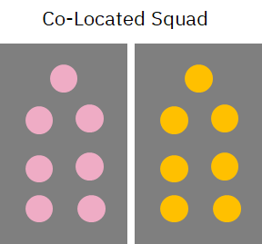

{: .no_toc}
# Delivery Model

---

#### Table of Contents

  1. [Garage](#1-garage)
  2. [Dynamic Delivery](#2-dynamic-delivery)

---

# 1. Garage

## Objective

This section is used to highlight a Collaborative Delivery Model that is both organic & immersive and provides value for our clients.

| **Garage** |
| :-: |
|  |

## IBM's Approach

We offer a unique way of engaging through co-creation, joint squads, and the [IBM Garage Method for Cloud](https://www.ibm.com/garage/method){:target="_blank"} to deliver organizational change and a new culture of speed and velocity that’s sustainable for the digital future.

-    We think the best way to deliver co-creation to the clients is through joint squads
-    There should be SMEs from both IBM and from the client to ensure that skills are being transferred throughout the process
-    They’re working together in a very agile, very iterative way to prioritize what’s getting developed

There are three distinct ways of delivery build applications on cloud:
-    Envision: Quick engagement similar to a PoC that does high level architecture and defines the MVP
-    MVP: Actually building an MVP deployed to production – also contains elements of design and analyse
-    Scale:  Full engagement with multiple teams 

| **IBM Approach** |
| :-: |
|  |

 

|  | Envision | MVP | Scale |
| - | - | - | - |
| **Outcomes**         |  - Architecture and Blueprint    - MVP Definition    - Journey Map    - User Story Backlog    - Journey Maps |  - Blueprint & E2E Architecture    - MVP Deployed to Production    - 12-30 Microservices    - 135-270 story points with varying complexity |  - 2-5 Microservices per Month    - Deployment across geos, LOBs    - Co-Creation and Skills Transfer    - Organizational Change    - New technology adoption and skillset(AI, Analytics, Automation, Blockchain) |
| **Key Activities**   |  - IBM Garage Design Thinking Workshops    - Cloud Advisory Assessment    - Experience Led Development |  - Set up Dev & Test Environments    - Joint Development Squads    - Coexistence, E2E Testing and Integration                           |  - Organizational Change Management    - Employee Engagement    - Digital Change    - Full Dev & Test                             |
| **Duration**    | 3 Month Week     | 3-6 Months       | 6+ Months             |
| **Deployment Model** | Multi-cloud, On-prem | Multi-cloud, On-prem | Multi-cloud, On-prem |

 

[Back to top](#top)

---

# 2. Dynamic Delivery

## Leveraging the Power of Co-Creation

**Globally Distributed Flexible Squad Composition**

A program / account can have various flavors of these squad compositions, based on the workload & requirement. Some programs can start onsite heavy, and may move towards more offshore depending on the workload shifts and productivity.

**Co-located Squad**

-    Workloads that can be split into independent deployment units
-    Co-Creation - MVP/PoC using layered delivery

| **Squad Model** |
| :-: |
|  |

**Vertically Integrated Distributed Squad**
-    Workloads that have huge dependency between modules
-    Co-Creation with Clients and squads across multiple locations

| **Squad Model** |
| :-: |
|  |

## Ceremonies & Collaboration 

For Location Independent Distributed Squads, 
- Ceremonies should happen in overlapping time zone
- Tools to enable location independent collaboration
- Client Product Owner is required for Backlog Grooming, Prioritization, Playback and formal acceptance of user stories by end of sprint

| **Dynamic Collaboration** |
| :-: |
|  |

## Challenges of Distributed Agile

-    Distributed Agile promotes Federated Innovation and taps into Specialized Talents available in various development centers
-    ‘Follow-the-Sun’ approach contributes towards ‘Faster Time to Market’

**Communication**
-    Use visuals in communication / user story
-    Reduce team dependency in assigning work items
-    Use of Technology for team synergy – WebEx

**Accessibility**
-    Plan work time overlap across locations
-    Add handover as an agenda in Daily Meeting
-    Come up with Proxy roles for location

**Squad Structure**
-    Enable horizontal communication of peers
-    Squad size limited to around 8 resources
-    Virtual task-board to ease collaboration and sharing

**Delivery**
-    Parallel Scrums for distributing the workloads
-    Assign entire logical work to squads in same time zone
-    Integration Sprint
