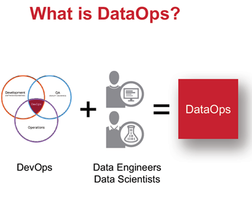
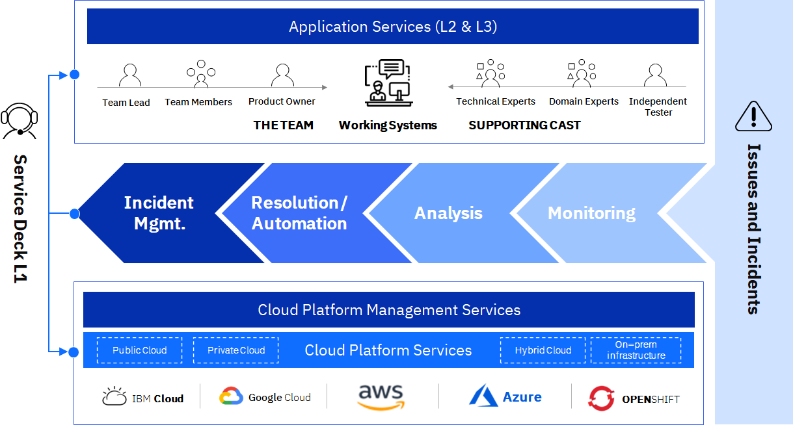
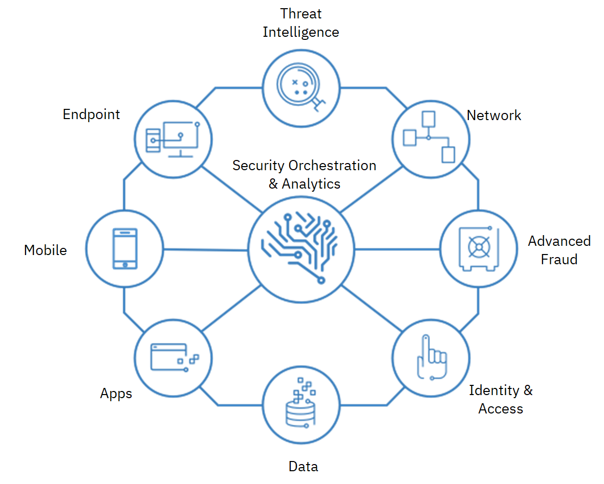
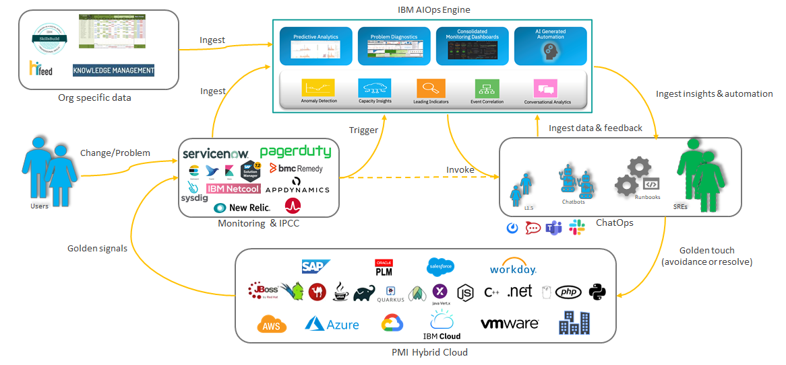
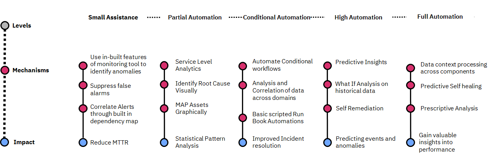
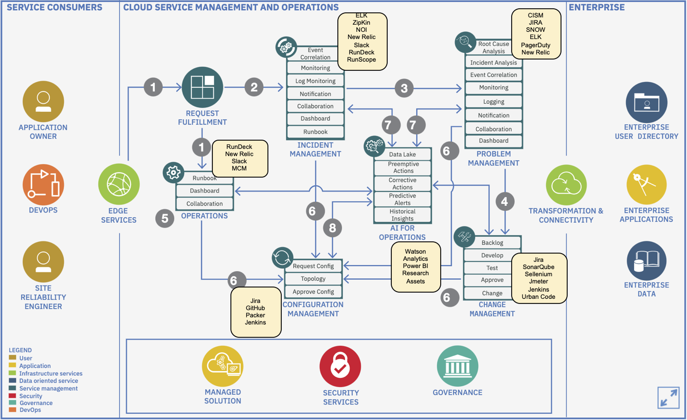

{: .no_toc}
# DevSecOps Principles

Modern enterprise workflows demand agility at all layers of business platforms, and they all need to securely deliver technology solutions faster and at scale. Driven by intense competition, the requirements for business applications are constantly changing so much; therefore, companies need to release updates daily or even multiple times per day at all layers of IT landscape. 

| **DevSecOps Drivers** |
| :-: |
|  |

---

#### Table of Contents

  1. [DataOps & Data Pipelines](#1-dataops--data-pipelines)
  2. [DevSecOps Tooling](#2-devsecops-tooling)
  3. [Monitoring](#3-monitoring)
  4. [Continuous Improvement with Site Reliability Engineering (SRE)](#4-continuous-improvement-with-site-reliability-engineering-sre)

---

# 1. DataOps & Data Pipelines

## Data Ops

| **DataOps** |
| :-: |
|  |

Data Ops lies at the conjunction of data engineering, data science and data analytics.

### Drivers for DataOps

**Problems**

-    Data Scientists spend a lot of time working on the data for various phases such as data filtration, cleansing, deduplication, profiling and transformation
-    As part of developing analytical models, the data scientists are required to test the models against datasets. With each iteration, the data needs to be refreshed and the models are required to be retrained. The metadata also changes and this requires to be monitored, giving rise to a need for KPIs for data

**Drivers**

-    Data must be delivered at the speed of analytics to meet the demand
-    Accelerate Data preparation and Data Enrichment for Data Scientists
-    Deliver DataOps as a Service for Data Platforms and Solutions – as an extension of DevOps & DevSecOps
-    Data Scientists should be able to consume data quickly with up to date datasets which are consistent throughout the life cycle of data without compromising on integrity

## Data Pipelines

Data has a workflow in a Data Platform between the point of source through the various stages of transformation to the point of consumption.

| **Data Pipeline** |
| :-: |
|  |
|    This includes Ingestion, Integration, Storage, Processing, Testing, Serving, Machine Learning & analytics. |
|  |

## DevOps vs DataOps

| DevOps                                                   | DataOps                            |
| -------------------------------------------------------- | ---------------------------------- |
| Development + Operations                                 | Data + Operations                  |
| Develop Software                                         | Deliver Data                       |
| Application Developers                                   | Data Scientists & Data Analysts    |
| Application Design                                       | Data Engineering                   |
| Integration of Developers, Testers, Operators and Users  | Integration of Data practitioners  |
| Application Development Life Cycle                       | Data Life Cycle Management         |

## DataOps-as-a-Service

| **DataOps-as-a-Service** |
| :-: |
|  |

## DataOps Ecosystem

| **DataOps Ecosystem** |
| :-: |
|  |

 

[Back to top](#top)

---

# 2. DevSecOps Tooling

## Background

Security and compliance have become top priorities in today’s volatile and uncertain business environment and must be integrated into software lifecycle to maintain velocity.

| **DevSecOps** |
| :-: |
|  |

Enterprises are under pressure to implement DevSecOps to modernize and be agile, deliver faster, acquire industry best practices, but they face serious implementation challenges.

### Managing Tool Sprawl

Individual business units choose from a plethora of DevSecOps tools in the market, usually without an enterprise level view resulting in tool sprawl

### Centralized Management

Without a management layer and GitOps, pipeline definitions become too decentralized and creates pipeline sprawl. Centralized access control with pattern-based approach is necessary for every organization.

### Toolchain monitoring and management

Ongoing management of the toolchain instances and application delivery pipelines require significant efforts.

### Optimization with continuous feedback 

The need for continuous feedback and optimization to evaluate the impact of each release and gauge end user satisfaction is essential to deliver the right business outcomes.

## IBM Approach

-    Help Clients to adopt a sustainable DevSecOps model, building upon any transformation they have already undertaken
-    Understand and build upon existing target model and transformation plan on different fronts: people, process, technologies as required
-    Build upon any foundational steps taken for creating a DevSecOps culture and roll-out across the client organization

| **IBM Approach** |
| :-: |
|  |

**Solution Design Points**
-    Assessment of client’s current SDLC state/development process and pain points
-    Build upon existing definition of target DevSecOps processes, toolchain and implementation plan, filling gaps where required
-    Provide DevSecOps framework artifacts and reusable materials for the client organization customization and roll-out

**Key Outcomes and Benefits**
-    Defined the target DevSecOps framework
-    Maximise shift left approach in DevSecOps environment
-    Defined optimization points for security activities within the SDLC

 

[Back to top](#top)

---

# 3. Monitoring

## Overview

Having an integrated multicloud services management delivers:
-    Ultimate flexibility, freedom of choice and avoidance of vendor lock-in
-    Simplified and delayered cloud and application management functions
-    Consistency in monitoring, optimized data/workload placement, improved service management quality
-    Reduced risk, enhanced resiliency, and improved reliability in your entire cloud operations
-    Increased transparency, faster innovation and reduced cost through simplified governance

| **Integrated Service Management** |
| :-: |
|  |

## Cloud Management

Manage traditional and cloud environments seamlessly across hybrid multicloud using our enterprise grade cloud management platform.

IBM delivers the only enterprise grade solution for managing hybrid multicloud which provides:
-    A unified operations layer that enables infrastructure and applications to be monitored and maintained including legacy infrastructure, private cloud, public cloud and container environments
-    A robust management platform with built in capabilities including inventory, orchestration, operations, and service management across cloud infrastructures.
-    An optimized digital self-service user experience to consume, deploy, operate, and govern across all clouds and data centers through a single pane of glass

| **Cloud Management** |
| :-: |
|  |

## Security Operations Center (SOC)

The SOC proactively monitors, avoids outages, quickly troubleshoots and continuously improves through: 
-    Single point of contact & pane of glass view into Hybrid multicloud provider landscape which delivers application run/operate/service delivery with cost savings of up to 20%
-    Integrated business services operations and management using proven SRE practices and AI-infused automation
-    Embedded Hybrid IT Security assures data protection, resiliency, and compliance

| **Security Operations Center (SOC)** |
| :-: |
|  |

## Services Control Tower

Services Control Tower enables you to manage the Cloud Operating Model with meaningful insights to redefine business strategies. The IBM Services Control Tower summarizes key metrics and allows you to manage and simplify digital, cognitive and cloud chaos, translating cloud complexity into tangible enterprise business strategies. It provides:

-    End-to-end visibility to manage operations
-    Produce early warnings for issues with automatic resolutions driving quicker response times
-    Reduce overall operating costs but increase business flexibility
-    Achieve the promise of the cloud operating benefits

| **Services Control Tower** |
| :-: |
|  |

## Integrated DevOps

Adopt an integrated DevOps platform for hybrid multicloud – offered as a shared, dedicated or customized model.

Embrace DevOps across the enterprise with new ways of operating and the tools required to accelerate software delivery, improve quality and enhance customer experience
-    The IBM DevOps Commander enables tool chain orchestration with customized, real time builds of your DevOps environment, almost 70% faster than traditional methods. 
-    Standardized, integrated DevOps tool chain services available across leading cloud platforms
-    Build a customized DevOps tool chain and integrate already deployed DevOps tools in less than an hour
-    Incorporates market leading and open source software engineering tools
-    Best in class security practices integrated into the software engineering lifecycle
-    Secure testing integration creates a robust DevSecOps environment 

## Security Cloud Framework

Traditional security controls and infrastructure operational practices are changing to data and workload-centric cloud security policies, technologies, and practices. We approach this challenge by aligning security controls with the realities of your hybrid multicloud IT estate to:

-    Enforce Application security via DevSecOps practices
-    Cloud Platform security 
-    Identification and planning for enterprise / regulatory specific controls / compliance / audits
-    Data and Storage security and privacy 
-    Security threat monitoring
-    Security incident management
-    Business risk and compliance services

| **Security Framework** |
| :-: |
|  |

 

[Back to top](#top)

---

# 4. Continuous Improvement with Site Reliability Engineering (SRE)

## What is SRE?

Site Reliability Engineering (SRE) is an DevSecOps discipline that aims at developing automation in operational aspects of running IT application. This includes infrastructure provisioning, responding to faults and events, managing performance, etc. It was conceptualized in Google in 2003 for their systems and has been adopted by the industry over a period as an essential set of practices. SRE is an engineering approach to deliberately introduce reliability into site operations.

Fundamentally, it’s what happens when you ask a software engineer to design an operations function. SRE fundamentally changes the approach to systems management. It recognizes that throwing bodies at the problem is not a long term approach. Introducing ever and more complex layers of management does not yield a winning strategy.

### SRE and Application Development

SRE is an important discipline for application development in the current and future. It has evolved into a product development paradigm - an ongoing process of incrementally delivering new capabilities, continuous focus in required on maintaining and improving the resilience of the application.

## SRE Practices

| **SRE Practices** |
| :-: |
|  |

**Key elements of an Engineering approach to Operations**
-    **Understand your system**
    System thinking! You can get still things done without understanding, but if you know what’s happening, you can innovate.
-    **Ask great questions** 
    Asking a really good question is like telepathically moving information from someone else’s brain to yours. 
-    **Read the code**
    Even difficult codebases, even in languages you don’t know. It can be easier than you expect to go look at the code and see what’s really happening.
-    **Debug like a wizard** 
    To be better at debugging.
-    **Write down a design** 
    Understand what all can go wrong. Use design docs, project briefs, etc. They help you catch misconceptions early and get good ideas.
-    **Understand the big picture**
    Better technical decisions. Either be sure that you know why the thing’s important, or go do something else. 

### Principles and Tenets of SRE

An effect SRE practice has the following principles:
1.    System Thinking
2.    Data-Driven Decisions
3.    Engineering Rigid
4.    Embracing Risk
5.    Eliminating Toil
6.    Remove Technical Debt
7.    Simplicity
8.    Collaboration
9.    Shared Responsibility
10.    Trust & Transparency

If you take these principles and try to apply them to operating a system you will recognize some common features:
-    Ops to scale with load through Automation, but don’t stop at Automation
-    Cap operational load: 50% time spent on toil - 50% on engineering projects (improvements)
-    Excess Ops work overflows to the Dev Team, share 5% of Ops work with Dev Team
-    Have an SLA / SLO for the service, measure against the SLA / SLO
-    Error budget to control velocity. Effective self-regulation of features vs. stability
-    Observability, including the Golden Signals: Latency, Traffic, Errors, Saturation, Requests
-    Actionable symptom-based alerts, from the user perspective. (Automated) runbooks to govern actions.
-    Blameless post-mortem for every event
-    Common staffing pool for SRE and Dev

### Tenets of SRE

1.    Scale Ops sub-linearly with load
2.    Cap Operational load at 50%
3.    Handle Overflow
4.    SLA/SLO/SLI
5.    ORP & Error Budget
6.    Golden Signals
7.    Symptom-based Alerting
8.    Blameless Postmortems
9.    Staffing Pool

## AIOps for SRE

Capture the most value from your cloud operations with Site Reliability Engineers (SRE) that are central to the ‘operations-centric’ design of our cloud management solutions. SRE principles enable enterprises to optimize their hybrid multicloud management and deliver:
-    High resiliency and elastic architecture
-    Reduction in errors and service requests
-    Optimized saturation ensuring resources are not constrained
-    Reduced latency by identifying hotspots and providing feedback to the development squads to automate the fixes
-    Engineering automation into the operations process

Infusion of AIOps techniques in operations can allow systems to continuously improve and become more reliable.

| **AIOps PoV** |
| :-: |
|  |

### Shift Left

Automation with AI techniques enable us to shift incident resolution closer to the source of problems – towards zero touch application management. Shift left resulting in improved service resilience, efficiency & user experience through proactive, automated & cognitive application maintenance.

| **AIOps Shift Left** |
| :-: |
|  |

### Automated Operations

Embrace automated operations and intelligent management utilizing AI Ops to enhance performance across your enterprise.

| **Automated Operations** |
| :-: |
|  |

Automate manual tasks involved in incident diagnosis, incident resolution, service request fulfillment, change implementation, scheduled / preventive maintenance & more to shift incident resolution closer to the source of problems.

### AIOps in Integrated Service Management Toolchain

| **Integrated Service Management Toolchain** |
| :-: |
| 

## IBM SRE Approach

IBM SRE approach brings measurable benefits through balance between Development & Operations.

| **IBM Approach** |
| :-: |
|  |

**Key components of IBM's SRE approach are:**

1. Identify and Design for the real reliability need
    - Baseline SLOs (instead of 100% of 3 sec response time, target for 90%)
    - Review architecture for significant use cases
    - Define IaaC framework
    - Enhance and Configure custom code quality checks
2. Use the error budget to release new features
    - Architect for Blue Green / Canary deployments with minimum or no downtime
    - Arrive at error budgets and approve new features to be deployed. (When the availability targets are met)
3. Observe everything
    - Implement Build to manage with heartbeat APIs when functional APIs are secured
    - Design and Implement Dashboards for various KPIs
    - Introduce distributed tracing to pinpoint the transaction failures
3. Automate everything which is repeatable
    - Identify toil and implement automated runbook
    - Create manual runbooks for toils which cannot be automated for L1.5
5. Consistent CI/CD
    - Implement touchless CI/CD with quality gates and automated (e.g. code coverage) regression tests
    - Introduce Performance tests with Jmeter in CI/CD
6. Ease of Operations
    - SREs jump in as first responders for Sev 1 issues
    - Introduce blameless port-mortem
    - Chat Ops with Bots for creating automated ticketing and resolution
    - Document RCAs and raise enhancement tickets for Dev Team

 

IBM has infused SRE into its **Integrated Operations Reference Architecture** too:

| **Infused SRE in Integrated Operations Reference Architecture** |
| :-: |
|  |

