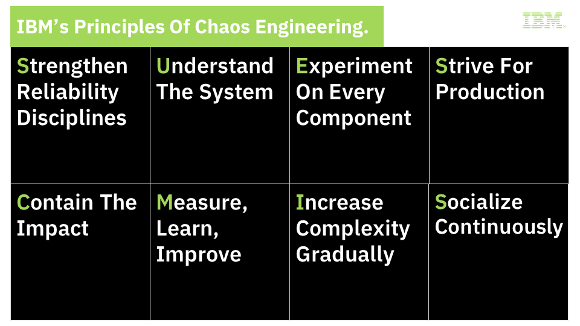

{: .no_toc}
# Software Engineering Practices

---

#### Table of Contents

  1. [Chaos Engineering](#1-chaos-engineering)
  

---

# 1. Chaos Engineering

Chaos Engineering is an evolution to business continuity and service resiliency planning. It is the discipline of experimenting on a service to build confidence in its ability to withstand failure in production. Chaos Engineering aims to introduce failures within a system to identify and fix failures proactively before they impact business operations.

| **Chaos Engineering** |
| :-: |
|  |

## Background: The Challenge

Like all things, an IT system lives as part of a bigger ecosystem and other elements of the ecosystem have a bearing on the health and operation of the system. While all enterprise want their systems to be robust and design for systems to be available in general, hardly enough effort is spent to make their systems resilient to such faults in the environment - the infrastructure, the connectivity, other systems or the application itself.

While some of these faults can be thought of and considered during designing the application,
1. Not all can be thought through. In some cases, doing so may offset of the value of building the system itself.
2. Manifestations of such faults vary as well as these fault themselves respond differently to the environment they exist in.

Considering external faults as random as they can be as chaos, engineering your system to respond to & survive such faults is Chaos Engineering. It is a set of practices largely focused on hypothesizing and experimenting to verify the hypotheis and using this cycle as a tool to uncover and address faults in design, deployment, tooling and operation.

| **Scientific Method** |
| :-: |
|  |

## Chaos Engineering & Application Development

Chaos engineering practices are important in context of application development in a number of ways and help development teams build capabilities in the application to tackle the following kind of failures by providing fault injection methods across a range of application development activities:
1. **Infrastructure & Network Failures** - Cloud native applications run on a set of resources typically managed by external service providers. An outage to any of the underlying resource can take down the application. This is also true for network failure events.  These outages can range from a storage device failure, a corrupt instance to outage of an availability zone. Ability to sustain such an event is essential. While some of these scenarios can be thought of, reproducing such events is next to impossible requiring massive coordination to create mostly unseen situations. By providing capability to reproduce such events, chaos engineering tools provide a way to build for and test for such outages.
2. **Application Failures** - Application Development is done at a much faster pace with agile practices trading off deep requirement and impact analysis in the processes. In such an environment, a testing method that can create scenarios beyond the specified acceptance criteria and requirements can add great value to the resiliency of the product.
3. **External Application Failures** - Integration is the core of modern applications and being resilient to faults in another systems an app is integrated with becomes utmost important. Faults that can be in form of errors or reliability or performance of the other system and can occur at any point for any duration. Ability to induce such faults into an app under development can greatly help developers identify and cater for such faults.

Apart from capabilities to reproduce and address failure scenarios, Chaos engineering tools can also help manage a running application. Using Chaos Engineering practices, an application team can effectively manage the utilization, security and performance of an application.

## Evolution

Point of views and guiding principles for Chaos Engineering have started to take shape, e.g. [Principles of Chaos](https://principlesofchaos.org/){:target="_blank"}.

## IBM Approach 

Chaos Engineering is the discipline of experimenting on a software system - often in production - in order to build confidence in the system's capability to withstand turbulent and unexpected conditions.

Although the name suggests chaos, the experiments are well designed and planned: at the beginning, failure points are identified and based on this a hypothesis is formulated. A corresponding experiment is built (node failure, packet drops, slow links) and then run against the system. The result of the experiment is measured and compared against the hypothesis to either proof or disproof it.

These experiments are typically performed in so-called "game days", to test the resilience of an application in a controlled environment. However, experiments may also be performed in production environments to assure the robustness of the application. The goal of testing in production is to be able to detect problems that cannot be surfaced in pre-production testing.

IBM has identified the following Principles for Chaos Engineering. Each of these 8 principles is support by a concise statement describing the What, Why, and How of that principle.

| **Chaos Engineering Principles** |
| :-: |
|  |

### Strengthen Reliability Disciplines

Chaos Engineering builds on established reliability engineering practices. Organizations should leverage mature business continuity processes and system reliability patterns. Through the discipline of identifying and mitigating reliability issues, the organization becomes more resilient.

### Understand the System

As a precursor to planning a viable Chaos Engineering experiment, the system and its business outcomes should be well understood. A baseline should be formed by understanding the system as a whole, its emergent properties and functions, as well as its topology, architecture, dependencies, steady-state behavior, output response, and characteristics such as availability, latency and throughput. 

### Experiment on Every Component

Treat all components, layers, services, and dependencies as subjects for potential experiments whenever possible. These experiments should uncover any gaps between expected and actual behavior and should validate fallbacks.

### Strive for Production

Experiment first upstream in non-production environments. Build confidence by learning about the system behavior during different scenarios and ensuring the system's ability to gracefully withstand and recover from failures and unexpected events. As confidence is gained, transition towards production.

### Contain the Impact

Avoid cascading failures by containing tests scope and detaching dependencies. Different containment strategies should be applied to help limit the scope, minimize impact on business, and confirm their effectiveness. 

### Measure, Learn, Improve

Infuse observability into all system components. Measure experiment results to understand the business impact. Learn from the collected insights to improve system reliability and guide future experiments.

### Increase Complexity Gradually

Increase complexity gradually while adjusting the granularity of the experiments. Expanding scope and combining tests may reveal previously unknown weaknesses. 

### Socialize Continuously

Effective and transparent communication is critical to the success of any Chaos Engineering program.  This creates a culture that recognises the benefits of introducing rigorously controlled risks to drive increased resilience.

IBM uses a range of tools and platform capabilities around chaos engineering thus, enabling development teams to weed out such issues and therefore, build resilient products
- Istio (the core of OpenShift Service Mesh) provides capabilities to induce HTTP errors, response delays for applications deployed in container applications. Refer [this article](https://redhat-scholars.github.io/istio-tutorial/istio-tutorial/1.4.x/6fault-injection.html){:target="_blank"}.
- Netflix's [The Simian Army](https://www.gremlin.com/chaos-monkey/the-simian-army/){:target="_blank"} is a set of tools (called monkeys) to induce various kind of failures in a cloud environment e.g bringing down a virtual machine.

## IBM's Chaos Engineering Method 

IBM's methodology for Chaos Engineering is an iterative journey that describes the planning, execution, scaling and learning of Chaos Experiments towards a robust and resilient service as well as organization. For each of the 10 steps, a description of the key activities is provided. This leads to a comprehensive methodology of performing Chaos Engineering in the enterprise.

| **Methodology** |
| :-: |
|  |

Here is the details of the phases of this method:

### 1. Understand the System End-to-End

A successful Chaos Engineering experiment requires a clear understanding of the system end-to-end: its weaknesses, its failure events and even any skepticism towards the reliability of that system. This will help determine the answer to the question "what are we testing?".

### 2. Gain Organizational Agreement

Chaos Engineering helps organizations make systems more resilient and reliable. This intent of enhancing resiliency through continuous failure testing may not be an easy sell, as it intentionally introduces minor short-term risks, to avoid major long-term risks by improving overall reliability.

### 3. Create a hypothesis and plan related experiments

Simply put, a hypothesis is a collection of 'what ifs'. It is a prediction about the expected system behavior upon introduction of a certain system change or changes. One or more chaos experiments can be used to either prove or disprove the hypothesis. 

### 4. Enable observability

In order to understand the impact of the experiments, it's important to have objective measurements that can illustrate the health and behavior of the system. When it takes the manual work of experts to make subjective evaluations of system health, their time required represents an ongoing tax on each experiment. Monitoring should be holistic, it shouldn't only cover black box monitoring such as disk space, CPU usage etc., but it should also cover white box monitoring such as queries per seconds, transactions per seconds etc.

### 5. Prepare your experiment

A Chaos Engineering experiment requires thoughtful preparation and planning to minimize service disruption. A risk management analysis should be done by factoring in the current availability metrics for the system against what is expected, the impact the test can bring to end user experience and most importantly, data integrity.

### 6. Run chaos experiments

A successful chaos experiment follows a structured approach that ensures standardized communication and data collection. Different methods can be applied to mitigate risks and help improve the chances of a positive outcome.  Experiments should proceed within the framework of a predefined and communicated schedule so that stakeholders know what to expect. Frequent and thorough communication is critical to avoid unnecessary pitfalls during the execution of an experiment. Chaos experiments can be run during scheduled 'GameDays' and eventually as part of automated continuous testing.    

### 7. Analyze the results to prove or disprove the hypothesis

Chaos Engineering experiments will hopefully produce meaningful and relevant results. The quality of the generated data is dependent on how comprehensively observability tools have been configured. With the results in hand, we can analyze the outcome, compare it to what was predicted and then make educated decisions on how to proceed.

### 8. Communicate findings and improve

Chaos Engineering experiments may uncover system defects and weaknesses that must be addressed. After the results are reviewed and analyzed, the findings need to be clearly communicated and converted into actionable plans with appropriate ownership. 

### 9. Grow blast radius and repeat

Chaos Engineering is a practice of continuous experimenting and learning. Before expanding scope and growing complexity, a consistent baseline needs to be achieved (have confidence in a consistent baseline). Experiments should start small to allow the organization to mature (gain confidence) and gradually increase in scope and complexity. This means experiments should iteratively target larger blast radiuses and widen their scope to eventually touch the system end to end.

### 10. Evolve and expand to production

It is important to demonstrate safety in a non-production environment before running an experiment in production. Remember that non-production and production environments may yield different experiment outcomes and insights. Moreover, production data and traffic may not be available outside of production. It is crucial to start your production chaos testing with 'GameDays'. As capabilities mature and consistent results are achieved, chaos experiments can then be run periodically via unattended automation and during deployments.

## IBM Publications

- [IBM's principles of chaos engineering - Learn to improve the reliability and availability of your systems by following IBM's principles and 10 steps for chaos engineering](https://www.ibm.com/cloud/architecture/architecture/practices/chaos-engineering-principles/){:target="_blank"}
- [Use chaos engineering to assess application reliability](https://www.ibm.com/cloud/architecture/architecture/practices/use-chaos-engineering-to-assess-reliability/){:target="_blank"}
- [Run chaos engineering experiments by using Gremlin on IBM Cloud](https://www.ibm.com/cloud/architecture/architecture/practices/chaos-engineering-with-gremlin-on-cloud/){:target="_blank"}
- [Get started with chaos engineering by using Gremlin on IBM Cloud](https://www.ibm.com/cloud/architecture/tutorials/use-chaos-engineering-to-validate-resiliency-with-gremlin){:target="_blank"}
- [Chaos Engineering vs Voodoo](https://medium.com/ibm-garage/chaos-engineering-vs-voodoo-9bce58434fe1){:target="_blank"}
- [Overcoming chaos on the way to the moon](https://medium.com/ibm-garage/overcoming-chaos-on-the-way-to-the-moon-b2c74f69be6e){:target="_blank"}

