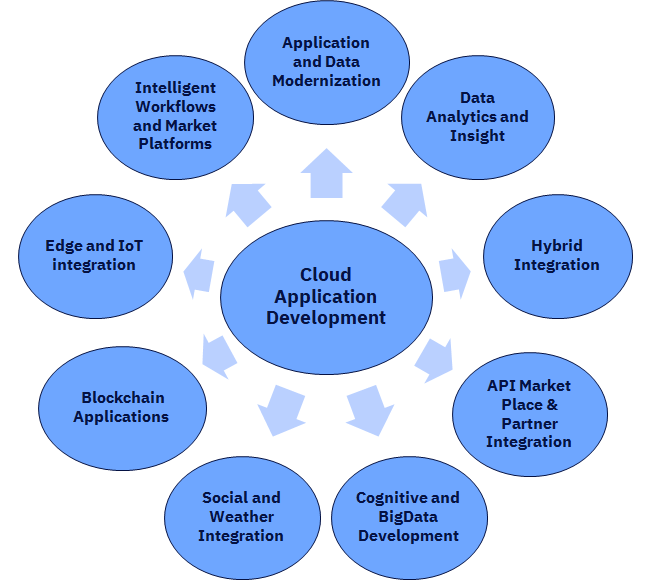

{: .no_toc}
# Future of Application Development

 

Organizations are being disrupted from traditional competitors and new players never seen in their markets. To combat the disruption, organization recognize they need to pivot, act quickly to market shifts, create new markets and lower the cost of operations to compete. A key element in an organization’s transformation strategy is technology. Leveraging emerging technologies can often be the difference between being disrupted or being the disruptor.  Today’s top organizations are leveraging emerging technology to innovate and differentiate. Key to their success is the ability to reimagine existing customer facing applications and build new applications that support new ways of delivering goods and services. Central to their digital transformation journey is Application Development.

| **Digital Transformation** |
| :-: |
|  |

The following sections provide  IBM’s vision on the Future of Application Development and the key elements to consider when modernizing your existing applications or building new capabilities.

1. [Key drivers]({{site.baseurl}}/key-drivers) of the evolution of application development, what our clients are doing and how this is happening.

2. [Target Operating Model]({{site.baseurl}}/target-opt-model): What this evolution means for the enterprise. Modern enterprise workflows demand agility at all layers of business platforms, and they all need to securely deliver technology solutions faster and at scale. Driven by intense competition, the requirements for business applications are constantly changing a lot, so, companies need to release updates daily or even multiple times per day at all layers of IT landscape. 

3. New age models of application development and how IBM has been changing to enable enterprises:
- [Architecture]({{site.baseurl}}/arch) is becoming more reactive and event-driven than just APIs. 
- [Delivery Model]({{site.baseurl}}/delivery): High Speed Garages and Dynamic Delivery models to enable enterprises deliver new applications.
- [DevSecOps Principles]({{site.baseurl}}/devsecops-principles): Key disciplines of DevSecOps - DataOps & Data Pipelines, Tooling, Continous Monitoring and Site Reliability Engineering for Continuous Improvements.
- [Software Engineering Practices]({{site.baseurl}}/sw-engineering): Key practices which are enabling this evolution.
- [New Age Development with Hybrid Integration]({{site.baseurl}}/hybrid-int): How Hybrid Integration is becoming the center stage of application development.
- [Low-Code No-Code]({{site.baseurl}}/lowcode-nocode): a new form of application development platforms evolving with lower barrier to entry for coding. 

