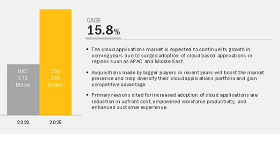

{: .no_toc}
# Key Drivers of Application Development

 

This section highlights the key drivers of the evolution of application development, what our clients are doing and how this is happening.

---

#### Table of Contents

  1. [Key Drivers](#1-key-drivers)
  2. [What Is Evolving?](#2-what-is-evolving)
  3. [What Are Our Clients Doing?](#3-what-are-our-clients-doing)

---

# 1. Key Drivers

Rapid technology advances are driving higher expectations around speed, efficiency and security.

## 1.1. Business Expectations

Infuse technology to drive speed to market, create new revenue streams and enhance customer experience.

| **Business Expectation** |
| :-: |
|  |

- **IoT** allows to draw from multiple data sources in real time. Optimizing productivity with predictive maintenance, end-to-end connected vehicle and monitoring courier package status through **Industrial IoT**.
- 5G and Edge enabling compute and storage options. Virtualization of Telecom Network Function and enhancing Immersive Virtual Reality Experience through **5G and Edge technologies**.
- Analytics enable to make sense of data and identify new opportunities with access to unique data sets. Increasing hyper-personalization, Fraud Detection and unified view  of customers, products and channels through  **real-time data capture Analytics**.

## 1.2. Technology Trends

Technology evolutions drive innovation through Data, Integration, AI and Automation.

### Distributed Cloud

Allows data centers to be located anywhere. This solves both technical issues like latency and also regulatory challenges like data sovereignty. It also offers the benefits of a public cloud service alongside the benefits of a private, local cloud.

### Data Fabrics

A core component of digitization is treating data as an asset. To be successful with digitization, businesses must use data management and governance techniques to free data from supporting IT components.

### Hyperautomation

Application of advanced technologies, including AI  and ML, to increasingly automate processes and augment humans. It refers to the sophistication of the automation (i.e., discover, analyze, design, automate, measure, monitor, reassess).

### Multiexperience

Immersive experiences that use AR, VR, mixed reality, multichannel human-machine interfaces and sensing technologies. The combination of these technologies can be used for a simple AR overlay or a fully immersive VR experience.

### Hybrid Integration

Unified, cloud agnostic integration platform that enables internal, external, edge, IoT, SaaS, market place and partner ecosystem integration using traditional and advanced integration technologies, e.g. event, messages, data transfer and streams.

### Edge & IoT

Information processing and content collection and delivery are placed closer to the sources of the information moving key applications and services closer to the people and devices that use them.. 

### Application Composition

Composable business functions, services and workflows from traditional applications, enabled by APIs, microservices and containers.

### Cognitive Augmentation

Enhances a human’s ability to think and make better decisions, for example, exploiting information and applications to enhance learning or new experiences. 

### Technology Velocity and Security

Technologies evolve rapidly, enabled by open source and cloud ecosystems and the need for increased security.

## 1.3. Market Analysis Forecast

Market analysis forecasts increasing adoption and growth for cloud based applications:
-    Cloud applications market size is expected to grow from USD 171 billion in 2020 to USD 356 billion by 2025, at a Compound Annual Growth Rate (CAGR) of 15.8%.
-    By 2022,  modernization of existing applications and developments of new cloud-native applications will increase the percentage of cloud-native production applications to 25%.
-    By 2023, 60% of the G2000 enterprise will have created their own software ecosystem.
-    The enterprises that build cloud based applications:
        -    77% of enterprises say they develop and deploy applications faster.
        -    67% of enterprises say they respond to market changes and demands faster.
        -    86% of organizations report improvement in application performance.

| **Market Analysis** |
| :-: |
|  |

 

[Back to top](#top)

---

# 2. What Is Evolving?
A lot is being re-imagined about Application Development - how its done, why its done, who does it. Enterprises are building new applications not just to automate and drive out costs but to allow them to flex & to scale and to reach out to newer markets in unimagined ways.

| **What is evolving** |
| :-: |
|  |

## 2.1. Shift in Focus

Software engineering is now seen as a core compentency they need to build not only to help them achieve their business goals but also to be competitive and innovative in their industry. Therefore IT programs are shifting from a project delivery focus to a more continuous product centric view which involves long term thinking, agile & automated IT processes and long running teams. 

This has introduced newer organizational roles & disciplines e.g.  Product Management bridging the gap between business users and IT teams, Release Engineer & Site Reliability Engineers bridging the gap between erstwhile IT projects and IT operations. This has also meant that enterprises are now wanted to build more skills in this space instead of outsourcing the delivery of an IT system. IBM has well understood this evolution and the need for enterprises to be engaged deeply in this process and is helping its clients take this journey using our Co-Creation model IBM Garage Method.

## 2.2. Cognitive Thinking & Models

Cognitive technologies have transformed business processes and business models by becoming central to decision making in real time based on accumulated systemic intelligence. 

This has led to an entirely different way of developing applications. Here are some of the considerations of building apps using AI and Machine Learning technologies:

-   No more building logic trees, build models
-   Training over testing
-   Crowd sourcing data over generating synthetic data

This implies that organizations require a new set of capabilities. Effectiveness of machine learning models are a direct result of the quality of training data. Right set of tools and practices need to be adopted to build training data and manage it with the evolving system.

## 2.3. New Platform Capabilities

There is also evolution in application development driven by new capabilities being made available by underlying and emerging platforms. Public cloud platforms have evolved to make almost all functions available through CLI and API interfaces allowing for all administration functions to be performed in automated and autonomous manner. There is also emergence of Low Code No Code platforms enabling rapid application development by a wider range of skilled resources including the likes of Business Analysts and Product Owners. Moreover, availability of such hosting platforms on previously unsupported environments like Edge devices has triggered development of new kind of workloads which weren't possible earlier.

 

[Back to top](#top)

---

# 3. What Are Our Clients Doing?

This section describes some cross-cutting client stories which are examples for new age application development models.

## 3.1. BNP Paribas: Multicloud Transformation & Operating Model

IBM worked with BNP Paribas over five months to deliver a Strategic Engagement defining its 2022 Multicloud Transformation and Operating Model, supported by a Cloud Competence Center, specifically to provide:
-    Creation of new Cloud Services, in particular PaaS
-    Integration of brokered Public Cloud Services
-    Adoption of new skills and roles to drive an Agile culture
-    Review of security and compliance for Cloud and DevOps
-    Review of app portfolio for containerization and migration
-    Design of key assets, including Architecture Center Portal
-    Design of a multi-Cloud DevOps Toolchain and Practice

This covered a multicloud & legacy portfolio of 4.000+ Applications in terms of service catalog, chargeback, architecture topology, toolchain, migration, etc.

### Client Context
-    Among the world’s Top 10 Banks based out of Europe; was lacking an accelerated approach for a holistic Cloud Transformation. 
-    The Project dedicated to the Client-IBM JV (multi-billion contract), providing IT & Cloud services to the Group’s business units.
-    New Group CIO demanding IT to show true Cloud capabilities comparable to leading market player to avoid increasing shadow IT.
-    Strategy & Initiation phase spanning across the IT organization including Operating Model and CCC Creation.

### IBM Solution

JV with IBM: A holistic Multicloud Transformation & Business-centric Operating Model driven through a CCC.

| **IBM Solution** |
| :-: |
|  |

1. 3 use-case based pilot solutions in the process of rollout: DevOps Toolchain, Architecture Center Portal, IBM Cost & Asset Management.
2. 8 new Services / Capabilities identified as 2019 backlog. Initial Cloud Affinity Assessment of 3000+ Applications performed (using BlueCAT).
3. 2 New organizational entities, CCC and Transformation Management Unit designed for “Crawl” phase.
4. A holistic 2022 Cloud Transformation Roadmap and Governance System.