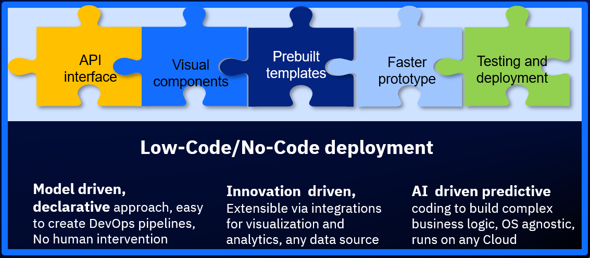
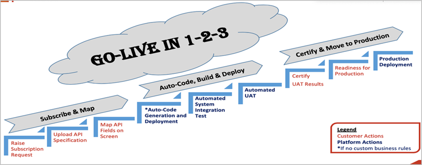
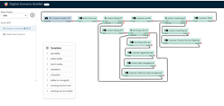
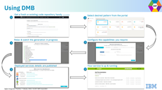
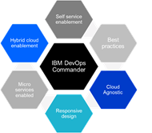

{: .no_toc}
# Low-Code No-Code

## What is Low-Code No-Code

Visual software deployment platform for creating business applications with a click or drag and drop of components and piecing them together. Key benefits of Low-Code No-Code development platforms are:

-    Quickly create and deploy applications
-    Improved business process agility and automation
-    Standard design and accessibility principles
-    Easy to build and test
-    A simple submission(data) transformed into end-end service
-    No complex deployments, hosting, integrations required
-    Business perspective development platforms
-    Frontend, backend, data, process flows, and architecture all embedded into the platform
-   Provides holistic view of the entire applications

| **Low-Code No-Code** |
| :-: |
|  |

- **Model components** should be immutable,any new changes should be new components, extensive testing is required, need support for flexible auth requirements.
- **Avoid vendor lock-in** by using open source-based components, no frequent updates to components, cultural changes and training needed.
- **Set appropriate security constraints** for B2E, B2C and B2B applications, customization is difficult, data compliance policies revisit needed.

## IBM Approach
Prebuilt assets to accelerate Low-Code Cloud Native Development.

### Client Scenario

Build an X-Press connect API marketplace for business and third party Partners with following features:
-    Partners to self-subscribe and map APIs on the platform
-    Automatic code generation, build and deploy to non-production environments
-    Certify and move to production in order to consume the APIs 

### IBM Solution

| **IBM Solution** |
| :-: |
|  |

**Digital Scenario Builder (DSB)** helps choreograph microservices into a digital scenario flow 
-    Automated Code generation leads to 25 % better code quality, reducing cost of maintenance
-    25% cheaper with enhanced productivity using core language resources and scaling abilities

| **Digital Scenario Builder** |
| :-: |
|  |

**Digital Microservices Builder** 
-   Generate microservices code using API definitions that enables to rapidly deploy new functionality  & accelerate go-to-market of new products & services
-   Accelerated to get Microservices program to be 20% faster

| **Digital Microservices Builder** |
| :-: |
|  |

**DevOps Commander and Deployment Automation Tool**
- Automate design, build, deployment  and operation based on best practices, Microservice API enabled tool, UCDz, Jenkins, Jira, REXX Scripts, Shell Scripts

| **DevOps Commander and Deployment Automation Tool** |
| :-: |
|  |

