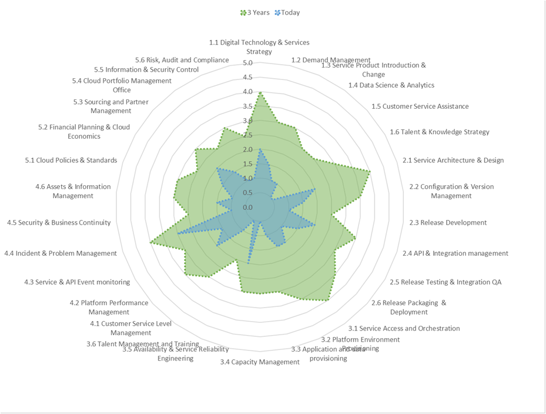
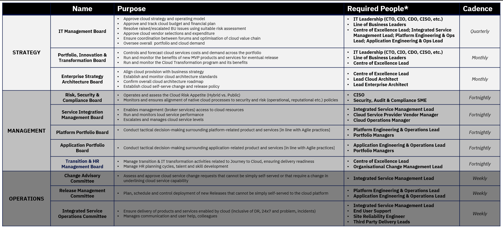
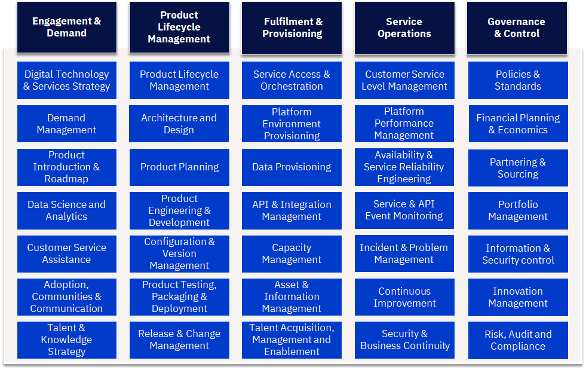
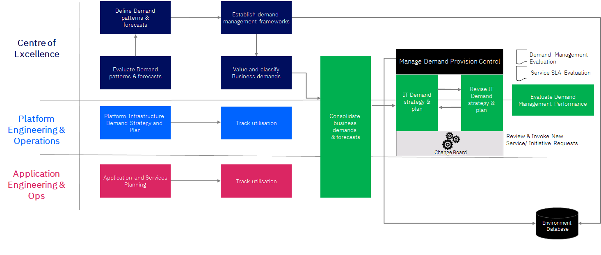
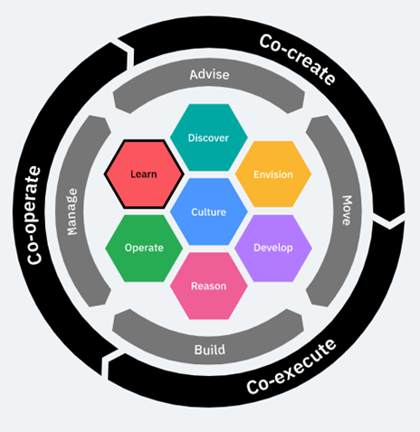

{: .no_toc}
# Target Operating Model

 

How you operate contributes more to the ability to innovate and being agile for an enterprise than any technology you can adopt as an enterprise. Operating Models for Future Application Development are about locking in the value of your investments in cloud and exploiting them for growth. Cloud is more than a set of technologies, therefore successfully adopting and operating multicloud requires operating model transformation:
-    Competitive disruption is driving new and changed business models enabled by technology that IT is asked to integrate, secure, and operate.
-    IT’s mission has been redefined to become a digital integrator across multiple business and IT platforms - a mission that requires a multicloud operating model.
-    Cloud technology cannot be separated from the organisational, cultural, and process transformation needed to use those technologies to drive desired business outcomes.

---

#### Table of Contents

  1. [Overview](#1-overview)
  2. [What Do We Want To Be And What Do We Want To Achieve?](#2-what-do-we-want-to-be-and-what-do-we-want-to-achieve)
  3. [Capabilities Required & Transition](#3-capabilities-required--transition)
  4. [Services Portfolio](#4-services-portfolio)
  5. [Organization & Functions](#5-organization--functions)
  6. [Manage and Control without Inhibiting Agility & Flexibility](#6-manage-and-control-without-inhibiting-agility--flexibility)
  7. [Financial Models](#7-financial-models)
  8. [Digital Platforms & Supply Chains](#8-digital-platforms--supply-chains)
  9. [Innovation & Agility in Delivery Approach](#9-innovation--agility-in-delivery-approach)
  10. [Agile Metrics, Processes & Toolchain](#10-agile-metrics-processes--toolchain)

---

# 1. Overview

## A Design Thinking, Persona-driven Approach to Operating Model

To capture the value of these investments, enterprises need to change how they operate with clients, employees, partners, and regulatory authorities to provide digital products in a safe, sustainable, consistent, quality and profitable fashion. Our Cloud Strategy Operating model examines how to look at the changes you will need to make in organizing for and executing new work to deliver Digital Products and Services in a much changed operating environment. Each operating model dimension must be aligned with multicloud. A multicloud target operating model is: 
-    Powered by cloud platforms that are full-stack operated with clear governance and a powerful IT ecosystem
-    Supported by skilled people, collaborative enterprise culture, and automated processes.

| **Target Operating Model Dimensions** |
| :-: |
|  |

 

Traditional business & IT operating models are broken and require urgent transformation to meet demands of multicloud world.

| Dimensions | Existing Way of Operating | Agile Cloud Way of Operating |
| ---------- | ------------------------- | ---------------------------- |
| Organisation                 |  - Waterfall Product development – From business Teams handover requirements to IT dev to Ops                 |  - Agile iterative product development - Business team roles become Product Owners working continuously with the DevOps teams                                                             |
| Governance                   |  - Centralized governance boards focused on new project approvals, change control                    |  - Offering management driving innovation funnel from IT with agile architecture embedded into development teams  |
| Financial Model              |  - Corporation funds IT projects part of long term portfolios                 |  - Corporation funding product and services lines with flexible usage based                             |
| Workforce Model              |  - Staff performance \- position and salary driven by size of teams, size of budgets, duration - Skills and role/responsibilities of Technical professionals are legacy based often narrow in responsibility or Skill |  - Staff position and salary aligned to knowledge and value creation - DevOps Team model to encourage technical capabilities collaboration - Site reliability engineering will require deep technical experience across platform technologies                               |
| Leadership & Culture         |  - A formal demand vs supply relationship with the business - Risk averse, adopt tried and tested                                   |  - Co creation with the business and the partners - Empowerment for experimentation, learning, continuous improvement                                                                    |
| Partnering & Sourcing        |  - Out source / task 3rd party suppliers for dev, maintenance                   |  - Co creation with suppliers, delivery lines, rebalance internal vs outsource                                                       |
| Digital Technology Platforms |  - Teams build and develop applications and features to a monolithic architecture style, with staged releases                                                                                                         |  - Teams build with Microservices architecture approach, Containers and continuous feature releases - Agile engineering approach for co creation                                                                                                                            |
| KPIs & SLAs                  |  - Requirements and Solutions are business activity focussed                                                                                                                                                          |  - Requirements and Solutions are Value Stream Outcome focussed, and on cloud Platform Service & solutions |
| New ways or working          |  - Application Teams develop applications and handing over to Operations to run and maintain  - Operations team control stacks and technology implementations often limiting choice for efficiencies                   |  - Application teams become full stack Service Product lifecycle teams, providing support, and automation for “Less Ops” service management - Ops team take on the Multicloud management higher up the stack, rely on self directed DevOps teams owning product performance |

## How Are Enterprises Organising Themselves?

This section provides a peek into how organizational structures are forming around new era of digital enterprise and application development.

Modern IT functions are typically supporting the development of cloud enabled, digital products in several ways:

| **4 Pillars** |
| :-: |
|  |

1. **Center of Excellence** - Drives adoption and usage of cloud services in a controlled, secure and consistent way
    -    Advise on cloud adoption to lines of business
    -    Develop guardrails and standards for cloud consumption
    -    Curate a catalogue of cloud services approved for use within the enterprise
    -    Provide education and talent development 
2. **Platform Provider** - Creates a platform of business & technology services to support digital transformation
    -    Incubate the new technology platforms to be consumed by Digital/LoB teams
    -    Act as a broker and integrator across hybrid multi cloud environments
    -    Provide operational platform support
    -    Enable DevSecOps toolchain and capabilities
3. **Digital Product Co-creator** - Partners with lines of business to compete successfully in the marketplace
    -    Operate on product lines towards new digital propositions
    -    Operate agile end to end teams
    -    Drive design thinking for new engineering practices
    -    Experiment and scale fast
    -    Full end to end service accountability
4. **Integrated Service Management** - Centralised command centre to protect live service and drive service excellence across the enterprise
    -    Level 1/1.5 support function
    -    Command centre proactively monitoring services, enabled by analytics and automation
    -    Provides real-time reporting on service performance
    -    Drives service excellence across the enterprise for operations including Site Reliability best practices

These elements interact together to provide an integrate eco-system to create and operate digital products. Within each of these elements, there are various functions that support product development and operations.

| **Target Operating Model - 4 Pillars** |
| :-: |
|  |

### Center of Excellence

The role of the Centre of Excellence is to drive cloud adoption through governance, to build communities and advise on consumption and usage to meet business requirements:
-    Sets guardrails and policies to provide choice and agility, without comprising security and compliance
-    Sets technical architecture and guidelines for development of products and services
-    Delivers education to product teams with line of business and cloud/infrastructure platform teams
-    Promote asset reuse, best practices and recommendations
-    Manages communities to encourage collaboration 
-    Provide advice on sourcing and vendor selection
-    Deliver professional services to support and augment product teams

### Platform Provider

The role of Platform Provider (Platform Engineering & Operations) is to develop and operate cloud, technology and infrastructure products for use across the enterprise:
-    Develops and operates enterprise wide services technical services to be consumed by lines of business IT or value streams
-    Develops services on public and private cloud
-    Manage end-to-end lifecycle of platform services
-    Manage performance and capacity of platform services
-    Develop and operate shared tooling services for consumption across the enterprise 
-    Providers data platform services for consumption across the enterprise
-    Develops and operates integration services including API publishing and management 
-    Manages and maintains the core infrastructure including network, physical infrastructure and data centres 

### Digital Product Co-creator

The role of Digital Product co-creator (Application Engineering & Operations) is to develop and operate business and application services to deliver customer and business outcomes:
-    Develops and operates business and application services
-    Focused on delivering business outcomes and creating new customer/consumer experiences 
-    Help re-defining business process and workflows to deliver better outcomes
-    Work in cross-functional, agile teams working in conjunction with business users
-    Manages the end-to-end lifecycle of business and application services
-    Have overall end-to-end service responsibility
-    Consume and utilise products and services developed and operated by platform teams 
-    Optimise business service/application performance and service levels

### Integrated Service Management

The role of Integrated Service Management is to provide centralised first line support, Operations Command Centre and driving service management excellence across the organisation:
-    Provides level 1/1.5 support capability across applications and platforms
-    Operations Command Centre providing centralised monitoring and enabled by analytics and automation
-    Drive service excellence across the organisation for incident, problem and change management
-    Managing configuration and asset management across the organization to have a fully integrated view of all assets within the IT estate
-    Provide centralised real-time reporting and dashboarding capability on service performance

## What Is Required To Be Done?

Enterprises need to take a holistic look at the operating model by doing which, many of the key questions IT are faced with can be addressed:

| **Target Operating Model Questions** |
| :-: |
|  |

 

[Back to top](#top)

---

# 2. What Do We Want To Be And What Do We Want To Achieve?

| **Target Operating Model Vision** |
| :-: |
|  |

Defining the vision for your organization, the services it will provide and the capabilities needed to deliver these, shaping how all other dimensions of the operating model need to be designed and the priority in which they need to be addressed. Defining from the outset a clear vision, mission & set of principles is critical as it sets the direction, tone and shape of all other operating dimensions.

## Constructing a Vision, Mission and Principles 

| **Target Operating Model Vision** |
| :-: |
|  |

The two top layers of the detail are the ways in which vision and mission statements align to clients overarching strategy. **Vision** describes what we aspire to achieve e.g. Creating the very best digital products, enabled by flexible platforms and the best talent. **Mission** describles what we do and who we do it for.

These mission statements are subsequently met through key **transformation levers** which describe how the vision and mission be achieved.

The foundational layer introduces the key **principles** that guide the direction of transformation and underpin the way in which digital products are created and cloud is adopted within IT and adopted across the enterprise.

## Guiding Principles

The guiding principles set the direction and guardrails for operating model transformation. A strong principle is supported by a clear rationale and associated implications. 

| **Target Operating Model Principles** |
| :-: |
|  |

A Guiding Principle is a high level statement of intent or purpose intended to guide and govern the design & operation of the operating model. The Rationale highlights the business benefits of adopting the principle. These are directly related to the mission statements. Implications are tasks that must happen in order to successfully implement the principle to realise the associated benefits.

Here is a set of principles that are emerging in transformative enterprises:

1. **Business Oriented** - In everything we do, have what we are trying to achieve as a business and what delivers value at heart.
2. **Innovation** - Constantly innovate in the products we create, the way we work, looking for inspiration in how we can transform our business by embracing the latest technology.
3. **Agile culture** - Create an agile culture where everyone is looking to deliver value through every action we take and making that available to others.
4. **Developer First** - Put the developer experience at the forefront of what we do and enable them to create business value and digital products that delight our customers.
5. **Self-Service** - Create products and platforms that can be easy accessed, understood and consumed, in a self-service way wherever possible.
6. **Sharing** - Share for the benefit of your colleagues, teams and the enterprise through assets, practices, experiences, skills and support.

Principles will have an impact on the design and elaboration across a range of operating model dimensions, such as the 2nd example above i.e. Innovation.

* **Principle**
    - Constantly innovate in the products we create, the way we work, looking for inspiration in how we can transform our business by embracing the latest technology.
* **Rationale**
    -    Our industry is underthreat from new start-up market entrants and therefore we need to make sure we innovate what we do to ensure we are constantly providing the best customer experience.
    -    We need to transform the way we think and work as an organistion to ensure we are always improving what we do to be more effective and efficient, focusing on what adds value.
* **Implications**
    -    **Ways of Working**: Provide Design Thinking and User Journey training to everyone in the organisation
    -    **Workforce Model**: Allow headroom to our colleague to tackle ‘pet projects’
    -    **Financial Model**: Provide funding for ‘sandpitting’ of new technology to every employee
    -    **Processes**: Create a mechanism to showcase potential initiatives to receive innovation funding
    -    **Leadership & Culture**: Develop a culture where people are encouraged to think differently and beyond the everyday
    -    **Partnering & Sourcing**: Establish a regular forum for our partners to showcase their latest thinking and technology
    -    **Financial Model**: Provide funding for colleauges to attend conferences and technology showcases
    -    **Governance**: Develop and innovation forum as part of our governance structure 
    -    **Locations & Facilities**: Create innovation spaces where people can collaborate outside of normal teams

## How Vision, Mission & Goals effect the organizations in the enterprise

Over the course of the operating model transformation, each area of the organisation may elaborate their own set of principles in-line with the overall vision & mission.

| :-: |
|  |

 

[Back to top](#top)

---

# 3. Capabilities Required & Transition

 

<h2 style="text-align: center;"><i>We can only see a short distance ahead, but we can see plenty there that needs to be done.</i></h2> <h3 style="text-align: right"><i>- Alan Turing</i></h3>
<h2 style="text-align: center;"><i>No one is less ready for tomorrow than the person who holds the most rigid beliefs about what tomorrow will contain.</i></h2> <h3 style="text-align: right"><i>– Wacker, Taylor & Means</i></h3>

## What Capabilities Are Required to Deliver Digital Products & Pervices and Platform Services?

A broad range of capabilities are required to ideate, develop, support and control digital products and services throughout their lifecycle. 
-    **Engagement & Demand**: the capabilities needed to translate business strategy, needs and requests into products and platforms and ensure the right skills are available across the organisation.
-    **Product Lifecycle Management**: the capabilities needed to architect, develop and release both application and platform/technology products and services.
-    **Fulfillment & Provisioning**: the capabilities required to make products and services easily consumable and rapidly available for use when needed.
-    **Service Operations**: the capabilities required to support and operate products and services and ensure they are performant, resilient and meet business and user service levels.
-    **Governance & Control**: the capabilities required to support and operate products and services, and ensure they are performant, resilient and meet business and user service levels. 

Many of these capabilities cut across the organisation, but have a ‘centre of gravity’ of where the direction and approach for these is set. 
-    Many of these capabilities will be required across various areas of the organisation and will play a role in developing and supporting digital products in an effective, flexible and agile way.
-    However, there is typically a ‘centre of gravity’ within the organization that helps set the direction, standards and process for how that should be done across the organisation.
-    Where this ‘centre of gravity’ resides can vary depending on the maturity of the organisation and the level of autonomy in which parts of the organisation are given.

| **Capabilities** |
| :-: |
|  |

## Capability Evolution

The key question to ask is how these capabilities are changing for leading digital, platform and cloud enabled organisations? Some capabilities are reinventing themselves and some new capabilities are found to be necessary for optimization that is happening in the operating model of digital enterprises.

### Engagement & Demand

| Aspects  | Traditional | With Digital, Platforms & Multicloud  | Change Implication     |
| ------- | ------------------------------ | --------------------- | ------------- |
| Demand  | Demand is planned, typically with tight controls & constraints     | Variable Demand can be readily supported with less constraint, integrated Bus DevOps  |     |
| Digital Technology & Services Strategy | Strategy focus is asset & technology-centric. Adoption driven by vendor features on a cyclical basis                | Continuous strategy focus is Business Value-Centric (Time to Value, User Experience). Greater focus on Technology adoption timing, experimentation pilots. End to end service execution can be displayed against strategic goals via dashboards with analytics. | Design Thinking applied to Technology Adoptions. Enterprise Architecture re-focus on Bus Architecture & Business Service Components.  Sense & respond to Technology maturity changes |
| Demand Management                      | Focus is typically on IT and project driven demand, IT requirements or major business events. CAPEX as a constraint | Forecast in a different way, focus shifts to business usage behaviors & needs for services. Use automation to detect patterns and capacity need changes. OPEX consumption estimating                                                                            | Business Partner roles can now focus on strategic demand & value outcomes. Estimate based on Pay-per-usage. Service Catalogs required                                                |
| Product Introduction & Roadmap         | Focus is typically on IT and project driven IT requirements, staged releases                                        | Agile based approach, with significant potential for frequent release cycles. But SoR integration mast be managed                                                                                                                                               | New Methods to guide business product owners. New ways of working with IT teams, to plan for change.                                                                                 |
| Data Science and Analytics             | Data is managed as a storage cost and constraint. Data not treated as a strategic asset                             | Data as a Service (DaaS) greatly increases the speed and the capacity to add data services with speed, agility, and with cost impacts transparent. Big Data management disciplines for Cognitive AI and Analytics consumption                                   | Enterprise Architecture teams need to update approaches, patterns and controls to drive DaaS adoption and establish Data platform services                                           |
| Customer Service Assistance            | Traditional Helpdesk & support staff, IT help pages                                                                 | Helpdesk teams need to be able to manage incidents across cloud providers and IT teams. Greater focus on self-support and use of Virtual Assistance. Business Relationship / Account Management disciplines                                                     | New procedures, help scripts etc. Virtual Assistance and Robotic Process Automation for high frequency topics                                                                        |
| Adoption, Communities & Communication  | Created in an ad-hoc way usually within organisational silos                                                        | Communities and tribes that cut across the organisation focusing on developing core skills, capabilities and collaboration needed to develop digital products and services                                                                                      | Develop clear communities with specialty and focus areas, create a culture of cross organisation working, incentivizing giveback to the organisation                                 |
| Talent & Knowledge Strategy            | Traditional model                                                                                                   | Skills are evolving rapidly, as cloud platforms and solutions evolve. Heavy reliance on external talent bases                                                                                                                                                   | Centre of Excellence approach and Joint Venture & Collabration models to jump start capability change                                                                                |

### Product Lifecycle Management

| Aspects  | Traditional | With Digital, Platforms & Multicloud  | Change Implication     |
| ------------------------------------- | -------------------------------------------------------------------------------- | -------------------------------------------------------------------------------------------------------------------------------------------------------------------------------------------- | ------------------------------------------------------------------------------------------------------------------------------------------- |
| Product Lifecycle Management          | Release cycles are staged and somewhat constrained for the business              | Cloud Solutions enable multi-speed IT and increased parallel changes                                                                                                                         |                                                                                                                                             |
| Architecture and Design               | Complex multi-layer architecture planning skills required                        | Cloud platforms provide a foundation architecture, focus is on re-using existing legacy, and integrating new solutions. Shift to End User experiences                                        | Legacy modernisation skills required. Design Thinking Methods. Ensure regulatory & policy compliance is embedded in the process             |
| Product Planning                      | Long cycle planning, with features needs to be added in elongated release cycles | Clear product ownership driving a priortised backlog that is aligned to changing business needs                                                                                              | More flexible budgeting and planning, with shorter cycle roadmaps dor development                                                           |
| Product Engineering & Development     | Build and Unit Test monolithic application code                                  | DevOps with Microservices and container based approach.                                                                                                                                      | New development methods & DevOps discipline                                                                                                 |
| Configuration & Version Management    | Typically a pain point across AD & infrastructure, and rarely well automated     | Stronger focus on Config & Version management across environments, enabled through technology. Multi-concurrent versions can be enabled AB Testing                                           | Re-training of staff, tool changes and new working disciplines.                                                                             |
| Product Testing, Packing & Deployment |  Build and Test in dedicated environments – traditional staged approach          | DevOps approach:  Test with containers and in Production partitions. A/B Testing of features. Service integration experience testing focus (eg: single-sign on). Operations testing for risk | Streamlining the process & automation to avoid quality being a bottleneck. Ensure regulatory & policy compliance is embedded in the process |
| Release & Change Management           | Release cycles are staged and somewhat constrained for the business              | Business gain potentially radically variable and fast feature deployment cycles. Automation to drive change control compliance - DevOps                                                      | Release & deployment management process changes. Controls change. Empowerment of ADM teams - DevOps                                         |

### Fulfillment & Provisioning

| Aspects  | Traditional | With Digital, Platforms & Multicloud  | Change Implication     |
| ------------------------------------------- | --------------------------------------------------------------------------------------------------------- | ----------------------------------------------------------------------------------------------------------------------------------------------------------------------------------------------------- | ----------------------------------------------------------------------------------------------------------------------------------------------------------------------- |
| Service Access & Orchestration              | Mixed models                                                                                              | Self Servicing, catalog based approach. Single-sign-on globally                                                 | Need for single sign-on & catalog capability across multi-clouds. Corp Policy to manage authorised cloud services, security access rights and self-service clip levels. |
| Platform Environment Provisioning           | Developers face long wait times to secure access to IT environments                                       | Developers can self-serve IT environments, improving quality                                                                                                                                          | New policies and processes for developers, and for IT environment managers                                                                                              |
| Data Provisioning                           |  In-house online install catalog                                                                          | Application Store & Continuous updates Container based approach - Cloud native applications and DB's are provisioned in to the cloud environment mirroring dev and test environments reducing errors | Current personal supporting provisioning services will have greatly reduced demand.                                                                                     |
| API & Integration Management                | Application & Data Integration requires centralised IT teams, intensive effort & bottlenecks in lifecycle | Open approach to Application & Data Integration, decoupled, fewer bottlenecks                                                                                                                         | Application Development strategy change. API Lifecycle management processes.                                                                                            |
| Capacity Management                         | Capacity pre-planned and constrained by In-house or Supplier Technology Stacks                            | Capacity practices alter - depending on the cloud model (Eg: public vs private, on-premise). Dynamic capacity and self-service needs to be controlled to avoid run-away costs, and minimise wastage   | New capacity planning and management practices according to IT deployment model. Active lifecycle approach required to reduce ‘Zombie’ accounts and Inactive capacity   |
| Asset & Information Management              | Assets and Information controlled centrally or dedicated provider.                                        | Asset & Information sit across Cloud Providers - focus of IT is to regulate, audit & optimise.                                                                                                        | Change to policies and processes. Use of technology (APIs) to automate data collection. Cost management disciplines for data archive and retrievals                     |
| Talent Acquisition, Management and Training |  Training Courses & Certifications Power User support mechanisms | Continuous Just In Time & experiential learning. Agile communities              | Garage Days & Hackathons. Center of Excellence models Social collaboration enablers |

### Service Operations

| Aspects  | Traditional | With Digital, Platforms & Multicloud  | Change Implication     |
| ---------------------------------------------- | -------------------------------------------------------------------------------------------------------------------------------------------------- | ----------------------------------------------------------------------------------------------------------------------------------------------------------------------- | ------------------------------------------------------------------------------------------------------------------------------------- |
| Service Operations                             | Focus on prioritising issues and problems, housekeeping and maintenance                                                                            | Focus on continuous operation, prevention and containment, continuous tech refresh                                                                                      |                                                                                                                                       |
| Customer Service Level Management              | Standardised SLA models, controlled in-house                                                                                                       | SLAs vary across cloud providers. Service integration through Operating Level agreements & automation                                                                   | Policies need to be established, particularly for mission critical business processes, to avoid business performance issues           |
| Platform Performance Management                | Performance is internally controlled, but also constrained by pre-build technology stacks                                                          | Performance shifts to cloud providers and platform integrators, with varying characteristics. Network latency as a typical constraint.                                  | IT need to adapt monitoring across multicloud providers with a focus on latency issues and new technology standards (eg: containers) |
| Availability & Service Reliability Engineering | IT Support staff model – System Administrators and DBAs. IT manages availability to SLAs, with a focus on scripts, maintenance windows and recover | Prevention based practices – Site Reliability Engineers. Automation to continuously detect, prevent and recover.                                                        |  Site Reliability Engineering skills and IT Self-Healing script automation.                                                           |
| Services & API Event Monitoring                | IT incidents handled through predictable supplier based models                                                                                     | Strong focus on prevention, root-case analysis and recovery - DevOps Site reliability Engineering, event management, and skills at Helpdesk level. Increased complexity | Processes need to robust for resolving problems & issues in timely manner. Strong root cause skills                                   |
| Incident & Problem Management                  |  ITIL based support approach                                                                                                                       | Emphasis on early detection and prevention, auto-recovery                                                                                                               | Embed Site Reliability Engineering. Auto-recovery, Event Analytics. Integrate with legacy operations                                  |
| Continuous Improvement                         | Done through lessons learnt at the end of major programmes or initiatives                                                                          | Ingrained as part of the fabric of working, with a culture that seeks out improvement. SRE capability constantly seeking to automate and reduce TOIL                    | Clear metrics to measure improvements, culture and incentives to delver improvements                                                  |
| Security & Business Continuity                 | Security enablers to prevent vulnerability (eg; virus scan). Manual fall backs for continuity                                                      | Continuous threat posture, with security operating across boundaries, detecting trends and weakness ahead of major events. Dynamic continuity changes & Robust fallback |  Automation & AI to pre-empt the risk.   Platform standards to minimize variation vulnerability                                        |

### Governance & Control

| Aspects  | Traditional | With Digital, Platforms & Multicloud  | Change Implication     |
| ---------------------------------------------- | -------------------------------------------------------------------------------------------------------------------------------------------------- | ----------------------------------------------------------------------------------------------------------------------------------------------------------------------- | ------------------------------------------------------------------------------------------------------------------------------------- |
| Policies & Standards                 | IT Policies are Asset and technology Centric, for internal IT teams. Policies and standards are relatively static | Cloud IT Policies & standards are utilized by the Business, suppliers and external users, enforced by central governing teams. Standards are platform and As-A-Service centric. Standards continuously evolve with new Technology | Policies & Standards to enable greater Self-Service, by external parties (Eg: APIs), and for platform standardization. Focus on continuous updates                                                                                                |
| Financial Planning & Cloud Economics | Fixed period planning cycles (annual, per project), with significant investments for asset refresh                | The IT service framework now prices IT Services incrementally from the IT vendors to get accurate Operational Expense forecasting. Consumption driven planning with Business Product Owners                                       | IT budget planning processes change. Project estimating & planning process changes. Budget allocation & chargeback models change, aligning to Business Product Owners - need to be handled carefully. Handling business case viability challenges |
| Partnering & Sourcing                | IT supplier based models. Value assessed on asset basis. Long procurement cycles                                  | "Vendors" are replaced with partners who are tied in seamlessly to the essential delivery of IT services. Value assessed on business outcomes. Rapid proof of value procurement cycles                                            | Procurement and sourcing business rules need to be modified to reflect the new opex nature of cloud operations.                                                                                                                                   |
| Portfolio Management                 | PO is driving mixed model of CAPEX programmes & project releases. Traditional PPM                                 | Project staffs will plan projects incrementally and measure value for incremental progress. ROI metrics will be easier to acquire and justify.                                                                                    | Training of PMO staff's in agile management techniques is required. Governance changes required                                                                                                                                                   |
| Information & Security control       | Internal controls are managed against assets and                                                                  | Security polices and controls are proven for each cloud service fielded. For industries with regulatory concerns, security works ahead of ahead of new imitative to show the impact of cloud tools and procedures.                | Security Organizations need extensive education/exposure to how cloud operations should be tailored for security polices and control,                                                                                                             |
| Risk, Audit and Compliance           | Control is managed centrally, and controls are typically transparent                                              | Cloud Service Provider contracts assure compliance. Understanding the compliance and regulations for using public cloud providers requires clients working with their providers to validate their deployment patterns.            | Proactively work with compliance authorities to implement new policies and control's - but may stretch the talent and experience of incumbent personnel, such as for GDPR issues.                                                                 |

## How Do We Transition?

Assessing the maturity of these capabilities helps determine the areas for focus of operating model change and sets a baseline for measuring improvement. Undertaking a maturity assessment across these capabilities provides a number of benefits to defining the future operating model transformation
-    Bring visibility to current practices adoption
-    Identifying and prioritise gaps in existing capabilities
-    Expose pain points
-    Provide a future view of ambitions and goals with to help focus capability transformation
-    Structure the transformation priorities
-    Target quick wins and early proof points 

Additionally, this maturity assessment case act as a ‘yard stick’ to measure progress of the operating model transformation, alongside other KPIs that help support the measurement of each capability.

| **TOM Capability Maturity** |
| :-: |
|  |

 

[Back to top](#top)

---

# 4. Services Portfolio

## What Services Does The Next Generation IT Organisation Offer?

The service portfolio outlines what is offered, developed and supported across the organisation using a common taxonomy, language and service definition. It covers all products and services across the organisation in a clear and transparent way.

Why is it important?
-    Provides clarity on what products and services are offered, develop and managed within the organisation and by suppliers, with identified internal product owners
-    Clearly defines the role between and application and platform engineering teams and establishes clear ownership
-    Creates clear line of sight between business services and underlying technology simplifying supportability and operations
-    Helps avoid duplication of functionality and accelerates development through patterns that are architected and built with the necessary security and compliance approval
-    Make services more consumable by describing them in a common way, make costs transparent, presenting in a curated catalogue and automating access and provisioning where possible
-    Helps manage the lifecycle of services driving investment decisions, architectural choices and service strategy

| Target Operating Model - Service Portfolio |
| :-: |
|  |

---

## Key Principles for Establishing Service Porfolios

| Principle                   | Description       |
| --------------------------- | -------------------------- |
| Single & Hybrid Offering    | - The same offering must be delivered everywhere. - Leverage capabilities from Private and Public Cloud Providers and facilitate Exit Strategies.                  |
| Technology Agnostic         | - Focus on the abstraction and the interface defined by the service and the value which gets delivered rather than particular implementations that might be supporting it.                                                                              |
| Standardized & Prescriptive | - Consumer applications and services rely on the set of standardized set of Cloud Platform Services that have been published for each customer. - Each service might require a number of other mandatory service components (either by policy or as part of a bundle) in order to meet other key objectives and requirements.                |
| Managed & Platform-centric  | - As opposed to Workload centric offering, a Platform-centric offering provides Cloud Services that presents building blocks that can be used by consumer applications and services. - A managed Cloud Service Portfolio must ensure and deliver:  - Value that contributes to fulfill the vision and the strategy  - Enterprise grade SLAs. |
| Differentiated              | - A Single, Managed, Secure and Hybrid Multicloud offering presents a distinctive value chain that goes way beyond the one obtained by just doing a pass-through of technology proposals from different CSPs.                                           |
| Compelling & Competitive    | - The Service Offering must be compelling and competitive so that customers are willing to adopt it  - The CCC must make sure the solution proposed as a Service Offering is cost effective and cost efficient.                                          |
| Agile                       | - The Service Definition process must follow a regular cadence of small, frequent and incremental iterations.  - Prioritization efforts must take into consideration a positive feedback loop with customers and prospects.|

 

[Back to top](#top)

---

# 5. Organization & Functions

 

| **4 Pillars** |
| :-: |
|  |

You have earlier seen how enterprises are organising themselves in the digital and multicloud world and the four kind of organizations thus forming.

Within each of these elements, there are various functions that support product development and operations:

| **4 Pillars Function** |
| :-: |
|  |

## Centre of Excellence

### Strategy, Architecture & Demand

#### Purpose

- Provides overall direction by being responsible for aligning both cloud and IT strategy with the broader enterprise strategy. 
- Owns and iterates a “to-be” cloud vision, and provides governance to ensure projects, services and products are operated in a standardised and strategical aligned method. 
- Defines and maintains the Enterprise’s cloud strategy, policy and architectural references (including integration, infrastructure, software & licenses and disaster recovery). 
- Collects new requirements for functionality to be implemented. 
- Acts as a consultant and/or advisor for Lines of Business expected to consume its products and services, consulting on delivery and best practices associated with cloud technologies.

#### Core Activities

Responsible and Accountable for:
-    Continuously reviewing and communicating cloud strategy against business strategy objectives
-    Defining and maintaining cloud reference architecture, patterns, principles and standards for the Cloud Platform
-    Managing cloud architecture governance on behalf of the Centre of Excellence
-    Developing and maintaining guidelines and policies for cloud integration, cloud infrastructure, configuration management, software & license management and disaster recovery
-    Defining and maintaining target “to-be” cloud estate and transition states for cloud implementation
-    Understanding customer needs and validating solutions from customer perspective. 
-    Translating business requirements into Solution Design Documents and initial product or service roadmap (implemented by AEO/PEO)
-    Monitoring and tracking new business requirements and technology approaches based on demand

Consulted on activities linked to Platform Engineering Operations, Application Engineering Operations, and Integrated Service Management.

#### Roles

-    Centre of Excellence Lead — Define and agree Vision, Mission, and Goals for Cloud Strategy Operating Model — in line with Business Outcomes set by Enterprise C-Suite—and drive alignment of IT products & services with consumer demands and BoB innovation
-    Architecture Squads [Chief Solution Architect; Cloud Platform Architect; Transformation SRE; Security Consultant; DevSecOps Engineer] — Determine cloud architecture strategy (and associated policies and standards) and data stewardship standards in tandem with enterprise architecture strategy; Defines the service integration strategy and architecture for the enterprise; Drive alignment for a full stack product or service solution that meets customer demand

### Adoption & Communities

#### Purpose
Collects new requirements for functionality to be implemented into the Centre of Excellence, Application Engineering & Operations, Platform Engineering & Operations, and Integrated Service Management. Acts as a consultant and/or advisor for Lines of Business and Delivery on best practices associated with cloud technologies, application modernisation and application migration.

#### Core Activities

Responsible and Accountable for:

*Communications Strategy and Marketing*
-    Continuously develop and communicate the vision to Enterprise stakeholders
-    Determine marketing communication methods and frequency 

*Methods and Knowledge*
-    Develop, maintain and share relevant industry and business knowledge
-    Maintain and create standard development methods to share across all areas of the business
-    Share information on existing cloud capabilities to Enterprise
-    Implement, update and maintain mechanisms for cloud knowledge management
-    Maximise reuse by sharing of solutions across AEO and PEO teams

*Cloud Transformation/Migration Support* (as needed)
-    Support the migration to Cloud of the legacy IT estate (where appropriate) by defining the approach and principles appropriate for an application centric migration
-    Perform cloud affinity assessment & workload analysis for each service/application proposed to move to the Cloud
-    Run cloud affinity and workload analysis for all departments/sectors/businesses within the organisation
-    Create cloud transformation roadmap based on affinity, workload and difficulty ratings.
-    Provide estimates for modernisation of applications

#### Roles

-    Centre of Excellence Lead – Leads cloud within the Enterprise
-    Cloud Ambassador - Acts as a consumer advocate for cloud services
-    Cloud Engagement Manager - Interfaces with the Lines of Business to understand and interpret business needs

### Education, Talent, and Skills

#### Purpose

Manages resourcing, skills assessments, upskilling & development and the arrival of expertise at the right time. Leverage existing talent within the Enterprise, procure talent outside the Enterprise, and upskill individuals with skills that best align to business and IT needs.

#### Core Activities

Responsible and Accountable for -
-    Analysing current team skills and  skill gaps
-    Leveraging partner organisations to augment roles within Organisation as required
-    Establishing re-skilling initiatives
-    Establishing initiatives, processes and policies to capture and retain cloud talent
-    Establishing cloud enablement education programs, workshops and seminars
-    Mapping cloud education and training to roles and responsibilities
-    Establishing cloud re-skilling programs
-    Conducting training of user communities and IT support resources
-    Educating relevant stakeholders in their responsibility for compliance
-    Organising and managing community events
-    Integrating external community partner services into portal
-    Setting up partner external community relationship

#### Roles
-    People and Talent Lead – Create business case for talent (upskilling of existing talent, acquisition of new talent, cross-skilling of talent, etc) to align with evolving needs of business delivered by the IT organisation; Own relationship between HR and the IT organisation to ensure both are tightly coupled
-    Cloud Education Specialist – Drives cloud operational efficiency by building cloud training offerings
-    Talent Acquisition Manager – Coordinate and drive acquisition of talent in line with business skillset requirements

### Security, Risk & Compliance

#### Purpose

Provides confidence to Enterprise that IT products and services meet the regulatory and compliance requirements as outlined by geographical regions, industry bodies and Enterprise policy. Outline, review, iterate and communicate controls in line with the agreed organisational risk and compliance framework. Provide SecOps function with confirmation that cloud Platform and associated cloud products and services comply with Enterprise security rules and standards. Set, manage, and report on all security standards whilst assessing new and existing projects and tooling for compliance with regulation.  

#### Core Activities
Responsible and Accountable for:
-    Defining application, network, data, identity and access management, and system security guidelines and policies (in line with best practice for cloud products & services)
-    Understanding regulatory and confidentiality requirements and policies and add into products and services backlogs
-    Documenting the internal and external context of each security, privacy and data protection risk, and the evaluation criteria
-    Reviewing and monitoring physical and logical data security measures 
-    Reviewing and monitoring application security controls 
-    Monitoring network intrusion detection data
-    Creating and maintaining the policies and supporting controls for cloud under enterprise risk management framework
-    Managing, maintaining and reporting on compliance policies, standards and processes (following predefined cadence)
-    Determining and understanding the relevant regulatory and audit requirements 
-    Embedding ownership and responsibility for IT-related risks within the business at an appropriate senior level 
-    Identifying and evaluating risks related to information security, cloud project management, cloud sourcing, etc.
-    Identifying and prioritising projects to enhance cloud compliance and to remediate identified issues/risks 

#### Roles

-    Cloud Auditor - Ensures Cloud environment compliance is being performed according to the agreed and documented processes
-    Cloud Service Security & Risk Manager – Implements security and compliance policy 

---

## Platform Engineering & Operations

### Brokerage & Orchestration

#### Purpose

Ensures the commercial and/or contractual arrangements associated with the third parties (e.g., ATOS, cloud vendors, etc.) that are part of the provision and implementation of cloud-related products and services are strategically planned and managed such that they deliver maximum value, low risk and are financially beneficial to the Enterprise.

#### Core Activities

-    Defining and implementing a category strategy for procuring cloud services (i.e. vendor management strategy)
-    Defining and running the partner qualification, selection and management approach
-    Managing active/ongoing contracts
-    Procuring/purchasing cloud services & products
-    Providing financial guidance for funding requests, procurement, and business case development for cloud services
-    Developing and operating the financial model and process for cloud products and services
-    Publishing & maintaining agreed cloud service pricing models
-    Providing a centralised billing capability and aggregating and reconciling bill for each cloud customer
-    Establishing CSOM business accounting and funding mechanisms
-    Creating and maintaining cloud budgets
-    Providing financial management of cloud assets 
-    Developing and managing accounting controls and standards
-    Establishing and operating financial reporting framework including the monitoring of all costs and variances
-    Negotiating relationships between providers and cloud consumers
-    Developing standard cloud customer contracts and relationship management approaches 

#### Roles

-    Cloud Pricer - Manages cost of Cloud services offering
-    Cloud Service Provider Management - Negotiates relationships between cloud providers and cloud consumers. Interfaces with external service suppliers to support purchasing and contract management
-    Cloud Financial Manager - Manages and enforces all aspects of CSP cost and consumer pricing
-    Cloud Marketplace Manager –Manages the marketplace evolution and ensures access to the services for end users

### API & Integration Management

#### Purpose

Publish, promote and oversee application programming interfaces in a secure, scalable environment, including end user support resources that define and document the API. Create business agility to drive rapid business reconfiguration (i.e. to revamp customer experience, address regulatory challenges (GDPR), etc.). Provide ease of use for APIs. Track and manage APIs in use. Build a framework for enforcing agreements on API use and security access control.

#### Core Activities

-    Planning, design, implementation, testing, publication, operation, consumption, maintenance, versioning and retirement of APIs
-    Elaborating channel IT design requirements
-    Delivering a developer portal through which to target, market to and govern communities of developers who embed APIs
-    Conducting runtime management
-    Enforcing relevant API security policies and requests and also guarantees authorization and security. 
-    Estimating APIs’ value
-    Using analytics to understand patterns of API usage [i.e. monitor API usage, load, transaction logs, historical data and other metrics that better inform the status as well as the success of the APIs available] 
-    Informing developers when an API is scheduled to be retired or deprecated, and what alternative APIs might be offered (frequently with a new pricing plan)

#### Roles

-    Cloud Service Integration Architect—Defines the service integration strategy and architecture for the enterprise
-    Cloud Service Composer & Developer—Creates/bundles products and services for end-user consumption
-    Cloud Service Integration Engineer—Technical focal point for cloud service integration within the IT ecosystem

### Infrastructure Management

#### Purpose

Maintain legacy estate (data centres, hardware, networks, mainframe, etc.) to ensure access and performance are uncompromised while exploring areas for transformation in alignment with business transformation goals and strategic priorities.

#### Core Activities

-    Managing physical infrastructure platform according to internal service level agreements
-    Managing physical capacity expansion in-line with growth forecasts
-    Managing physical assets usage optimisation and currency
-    Managing to policy compliance 
-    Conducting server configuration, server commissioning and decommissioning, server and backup management, server management remote and onsite, desktop management, database management, and network management LAN/WAN
-    Understanding implications/constraints of enterprise application and infrastructure architectures
-    Determining integration requirements between IT services and solutions
-    Identify opportunities for shared capabilities at a service/solution implementation level
-    Developing and maintaining service and solution architecture

#### Roles

-   Infrastructure Manager—Manage existing core infrastructure to maintain performance and availability

### Platform Product Engineering and Management

#### Purpose

Design, develop, test and deploy cloud platform to best align with evolving marketplace demands for cloud products in coordination with Application Development Squads. Ensure platform is built in line with security, risk, and compliance policies and standards and adheres to standards around capacity, availability, and reliability. Perform proactive and reactive management of platform products. 

#### Core Activities

-    Defining platform architecture specific to the applications (in consultation with App Dev Squads)
-    Designing development tools environment changes specific to the applications (in consultation with App Dev Squads)
-    Configuring DevOps environments, tools & automation frameworks for the development of platform
-    Leveraging DevOps & Automation to build & deploy the platforms needed for common services
-    Ensuring reliability is built into common platform
-    Proactively managing and continuously improving the platform
-    Developing and deploying automation and other best practices to address opportunities
-    Performing reactive management of the platform(s) to the required SLAs and contractual agreements

#### Roles

-    Platform Build Squads [Cloud Platform Architect; Platform Security and Quality Assurance; Platform SREs; Platform Specialists; Platform Developer (patterns/automation)] — Build and manage platform services in Agile manner
-    Shared Platform Squad — DevOps and Tooling — jointly design the development tools environment changes specific to the application group, leveraging common services

## Application Engineering & Ops

### Application Product Engineering Squads

#### Purpose

Innovate, design, develop, test and deploy an application (in Agile teams) to align with evolving marketplace demands for cloud products. Coordinate with Lines of Business, in alignment with a particular Value Stream (e.g.) to define and manage information throughout the product lifecycle. Leverage cutting edge technologies and ways of working to remain tightly coupled with delivering products that delight customers.

#### Core Activities

-    Understanding consumer demands and trends to ensure product development properly addresses needs in the marketplace
-    Translating consumer needs into requirements and own lifecycle for application (in consultation with Platform Squads, as applicable)
-    Developing common services to meet the functional requirements, following design created by architects
-    Ensuring non-functional requirements are met and Build to Manage principles are followed
-    Leveraging DevOps & Automation to build & deploy products
-    Proactively managing and continuously improving the applications
-    Developing and deploy automation and other best practices to address opportunities
-    Maintaining the functional elements of applications
-    Maintaining non-functional elements (in consultation with Platform SREs)

#### Roles

-    Application Development Squads [Application Developers; Application Security and Quality Assurance; Application SREs]—Build and manage applications in Agile manner
-    User Researcher—Research marketplace demands to ensure aliment with existing product portfolio; Identify areas for new products based on evolutions in the marketplace
-    User Experience Designer—Design products based on insights from UX in consultation with App Dev Squads
-    DevOps Transformation Lead Engineer—Coordinates DevOps practices definition and adoption

## Integrated Service Management

### Customer Assistance

#### Purpose

Own and manage relationship with consumers of cloud products and services to ensure consistent, high quality interactions. Monitor quality using OKRs and report results to stakeholders to visibility into quality on regular basis.

#### Core Activities

-    Owning and managing relationship with consumers of cloud products and services
-    Managing day to day interactions with customers (internal and external)
-    Ensuring high quality customer interactions via comprehensive monitoring and reporting
-    Monitoring quality using OKRs agreed by Cloud Customer Support & Care resource
-    Liaising with Operations Command Centre on resolution of complex customer service situations

#### Roles

-   Cloud Customer Support & Care –Assists with usage and change management as first point of contact

### Operations Command Centre

#### Purpose

Owns the operation of the cloud platform and ensures its alignment with standard Enterprise operating procedures. Implement and operate Enterprise cloud platform services, enabling accelerated delivery of new cloud products and services in a controlled and secure manner. Ensure the guidelines and policies for operations are clearly defined and maintained.

#### Core Activities

-    Forecasting business volumes for cloud services 
-    Providing Cloud User and Account Management
-    Conducting compliance/risk monitoring and reporting (upon consulting Risk & SecOps)
-    Monitoring and managing risks related to ongoing cloud activities based on cadence identified in the Enterprise Risk Framework (including information security, cloud project management, and cloud sourcing)
-    Developing and maintaining Cloud infrastructure Release and deployment guidelines and policies
-    Developing and maintaining Configuration management guidelines and policies
-    Developing and maintaining software and license management guidelines & policies
-    Developing back up and archive strategy and supporting guidelines & policies
-    Developing and maintaining DR management guidelines & policies
-    Developing event management strategy, guidelines and policies

#### Roles

-    Cloud Operations Manager –Owns daily operational activities
-    First Responder –Ensures rapid response to service level breaches
-    Site Reliability Engineer –Executes and optimizes automated operations
-    Cloud Operator –Supports cloud products & services 

### Service Excellence

#### Purpose

Monitoring and managing service to ensure quality is aligned with Service Management Strategy. Action changes in service (at either a strategic or tactical level) in accordance with Customer Service quality ratings. Monitor and manage service quality to ensure quality is sufficiently high enough to meet customer expectations.  

#### Core Activities

-    Developing and maintaining KPI data collection guidelines
-    Developing and maintaining checklist of introduction of infrastructure to production
-    Understanding implications/constraints of enterprise applications
-    Assisting cloud migration execution (provision new environment, validate compliance, prepare tools, create runbook)
-    Providing support for early operational problems
-    Defining processes for resolving service performance issues and proactively identifying improvement opportunities

#### Roles

-   Cloud Service Manager –Owns daily operational activities

 

[Back to top](#top)

---

# 6. Manage and Control without Inhibiting Agility & Flexibility

## Overview

The modern Cloud Strategy Operating Model Governance model ensures that all four of its IT elements (i.e. Cloud Centre of Excellence, Application Engineering & Operations, Platform Engineering & Operations, and Integrated Service Management) play an integral part in the successful delivery and realisation of strategic initiatives, enabled through IT cloud capabilities and services. 

| **Governance** |
| :-: |
|  |

This document describles the necessary forums that are required to determine how:
-    Digital products and services are being adopted and used via standardised frameworks and services.
-    Operations of capabilities and services are performing.

The Governance model will span across three accountability levels i.e. Strategy, Management and Operations — and will include board level decisions in Exec Committees through to day-to-day management decisions, which will in turn drive Operational delivery. An accountability level characterises the scope and intent of the activity and decision-making.

This cuts across all four IT Elements of a modern operating model.

| **Governance Pillars** |
| :-: |
|  |

Structured within a hierarchical model, each governing Board or Committee adds distinct value to the Enterprise:

| **Governance Structure** |
| :-: |
|  |

But how does this work in practice?				

| **Governance Boards** |
| :-: |
|  |

 

“Good” governance model is comprised of four main component:
- Structure
- Active Oversight Responsibilities
- Talent & Culture
- Infrastructure

## Structure

-    Outlines board and management committee structures, mandates, membership, and charters
-    Establishes design of governance framework
-    Delineates organizational structure, reporting lines, and relationships
-    Highlights roles and independence of control and support functions from business owners

## Active Oversight Responsibilities

-    Outlines the type of committees (board and management) and associated responsibilities
-    Specifies functional accountabilities for day-to-day management of business practices across the enterprise
-    Delineates board and management policies supporting delegation of authority  (decision rights) including reporting, escalation, and veto rights

## Talent & Culture

-    Aligns governance with operating and business principles
-    Articulates core beliefs and foundation for culture
-    Highlights characteristics of risk culture
-    Outlines leadership success, assessment, and development responsibilities
-    Aligns performance management, approach, measures and responsibilities to compensation and incentive plans

## Infrastructure

-    Establishes design and content of policy manuals and associated procedures
-    Outlines type and frequency of internal reporting and communications
-    Defines scorecards, measures, and metrics to track performance
-    Aligns technology and governance requirements

 

[Back to top](#top)

---

# 7. Financial Models

## Overview

Financial models for IT are evolving too, in line with the evolving digital enterprise and how they operate. Here are some of the key attributes of a suitable financial model to enable the enterprise to function effectively as an innovative organization and with agility:
1.    Asset light - Shifting from CAPEX to OPEX and dynamic accounting models
2.    IT Spend as a % of Customer Growth & Revenue Potential, ARPU
3.    Consumption driven IT economics
4.    Benefit & Value driven, not cost constraint decisions
5.    Committed investments to transform, start-up seed funding to innovate
6.    Optimise to Re-Invest

## Cloud Economic Considerations

An enterprise can generate value for itself from cloud by a combination of optimizing its IT infrastructure & operational cost and innovating its way to new revenue that it could not realize earlier.

| **Cloud Economics** |
| :-: |
|  |

1. Efficiently Utilize Cloud Resources
    - Proactively identify and eliminate unused resources
    - Identify and optimize idle resources
    - Right size resources for efficient cost and performance
2. Operational Optimization of Cloud Resources
    - Leverage dynamic auto scaling for cost optimized performance
    - Identify opportunities for movement to lower cost instances/families
    - Optimize and reduce operational costs of data resources
    - Balance performance and costs of cloud resources 
3. Financial Governance Mechanisms for Cost Management
    - Structural governance: Evaluate cost implications during design
    - Role governance: Determine the access, provisioning and budget authority for defined cloud roles
    - User governance: Create “menus” of available patterns for each role with cloud provisioning authority
    - Quality governance: Audit effectiveness and adherence to governance across all three levels
4. Pricing, Reserving and Discounting of Cloud Resources
    - Evaluate bulk pricing options for potential discounts prior to provisioning
    - Monitor use of cloud resources against purchased discounts
    - Utilize automated recommendations and alerting to identify opportunities for bulk purchases based on usage trends

## Value Levers

Different levels of value can be realized through layers of transformation:

| **Costing Layers** |
| :-: |
|  |

Value is driven through an exhaustive set of levers across 5 sources and needs to be supported by a business case. These are the 5 sources:

1. Business acceleration
    - Get 3.5X more benefit than public only
    - New insights and better client experiences
    - Faster time to market for all your apps
    - Innovation in a secure, consistent way 
2. Application modernization
    - Speed app release from months to weeks
    - Modernize 66% more apps
    - Consistent skills and agile dev ops 
    - Automation and less rework.
3. Infrastructure cost efficiency
    - Cut infrastructure costs by 4x with less maintenance
    - 95% incident reduction/higher resiliency 
    - Greater utilization
    - 10% infra cost savings
4. Regulatory and risk
    - Reduce compliance 
    - Spend by ~25%
    - Gain a single pane of control 
    - Consistent security/compliance policies 
    - Automation on a consistent stack
5. Strategic optionality
    - Realize a more agile, flexible architecture
    - Avoid vendor lock in
    - Match workloads to the right model 
    - Optimize cost by moving workloads

 

[Back to top](#top)

---

# 8. Digital Platforms & Supply Chains

This section tries to answer the following questions:
1.    How do I create a platform architecture to enable developers and business users to create business value?
2.    How do I best utilise and access an ecosystem of partners to add value to what we do?
3.    How has the recent pandemic changed traditional location-based working?

## Digital Platforms

Leading digital organisations are creating scalable, flexible and multi-level platforms that can be easily consumed by developers, business users and partners:

1. Business Platforms - Developing business platforms and services that can be re-used within the rest of the organisation (both business users and development teams) and with partners and B2B customers
2. Technology Platforms - Creating platforms on-top of cloud services that embed automation, controls and security that are easily consumable by developers ‘as code’ or via a self-service portal via a single pane of glass

| **Digital Platforms** |
| :-: |
|  |

The key drivers for such platforms are:
-    Engineered with open interfaces, 'standard' based and easy to connect to
-    Are aligned and pre-built to architectural, service, compliance and security standards
-    Removes a level of operations that needs to be performed by developers so they can focus on adding value and creating digital products
-    Adds value on-top of ‘out-of-the-box’ cloud and technology services 
-    Provides a set of stable core components, but which can support variety and evolution
-    Easily extensible, enabling scalability, not just on demand but based on strategy 
-    Encourages and facilitates innovation and novel usage
-    Opens up a business capability to be accessed by partners and customers
-    Allows the rest of the organisation and partners to add value and capture value through the interfaces

Business platforms are built upon a foundation of technology platforms, connected in an open and transparent way
-    Each platform provides a range of services that can be easily publish and consumed to construct digital products and services
-    These are surfaced either via APIs, CLI, self-service catalogues or through other user interfaces and visualisation engines (i.e. codeless BPM)
-    These can be combined together via open API and connectors
-    Each platform service should also provide APIs to monitor and operate services to provide visibility of availability and performance

| **Digital Platform Functions** |
| :-: |
|  |

## Partnering & Sourcing

An effective IT Supply Chain improves and organisation flexibility, cost effectiveness and ability to build capability.

**What is the IT Supply Chain?**

The process off managing interactions with cloud providers (platform vendors, SaaS providers, service vendors) formally by selecting them based on their ability to meet identified requirements and managing performance against the agreed upon commitments within the Service Catalogue. 

Some of the  key focus areas in this function include:
-    Migrating to as-a-service commercial models for both technology infrastructure enabled by cloud computing and a flexible workforce that delivers outcome-driven engagements
-    Adopting a more liquid workforce as they try to bridge the skill gaps resulting from rapid changes in technology
-    Implement the right mix of local and global focus given the flexibility on cloud, new ways of working and need for shorter delivery cycles with high business involvement

**What benefits does it bring?**

| **Benefits from IT Supply Chain** |
| :-: |
|  |

### Considerations Design when designing your IT Supply Chain

1. Collaborative Sourcing Relationships - Shift away from focus on deliverables and service levels. Focus on a sourcing philosophy to embrace a partnership approach that can result in collaborative processes, skill development
2. Managed Capacity - As enterprises continuously evolve their strategies and roadmap, they would need to pull in capabilities and services on Demand
3. Open collaboration tooling - The new ways of working would need collaborative working practices across microsites. Supplier base model will need to adjust to match the DevOps Lifecycle
4. Service Brokerage and Orchestration - Provide a centralized catalog of internal and external cloud, business platform and Open APIs to fuel rapid innovation across the enterprise
5. Multisourcing Strategies - Unlike the conventional tower-based sourcing, Continuous Delivery in a cloud world require flexible sourcing strategies that allow multiple vendors collaborate with clearly defined roes
6. Opex Centric Consumption driven planning - The IT service framework now prices IT Services incrementally from the IT vendors to get accurate Operational Expense forecasting.  Consumption driven planning with Business Product Owners
7. Predictive Demand Planning - Use in-depth analysis and predictive forecasts to anticipate demand and initiate sourcing with sufficient lead times
8. Monitoring - Globally monitor and control all local / regional cloud service consumption for continuous platform optimisation. Drive usage analytics and chargebacks through automated single unified plane of control across cloud service providers
9. Mitigation - Managing Cloud Platform risks like Vendor-lock-in, latency, security, and availability as an integral part of the Sourcing Strategy 

## Dynamic Delivery

Pre-pandemic, delivery models were optimised with delivery across client site, nearshore and offshore delivery centres. To balance cost and value, enterprises had Co-located garages for experience and innovation complimented by distributed Agile practices.

With the pandemic, this was challenges as business continuity came to the fore. Enterprises had to deal with Dispersed teams & Individual silos, lack of certainty and change in priority of projects as well as security concerns - truly hindering innovation.

### Shift 1

Enterprises initially focussed on recovering from this situation and getting back into being a resilient organization. This shift was focused on Employee safety, making existing team members virtually equidistant, bringing certainty to Program delivery, increasing portability of tasks and restoring Innovation.

| **Resilient** |
| :-: |
|  |

This shifted focus on 100% Cloudified Delivery Methods by adopting to Virtual Garage models and updated Security procedures and getting their teams skilled in virtual execution.

### Shift 2

Having realized the longetivity of the situation and the ability to change, enterprises are evolving further to generate value in spite of the handicap. Delivery across sites and individuals are being optimized for skill and cost (hybrid and variable), Automation has been taken up a notch in the Cloudified Delivery Platforms.

| **New Normal** |
| :-: |
|  |

The focus is now on building the ability in the enterprise to absorb shocks from external unforeseen events and be able to carry out any task, at any time, from anywhere. This, in turn, as offered an improved value and cost profile compared to pre-pandemic model,

 

[Back to top](#top)

---

# 9. Innovation & Agility in Delivery Approach

## New Ways of Working

To develop the future IT operating model, we recommend taking an agile, user centric approach. Take a persona lead approach, define user journeys to develop an operating model that is built for the people who will demand, consume and operate services. Elaborate and build out each operating model dimension in an agile and iterative way, informed by the user centric journeys and feedback on previous releases of the operating model.

| **Delivery Approach** |
| :-: |
|  |

Operating model dimensions are elaborated in an iterative way and based around key personas, the operating model is elaborated around those who will demand, consume and operate services.

| **Iterative Drivers** |
| :-: |
| 

 

[Back to top](#top)

---

# 10. Agile Metrics, Processes & Toolchain

## Performance - Measuring KPIs and SLAs

How can I measure performance within my organisation in a way that proactively informs future decision-making while offering line of sight into accountability and decision ownership?

Metrics and KPIs need to change from retrospectively assessing performance to proactively driving action. Historically, performance metrics and KPIs were static measures that looked backward to assess progress and lacked traceability to an organisation’s strategic objectives. 

| **Metrics** |
| :-: |
|  |

However, performance metrics must evolve to meet the demands of today’s modern IT estate. Instead of measuring past activity, metrics should be designed and implemented in a way that helps drive the organisation’s overall objectives and appropriate action, where possible, in a pre-emptive or predictive fashion. To do so, leading practice suggests organisations should use the industry recognised OKR (Objective & Key Results) approach for measuring and improving performance.

### OKR

OKR is an Effective Methodology for Measuring  Performance, OKR, known as Objective and Key Results, is a methodology is a system for setting, cascading and communicating goals throughout your organization. OKRs bring focus because they make it easy for companies, departments, and teams to recognize what the current priorities are, and to align them to employees personal objectives.

Benefits of an OKR:

-    Focus: OKR creates clarity and focus. Everyone has fewer defined objectives, which forces prioritisation at all levels.
-    Fast paced: OKRs are short term goals—typically 3 months in length. This gives employees more chances to assess and improve work.
-    Better results: using short term goals creates a culture where problems are solved quickly and where every contribution matters. This results in better and more consistent results

An OKR consists of two things:

**Objective** - memorable qualitative description of what you want to achieve. Objectives should be short, inspirational and engaging. Objectives should motivate and challenge the team.

**Key Results** - set of metrics that measure progress towards objective. They should not be a task. Each objective has 2-5 key results. 

    For example,   
    Objective #1: We will improve release velocity of the sprint Q3-2019 for version X.Y of product B as measured by ….

    Key Results:
    -    Reduce bugs found during development process by 20%
    -    Improve Unit testing coverage from 50% to 70%
    -    increase sprint capacity from 85 item (Sprint Planning ) to 100 SP
    -    Individual developer contributes to 20% more code review by end of every sprint

OKRs will vary across the organisation based on their priorities mapping reference OKRs to each CSOM component, such as: 

- Center of Excellence Sample Objective: Drive adoption and usage of cloud services in consistent way; Sample Key Results: Enhanced skills on cloud technologies, Increased brand perception by customers
- Platform Engineering & Operations Sample Objective: Incubate new technology platforms; Sample Key Results: Faster time to provision infrastructure, Increased Automation with DevSecOps toolchain enabled
- Integrated Service Management Sample Objective: Protect live service; Sample Key Results: Increase Process Efficiency, Proactively monitor services, Provide real-time reporting on service performance
- Application Engineering & Operations Sample Objective: Accelerate the development team speed; Sample Key Results: Reduced time to delivery, Change, release, incident and problem tightly coupled

| **OKR Pillars** |
| :-: |
|  |

## IT Processes

How do I adapt my processes to drive agility & speed, minimising friction without sacrificing control?

Key process underpin the capabilities required within the organisation -

**Engagement & Demand**: the capabilities needed to translate business strategy, needs and requests into products and platforms and ensure the right skills are available across the organisation

**Product Lifecycle Management**: the capabilities needed to architect, develop and release both application and platform/technology products and services

**Fulfillment & Provisioning**: the capabilities required to make products and services easily consumable and rapidly available for use when needed

**Service Operations**: the capabilities required to support and operate products and services and ensure they are performant, resilient and meet business and user service levels 

**Governance & Control**: the capabilities required to support and operate products and services and ensure they are performant, resilient and meet business and user service levels 

| **IT Processes** |
| :-: |
|  |

### Example Process: Engagement & Demand > Demand Management

Its the process of understanding the patterns of the business’ behaviors and relate those patterns to the impact on the supply of cloud services, synchronizing the consumption (demand) with the capacity (supply) of IT resources, as documented in the Service Catalogue.

**Objectives**
-    Minimize the mismatch between demand and supply
-    Minimize the mismatch between demand and the service catalog
-    Maximize reuse of the services in the service catalog
-    Identify the need for new or modified services and capabilities
-    Identify investment implications
-    Minimize the lead time to service the demand

**Outcomes**
-    Demand and capacity forecast model
-    Demand Servicing Lead time 
-    Ability to service both cloud and legacy assets
-    Predictability of budget estimates

**Activities**
- Define Demand Patterns
- Forecast Demand and Provision
- Manage Demand Provision Control
- Evaluate Demand Management Performance

**Cloud Adoption Considerations**
-    Multi-cloud service catalogs
-    Cloud consumption/demand policies
-    Trained BRMs to represent the CIO
-    Private cloud capacity constraints and AD resources
-    Demand for IT technology services to support requests from AD teams
-    Demand implications between cloud and legacy environments
-    Auto detect service usage patterns (e.g. seasonal spikes)
-    Continual refresh of 30-60-90 day demand forecasts

**Process View**

| **Demand Management Process** |
| :-: |
|  |

 

| Process Activities                             | Enterprise Business | Centre of Excellence | Application Eng & Ops | Platform Eng & Ops | 3rd Party Suppliers | Comments                                                                                    |
| ---------------------------------------------- | ------------------- | -------------------- | --------------------- | ------------------ | ------------------- | ------------------------------------------------------------------------------------------- |
| Investigate demand patterns & forecasts        | C                   | A/R                  | R                     | I                  |    I                | Business IT to operate a pull function                                                      |
| Define demand patterns & forecasts             | A/R                 | C                    | C                     |                    |                     |                                                                                             |
| Value & classify business demands              |                     | A/R                  | C                     | I                  |                     |                                                                                             |
| Consolidate business demands & forecasts       |                     |  A/R                 | A/R                   |                    |                     | CSP together with Enterprise IT will consolidate demand across its customers.               |
| Manage Demand provision control                |                     | C                    | A/R                   | A/R                | I                   |                                                                                             |
| IT Demand Strategy & Plan                      |                     |  A/R                 | C                     |  C                 | I                   | Business IT own development, and any subsequent revision of the IT Demand Strategy and Plan |
| Platform Infrastructure Demand Strategy & Plan |                     |    C                 | C                     | A/R                | I                   |                                                                                             |
| Application and Services planning              | I                   | C                    | A/R                   | C                  | I                   |                                                                                             |
| Track utilization                              | I                   | I                    | A/R                   | A/R                |                     |                                                                                             |

## IT Toolchain

Toolchain is a set of tool integrations that support development, deployment, and operations tasks. In the landscape of fragmented tools and processes, it is important for the enterprise to integrate tools and practices from multiple vendors and open source projects.  

For an agile and innovative team, a IT tool chain is required which offers right tools for the job while keeping some standardization, allow for automating and redefining processes with AI and removes bottlenecks & delays in the production line, enables collaboration across eco-system & integration across team silos and embeds digital processes & methods and auto-checks for compliance & quality.

| **Toolchain** |
| :-: |
|  |

Key focus and principles of the toolchains:
-    Best of Breed
-    Meet business demands, Objectives  and maximize flow in IT Value Streams
-    Fully Secured and Complaint to standards
-    Improve Visibility and Aid Automation
-    Reduce Integration Challenges
-    Supports Continuous Integration and Delivery

| **Tooling** |
| :-: |
|  |

What are the tools required at the minimum?
-    Planning and Collaboration: These are the tools that help accelerate the plan and provide transparency to stakeholders and collaboration opportunities (Slack)
-    Source Control: Manage the source code across all properties and assets
-    Tracking and escalation issues: To maintain a catalog when they troubleshoot problems or resolving issues and followed by a surge in responsiveness (Jira)
-    Development (CI/CD): Collaborative tools that provide dashboards to stakeholders and developers, providing transparency and the opportunity to work together during the CI/CD process
-    API/Integration
-    Security: Integrating security tools, processes and policies to the DevOps toolchain 
-    Configuration management: A convenient way to standardize configurations across assets (Chef and Puppet)
-    Automation and Testing: Collaborative tools to enable continuous testing and test automation
-    Brokerage and Orchestration 
-    Operations and Monitoring: Tools for monitoring provide essential information about the functioning of the software and the presence of security issues and threats. 
-    Cloud Management
-    Observability and Analysis

| **Periodic Table of DevOps Tools** |
| :-: |
|  |

